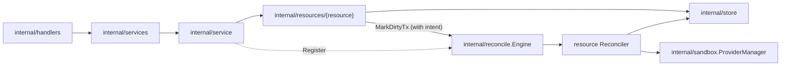

# Resources Design

`internal/resources` contains resource-owned behavior. Each child package owns
the API-facing service for one resource area and, where that resource has a
lifecycle, the lifecycle intent and the reconciler that converges it.

## Packages

| Package | Owns | Reconcile type |
| --- | --- | --- |
| [harnessconfigs](harnessconfigs/DESIGN.md) | Project-scoped harness configs and the configure flow | `harnessConfig` |
| [jobs](jobs/DESIGN.md) | Jobs API, a projection of the reconcile engine's dirty set | none |
| `judges` | The project's judge: the discobox that answers judging asks (ADR 26-09-22-838) | `judge` |
| `peers` | Enrolled peers: machines permitted to connect to this server | none |
| [pools](pools/DESIGN.md) | `Pool` API (`Service`) and trusted pool intent (`ControlPlane`, the `sandbox.PoolManager` handed to drivers) | `pool` |
| [projects](projects/DESIGN.md) | Projects and the default-project flag | none |
| [providers](providers/DESIGN.md) | Provider-instance API and startup reconciliation | none |
| [sandboxes](sandboxes/DESIGN.md) | Sandbox API, lifecycle intent, and reconciliation | `sandbox` |
| [secrets](secrets/DESIGN.md) | Credentials, their approval lifecycle, and sandbox delivery | none |
| `sshkeys` | Project-scoped SSH keys authorizing SSH to a project's sandboxes | none |

`peers` and `sshkeys` are plain store-backed CRUD services with no design doc of
their own.

`judges` has no API of its own: nothing a client calls creates, lists or deletes
a judge. It converges one per project against what the project says — a pool for
it, recorded when the project's first pool was made, and a configured default
harness, which is its image, its settings and the credential it answers with —
and is marked by whatever changes those. Its reconcile id is a project ID,
because a project has one judge, and its scan names every project so a judge
converges even when whatever changed did not think to say so.

What a server judges is its decision rather than a project's, made for
commands and requests apart (`judges.Judging`,
[ADR 26-10-02-054](../../../docs/adr/26-10-02-054-commands-are-judged-by-default-and-requests-by-opt-in.md)):
`judgeCommands`, on by default, judges the command `discobox-access run`
declares and a discobox handing a credential on, each before anything is
minted; `judgeCredentials`, off by default, judges every credential-bearing
request the proxy observes, holding its connection open. A project wants a
judge while either is on. While both are off, the convergence makes none and
takes away any made while one was on — the same path as removing the project's
default harness. A pool that asks about a kind the server does not judge is
answered with the judging-disabled problem before a judge is looked for: for a
request the proxy allows it, for a command the pool mints with no verdict, and
a delegation is refused.

A judge is an ordinary discobox in judge mode. Judge mode is a create body's to
ask for like any other, so what makes one *the project's* judge is that the
project points at it (`Project.JudgeSandboxID`), written by this package and by
nothing else — the mode alone would also match one somebody made themselves.

Routing a job to a judge is this package's other half (`route.go`). A pool asks
the control plane — `POST /api/pools/{poolId}/judge`, on the credential
broker's own scope, since deciding whether a credential may be used is what
that scope is for — and the control plane forwards to the pool hosting the
project's judge over the channel it already uses to create and start
discoboxes there. A judge that is not reachable yet — its pool not heard from
since this server started, or its host still coming back — is waited on for
`judge.ReachWait` with the sandbox service's attach wait, not refused. Every
deadline on the exchange allows for that wait on top of `judge.Timeout`.

What a pool asks with is which discobox is spending which approved use, and
what its proxy observed. It does not say what that use allows. The sentence
being judged against, the credential's name and the host it is approved for are
read here from the live grant the use belongs to (`secrets.ApprovedUse`), so
nothing a pool or a sandbox sends can widen its own question. The same goes
for guidance: a pool names the protocol and endpoint it recognized the request
as, and the words about them are added here from the judge package
(`judge.GuidanceFor`, ADR 26-09-26-240 §4), never taken from the pool. The same read
happens again after the verdict, because a verdict takes a while and a grant can
be revoked inside one. The question is composed only once a judge is found: a
project with no judge refuses whatever the use turns out to say, and that
includes a request an allow already standing would have covered.

Every answer the judge gives is recorded before it goes back to the pool — an
allow, a refusal, or an ask to be shown the body — as a request
`CredentialVerdict` (kind `request`, origin `judge`): the evidence, the exact
prompt and its `judge.PromptVersion`, the use and its grant, the judge discobox
with the harness and image it ran, and the round trip from reaching for the
judge to its answer, which includes bringing up a stopped one. A failure to
record is no verdict (ADR 26-09-22-838 §§4, 8). The re-check of the use runs
before the write, so a row is only ever the answer the pool was given. An ask
that got no answer, or whose use was revoked while it was judged, leaves no row;
the proxy's blocked audit row is its record.

An allow may stand (ADR 26-09-25-428). The judge may name a route
(`judge.Standing`); `admit` keeps it only when `judge.Job.Admits` does (a
first-round allow whose route covers its own request), caps it at
`judge.MaxStanding`, and records the route and expiry on that verdict's row.
Before routing a first-round ask, `standing` looks for an unexpired standing
row for the same discobox and use, and uses it only if the grant, the approved
sentence, and the origin (scheme, host and port, not the normalized host) all
match and its route matches this request. A match
answers allow without the judge and writes its own verdict naming the row that
decided it (`StandingVerdictID`). Since the use is read live before any of
this, a revoked grant ends a standing allow on its next request.

The row does not yet carry §8's request correlation. The proxy numbers an
exchange when it writes the audit row, after the judge has answered, so there
is no ID to send with the ask; a verdict joins the http trail by use, discobox
and time, which is ambiguous for a use that made several requests at once.

A command is asked the same way (`command.go`,
`POST /api/pools/{poolId}/judge-commands`, ADR 26-09-22-838 §3): the pool asks
before it mints a sentinel, naming the discobox and the use, with the argv,
its stdin and what the discobox reported about where it runs as evidence. The
purpose, credential and host come from the live grant
(`secrets.ApprovedCredentialUse`, which a host trust's use never matches),
the use is re-read after the verdict, nothing stands, and the answer is
recorded as a command `CredentialVerdict` (kind `command`, origin `judge`)
before it goes back.

Pools never call each other: they sit behind NAT, in clouds, and inside VMs,
and the only thing every pool can reach is the control plane.
That is what lets a pool whose own discoboxes are whole VMs of another
operating system judge at all. Every refusal on that path is the same answer —
no verdict — and the reason travels back so the pool can say why.

A server may judge with Jev instead (ADR 26-10-01-324). `judgeBackend: jev`
chooses it, and so does the default, `auto`, when `jevApiKey` is set. The
backend is the server's choice, like judging itself. With `jevUnsure: refuse`
no project wants a judge discobox, so the convergence makes none and takes away
any made before the switch. `put` sends the job to Jev (`judge/jev`) rather than to a discobox:
there is nothing to reach, so the bound is `judge.Timeout` alone. Everything
around the call is unchanged: the question read from the live grant, standing
rows (Jev proposes none, but rows a judge discobox left still cover until they
lapse), the re-check of the use, and the verdict recorded first. A Jev verdict
names its `Model`, the `Probabilities` it was decided from, `JevInput` (exactly
what Jev was sent, `jev.Verdict.Input`), and `jev.QuestionsVersion` as its
prompt version, in place of a discobox, harness and image. Jev refusing the key, being too busy, or saying something that is
not an answer are each no verdict, and what Jev said goes to the log, not to
the discobox.

With `jevUnsure: harness`, the default, a project keeps its judge discobox, and `put` asks it
about every job Jev does not allow (ADR 26-10-07-937): a clear no, a no Jev
could not tell, and a hazard alike, for commands, requests and delegations. Jev
alone decides only its allows. An ask to be shown the body is not a refusal: it
goes back to the pool. A later round is Jev's only when Jev asked for it
(`jevsRound`): nothing in an ask names the round before it, so that round is
looked for as the recorded body ask (`store.BodyAsks`, read from the primary,
since a replica may not have it yet) for the same discobox, use and request
one round earlier, within the bound. A round that finds Jev's own ask, and no
judge discobox's, is put to Jev first again. Every other later round goes to
the judge discobox alone, whether the discobox asked for it or the search
missed, so Jev never decides a round it did not ask to see; a miss costs a
discobox call. The judge discobox's answer is the
verdict, recorded with Jev's model, probabilities and input beside the discobox
that decided. The bound is a judge discobox's, since one may have to be
reached. A judge discobox that cannot be had, or runs out the bound, leaves
Jev's refusal standing and recorded rather than no verdict: the re-check of
the use and the record run on a deadline of their own (`recordTimeout`), not
the judge's. A round the discobox took over has no Jev refusal to stand, so a
discobox that cannot answer it is no verdict.

Judge-mode discoboxes are left out of listings unless asked for
(`store.IncludingJudges`, the API's `includeJudge`, `discobox admin box ls
--include-judge`): a judge runs no terminal and holds no work, so it is not
what asking what is in a project means. For the same reason it is not counted
against a pool or a project being deleted: a judge is not work anybody would
lose.

Naming one is another matter — the CLI's ID resolution includes judges, so a
judge can be got, shelled into, stopped and taken away like any other discobox.
Taking it away is not permanent: the convergence makes another, which is how a
judge is rebuilt after its harness image changes. The one thing it will not do
is run its harness, which the sandbox agent refuses in judge mode (see
[`sandbox-agent/DESIGN.md`](../../../sandbox-agent/DESIGN.md)): launching it
would run the project's agent, with the judge's own credential, in the discobox
whose purpose is to have no work in it.
Everything else — pool and harness resolution, the image pin, the harness
credential's sentinel — is the ordinary create, which is the point of a judge
being a discobox at all.

## Boundaries

```mermaid
flowchart LR
    handlers[internal/handlers] --> contracts[internal/services]
    contracts --> service[internal/service]
    service --> resources["internal/resources/{resource}"]
    service -. Register .-> engine[internal/reconcile.Engine]
    resources -- "MarkDirtyTx (with intent)" --> engine
    engine --> reconciler["resource Reconciler"]
    reconciler --> store[internal/store]
    reconciler --> runtime["internal/sandbox.ProviderManager"]
    resources --> store
```

- Resource packages call stores for simple CRUD. Sandbox and pool lifecycle
  intent (generation bump plus `MarkDirtyTx`) commits in one store
  transaction.
- Each reconcile type is a `reconcile.Reconciler` registered on
  `internal/reconcile.Engine` by `internal/service` at startup:
  `sandboxes.Service.RegisterJobs`, `pools.ControlPlane.RegisterJobs`, and the
  `harnessconfigs.Service` itself. The engine's semantics are in
  [../reconcile/DESIGN.md](../reconcile/DESIGN.md).
- A reconciler reads the latest persisted state by resource id and owns the
  generation-guarded writes for its resource area. A write lost to newer
  intent is `reconcile.Superseded`, which the reconciler's `Reconcile` maps to
  a zero `Result` so the run settles instead of backing off.
- Provider runtime side effects go through `internal/sandbox.ProviderManager`
  (harnessconfigs reaches sandboxes through its `SandboxRuntime` seam instead);
  resource packages never import `server/providers`.
- Keep HTTP transport adaptation in `internal/handlers`, service contracts and
  DTOs in `internal/services`, and persistence in `internal/store`.
  `internal/handlers` never imports a resource package
  (`handlers/boundary_test.go`); what a handler needs from one is reached
  through `internal/services`, as `services.AgentCredentialRequestStatus` is.

## Not-Found Mapping

`apperrors.NotFound(err, message)` is the single way a resource package turns a
store not-found into the 404 the API serves. It keeps the sentinel as the status
error's `Cause`, so a server-side caller — a reconciler reaping something that
is already gone, most of all — can still match it with
`errors.Is(err, store.ErrNotFound)`. Never build that 404 with
`apperrors.NewStatusError`: the sentinel is lost, and every in-process caller
that tolerates a missing resource starts failing instead.
