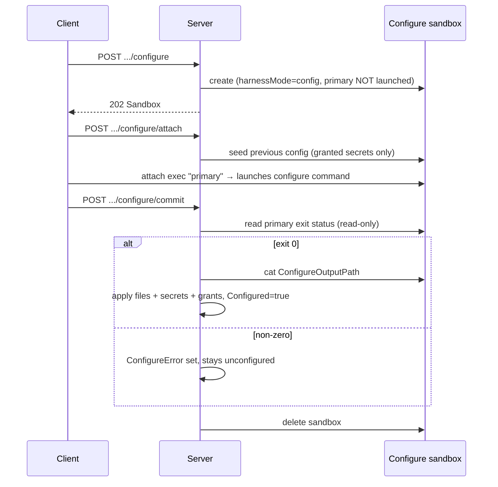

# Harness Configs Design

`internal/resources/harnessconfigs` owns project-scoped harness config behavior.

A harness config is the **only** harness concept — there is no separate
definition. Every harness in the registry is seeded as a built-in config
(`SeedBuiltIns`); everything else is a user-registered image.

`shell` is one of those registry harnesses, not a different kind of thing
(ADR 0043): `harness/shell`, built on the sandbox agent base like its siblings,
inspected and seeded by the same code path with no branch of its own. What is
still true of it, and true *by rule* rather than by slug:

- Its slug is reserved so nothing else can claim it (ADR 0032 §3). It is no
  longer the end of the resolution chain: create resolves an explicit harness or
  the project default and refuses when it has neither (ADR 0048). `shell` is
  reached by being named or by being the default, like any other harness — what
  still ends at it is the upgrade of sandboxes made before every sandbox carried
  a harness config, which adopt it.
- It carries **no run command**, which is a declaration and not a gap: the
  sandbox resolves the run user's login shell, the only place that knows whether
  that is bash, zsh, or fish. `sandbox-agent`'s terminal layer treats a declared
  harness with no command as that shell, keeping the declared harness identity.
- It is born `Configured` — because it declares no secrets, which is the rule
  for every built-in. A harness with no credentials to collect is ready when
  seeded, and a fresh project has to be usable before anyone configures
  anything.
- `configure` refuses it — stated as "its image declares no configure command"
  rather than by slug, since that is true of any such image. Deleting it is
  already refused by the built-in rule.

## Registration and image metadata

- The image's `io.discobox.harness.v1` label is authoritative. `image.go` inspects
  it **once** per image (local Docker daemon first, registry fallback) and
  snapshots the digest, run/relaunch/configure argv, configure reminder, files,
  and secret declarations onto the config. Nothing re-reads the label afterward.
- `runCommand` is **optional**, and omitting it means "run the login shell"
  (ADR 0043 §2) — so neither registration nor refresh requires one. A *blank*
  command is still rejected: declaring nothing and declaring an empty string are
  different.
- Built-in configs **track** their image: `SeedBuiltIns` clobbers `Image` and
  re-snapshots the label whenever the resolved image changes, which is how a dev
  rebuild (`DISCOBOX_HARNESS_<SLUG>_IMAGE` → `.env` → server restart) reaches a
  running server. `NewService` reads that override from the environment itself
  rather than having it threaded down from config, so a test binary that seeds a
  project honors it too. Seeding never changes `Configured`.
- Seeding is **not** how a test gets a harness config. It reads metadata off an
  image label, so it needs a daemon holding images a checkout may never have
  built — and on Windows it cannot reach a Linux image at all. Tests that need a
  selectable harness write the config to the store directly, which is what
  ADR 0066 §7 named as the end state; CI builds no stand-in images.
- Seeding is best-effort per harness: an uninspectable image is logged and
  skipped so it cannot block startup.

## Configured lifecycle

`Configured` is the enable flag — **only configured harnesses can be selected to
run** (enforced in `resources/sandboxes` at sandbox create; `harnessMode=config`
is exempt, being the configure flow itself).

- **Every agent call happens inside a user request**, using the caller's
  credentials (`AcquireSandboxHTTPClient`). The control plane never contacts a
  sandbox on its own authority.
- The client says *when* to commit but never *what happened*: the exit status is
  read from the sandbox, so a caller cannot mark a harness configured without
  having run the flow.
- Commit must resolve the primary **read-only** — resolving the virtual `"primary"`
  id relaunches a stopped primary, which here would restart the configure command
  instead of observing that it finished.
- In config mode the sandbox-agent defers the primary until attach, so seeding
  always precedes the configure command.
- Re-configuring is allowed and clobbers any in-flight attempt, so an abandoned
  run cannot wedge a harness. The reconciler is a **janitor only**: it reaps
  configure sandboxes left uncommitted past `configureTTL`, and touches no agent.
- The configure sandbox runs as `harness.ConfigureUserName`/`ConfigureUserUID`
  (`discobox`, 10000), **not root**. A run sandbox mirrors the caller's own user
  (ADR 0025 §5); this one has no source and no caller identity to mirror, so the
  flow names the account and boot creates it (ADR 0025 §4). A harness CLI is
  entitled to refuse to run as root — Claude Code refuses `bypassPermissions`
  there — so configuring as root would verify a credential under an identity no
  run sandbox ever uses.
- Because of that, both `ConfigureOutputPath` and `ConfigurePreviousConfigPath`
  live under `harness.ConfigureDir` (`/run/discobox/configure`), which
  sandbox-agent creates in config mode owned by that user, mode 0700.
  `/run/discobox` itself stays root-owned — it holds the resolved secrets file,
  the proxy CA bundles and trust env, and the control-plane and buildkit
  sockets — so the seed write and the command's own output go into the one
  subdirectory the sandbox user owns rather than widening all of it.
- To exercise or troubleshoot this whole flow without a real credential, use the
  stub harness fixture: `test/harness-stub/README.md`.

### Seeding the previous configuration

`configure/attach` writes the previous configuration to
`harness.ConfigurePreviousConfigPath` in the **same shape** the configure command
writes its output, so the command can parse its own prior output rather than
re-prompt from nothing. Only what this flow created is replayed —
`ConfiguredFiles`, and bindings whose secret is in `ConfiguredSecretIDs`. A
secret the user bound by hand is theirs, not the flow's to replay.

**The seed carries no secret values.** It is metadata: env name, name, type,
host, `usePrevious`. Values reach the configure sandbox the same way every other
sandbox secret does — as sentinels in its environment, minted by
`resources/sandboxes.applyPreviousConfigureSecrets` under
`harness.ConfigurePreviousEnvPrefix`. Nothing on this path calls
`OpenSecretValue`; no credential is ever serialized into the sandbox.

That is also why there is **no grant check here**. The sentinel resolves through
`ResolveSandboxSecret`, which requires a live grant covering the configure
sandbox's harness config — one enforcement point, at use, instead of a second
copy of the rule that could drift from it.

A secret that no longer exists produces no `PREV_` variable at all: deleting it
cascades its binding, and the seed walks bindings. The narrow case is a secret
that still exists whose grant was explicitly revoked (`discobox secret grant
revoke`); configure-created grants set no expiry, so they do not lapse on their
own. Then the sentinel does not resolve, the configure command's verification
fails, and a pending `SecretRequest` is raised like any other unresolved
sentinel.

Applying output mints the grant for a newly collected secret — a binding alone is
not a grant, so without it the secret would not be usable at run time. A secret
returned with `usePrevious` (or as its own sentinel) keeps its existing row,
binding, and grant, and stays out of the replacement sweep. See
`harness/DESIGN.md` for the command-side contract.

## OAuth (rotating) secrets

A configure command may return a secret of type `oauth` (the claude-code
subscription login does). Its value carries the current access token in
`SecretValue.Token` — so the proxy swap is byte-identical to a `bearer` — plus
the refresh material (`refreshToken`, `tokenUrl`, `clientId`,
`accessTokenExpiresAt`) that **never leaves the control plane**: the resolve
handler emits `Token` alone.

It may also carry `scopes` and `subscriptionType`. These are **not** credentials
— they describe what the grant is allowed to do — and they are recorded because
a client may gate features on the scopes it finds recorded next to the token:
Claude Code refuses Remote Control unless the credential it reads carries
`user:profile`, so a sandbox handed a bare token is limited to inference no
matter what the token is actually good for.

They are **captured at login, never assumed.** Which scopes a login yields
depends on the account and the flow, and claiming one the token does not have
trades a clear client-side refusal for an opaque upstream 401. `/login` is the
only moment they are visible — the authorization server returns them alongside
the token and they appear nowhere else — so the configure command copies them
out of the credentials file it just read. A rotation carries them forward
untouched: a refresh mints a new token for the *same* grant, not a new grant.

Refresh happens lazily inside `ResolveSandboxSecret` (`resources/secrets`), the
one place that decrypts and hands out a value:

- When the access token is within `oauthRefreshSkew` of expiry, the server
  POSTs `grant_type=refresh_token` to `tokenUrl` and re-encrypts the rotated
  pair before returning. The refresh token rotates on every use, so the server
  is the **single writer**: a per-secret `singleflight` collapses concurrent
  resolves onto one upstream refresh, and the persisted write is guarded by the
  row's `updated_at` (`UpdateSecretValueIfUnchanged`) so a refresh in another
  process cannot be clobbered.
- The rotated token's expiry comes from the response's `expires_in`, and from
  the access token's own `exp` claim when the endpoint omits it (JWT access
  tokens state it; OpenAI's are, Anthropic's are not). Recording "unknown"
  instead is not a neutral fallback: an unknown expiry means "refresh now" on
  every later resolve, and each refresh spends a refresh token that rotates on
  use. A token that states no expiry still records none — guessing one would
  defer the refresh past the point the token dies.
- The resolution's `ExpiresAt` is capped at `min(grant expiry, token expiry)`,
  so the proxy's per-`(client, sentinel, host)` cache lapses at token expiry and
  re-resolves — which is what triggers the next refresh. The **grant stays
  persistent**: consent is "the harness is configured", not the 8-hour token
  TTL, so tokens rotate silently without re-approval.
- A failed refresh is not fatal while a token is still on hand: it is served and
  a use-time `401` from upstream is left as the authority on liveness.

This is why the OAuth path uses `/login` rather than `claude setup-token`: only
`/login` yields a rotating refresh token; `setup-token` mints a single
long-lived token with nothing to refresh.

## Delivering configured files to a sandbox

`ConfiguredFiles` and `ConfiguredSecretIDs` record what the configure flow
produced, deliberately kept **separate** from the image-declared `Files`/`Secrets`
baseline. This package only stores that split; a later sandbox create resolves
it back into one effective set by path, mirroring ADR 0012's `Files` overlay
rule (image and runtime entries merge by path, a matching path replaces):

- `reconciler.createOptionsFromSandbox` reads both `cfg.Files` and
  `cfg.ConfiguredFiles` off the stored `HarnessConfig` onto
  `sandbox.ResolvedHarnessConfig`'s two matching fields.
- `poolruntime.agent_client` forwards both across the server→pool-agent
  boundary as two fields on the wire (`pool-agent/api/openapi/pool.yaml`'s
  `ResolvedHarnessConfig` schema), since that boundary is an independently
  generated OpenAPI contract, not a shared Go type.
- `pool-agent/sandboxruntime.buildSandboxDocument` assigns the image baseline to
  `sandboxconfig.Document.Image.Files` and the configured overlay to
  `Document.Runtime.Files` — **not** the same field — so `sandboxconfig.Effective`'s
  existing `mergeFiles(image, runtime, project)` does the actual overlay-by-path,
  the same function that already merges a project's `.discobox/project.json`
  `FilesAdd` in (`sandboxconfig/effective.go`). No merge logic lives in this
  package; it only owns getting the two inputs to the one function that merges
  them.

## Deconfigure

Deconfigure deletes exactly the secrets and their bindings the configure flow
created, clears `ConfiguredFiles`, and sets `Configured=false` — leaving the
baseline intact so the harness can simply be configured again.
`UpdateHarnessConfig` can replace either file set (`files`, `configuredFiles`),
which is how the CLI's file editing (`harnesses edit`, and `f` on the launcher's
harnesses screen) applies hand edits without a reconfigure; edited configured
files remain owned by the configure lifecycle and are still cleared on
deconfigure.

Deconfigure is also **refused for a harness with nothing to configure** (409):
configure is what would undo it, and configure refuses that harness too, so
turning one off would be a door that only opens one way — the create path
rejects an unconfigured harness, a built-in cannot be deleted, and seeding never
revisits `Configured`. The reserved `shell` built-in is what lands there, born
configured because it declares no secrets. For the same reason the refusal to
delete a built-in only points at `deconfigure` where that would do something.

Deconfigure is **refused for the project default** (409): the default must always
point at a configured harness, or `run` with no explicit harness would resolve to
an unconfigured one and be rejected at sandbox create. The client releases the
default first — `UnsetDefaultHarnessConfig` (`DELETE .../default`) clears it, and
the CLI's harnesses screen does this automatically when disabling the default.
Deleting a default harness is fine: the store cascade clears the pointer, and a
project with no default refuses a create that names no harness (ADR 0048) rather
than resolving to one nobody chose.

## Boundaries

- Project bindings remain control-plane state. Image metadata declares only
  secret requirements, never secret values.
- Service methods validate project scope and config input before writing through
  `internal/store`.
- Keep transport DTO conversion in `internal/handlers`; this package may use
  generated DTO aliases from `internal/services`.
- Harness config files are literal by default. Files marked `template` are
  rendered inside the sandbox against the public `SandboxConfig` JSON shape;
  configs must not invent a parallel set of runtime variables.
- The configure flow reaches the sandbox agent through `SandboxRuntime`
  (`AcquireSandboxHTTPClient`), which authorizes the caller's scopes — so it only
  works from inside a user request, which is the point.
- That lease addresses the **pool host**, not the sandbox: the pool agent passes
  exec routes through to the agent under `/api/project/{p}/pool/{p}/sandboxes/{s}/…`,
  and requests carry two tokens — the pool's on `Authorization`, the agent's on
  `X-Discobox-Sandbox-Agent-Authorization` for the pool agent to forward inward. The
  generated sandbox client cannot express that route shape, so `oneShotRunner`
  makes those calls directly.
