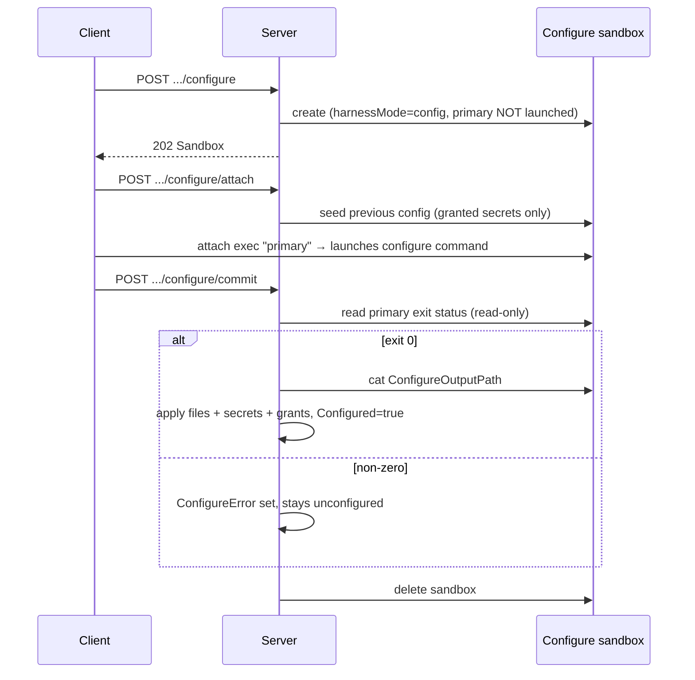

# Harness Configs Design

`internal/resources/harnessconfigs` owns project-scoped harness config behavior.

A harness config is the **only** harness concept — there is no separate
definition. The three included harnesses are seeded as built-in configs
(`SeedBuiltIns`); everything else is a user-registered image.

## Registration and image metadata

- The image's `io.discobox.harness.v1` label is authoritative. `image.go` inspects
  it **once** per image (local Docker daemon first, registry fallback) and
  snapshots the digest, run/relaunch argv, files, and secret declarations onto the
  config. Nothing re-reads the label afterward.
- Built-in configs **track** their image: `SeedBuiltIns` clobbers `Image` and
  re-snapshots the label whenever the resolved image changes, which is how a dev
  rebuild (`DISCOBOX_HARNESS_<SLUG>_IMAGE` → `.env` → server restart) reaches a
  running server. Seeding never changes `Configured`.
- Seeding is best-effort per harness: an uninspectable image is logged and
  skipped so it cannot block startup.

## Configured lifecycle

`Configured` is the enable flag — **only configured harnesses can be selected to
run** (enforced in `resources/sandboxes` at sandbox create; `harnessMode=config`
is exempt, being the configure flow itself).

- **Every agent call happens inside a user request**, using the caller's
  credentials (`AcquireSandboxHTTPClient`). The control plane never contacts a
  sandbox on its own authority.
- The client says *when* to commit but never *what happened*: the exit status is
  read from the sandbox, so a caller cannot mark a harness configured without
  having run the flow.
- Commit must resolve the primary **read-only** — resolving the virtual `"primary"`
  id relaunches a stopped primary, which here would restart the configure command
  instead of observing that it finished.
- In config mode the sandbox-agent defers the primary until attach, so seeding
  always precedes the configure command.
- Re-configuring is allowed and clobbers any in-flight attempt, so an abandoned
  run cannot wedge a harness. The reconciler is a **janitor only**: it reaps
  configure sandboxes left uncommitted past `configureTTL`, and touches no agent.
- To exercise or troubleshoot this whole flow without a real credential, use the
  stub harness fixture: `test/harness-stub/README.md`.

### Seeding the previous configuration

`configure/attach` writes the previous configuration to
`harness.ConfigurePreviousConfigPath` in the **same shape** the configure command
writes its output, so the command can parse its own prior output and validate
existing credentials rather than re-prompt. Secret values are included only where
a live `harnessConfig`-scoped `SecretGrant` still authorizes it; revoked or
expired grants drop out. Applying configure output mints that grant — a binding
alone is not a grant, so without it the secret would not be usable at run time.

## Deconfigure

`ConfiguredFiles` and `ConfiguredSecretIDs` record what the configure flow
produced, deliberately kept **separate** from the image-declared `Files`/`Secrets`
baseline. Deconfigure deletes exactly those secrets and their bindings, clears
those files, and sets `Configured=false` — leaving the baseline intact so the
harness can simply be configured again.

## Boundaries

- Project bindings remain control-plane state. Image metadata declares only
  secret requirements, never secret values.
- Service methods validate project scope and config input before writing through
  `internal/store`.
- Keep transport DTO conversion in `internal/handlers`; this package may use
  generated DTO aliases from `internal/services`.
- Harness config files are literal by default. Files marked `template` are
  rendered inside the sandbox against the public `SandboxConfig` JSON shape;
  configs must not invent a parallel set of runtime variables.
- The configure flow reaches the sandbox agent through `SandboxRuntime`
  (`AcquireSandboxHTTPClient`), which authorizes the caller's scopes — so it only
  works from inside a user request, which is the point.
- That lease addresses the **worker**, not the sandbox: the worker passes exec
  routes through to the agent under `/api/project/{p}/worker/{w}/sandboxes/{s}/…`,
  and requests carry two tokens — the worker's on `Authorization`, the agent's on
  `X-Discobox-Sandbox-Agent-Authorization` for the worker to forward inward. The
  generated sandbox client cannot express that route shape, so `oneShotRunner`
  makes those calls directly.
