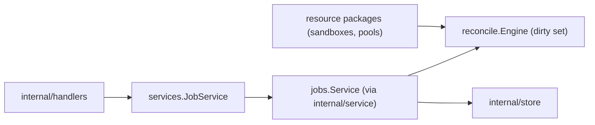

# Jobs Design

`internal/resources/jobs` serves the jobs REST API. There is no job queue:
resource reconciliation rides the level-triggered reconcile engine
(`internal/reconcile`), and this package projects the engine's **dirty set**
into the API's job shape.

## Boundaries

- A "job" is a pending reconcile mark. Its id is the dirty id with `/`
  flattened to `:` — `type:project-id:resource-id`; `type` is
  `<resource-type>.reconcile` and `resource_id` is the bare resource id.
  Status is derived from claim state, `not_before`, and `attempts`:
  - `running` — claimed by a node.
  - `pending` — claimable now.
  - `scheduled` — future `not_before` with `attempts == 0`: a reconciler timer
    (`Result.RequeueAt`, e.g. archive retention or a park deadline). Healthy.
  - `backoff` — future `not_before` with `attempts > 0`: the last reconcile
    failed; `error` carries the engine's `last_error` for that row.
- Only `sandbox` and `pool` marks are served; their dirty ids carry the
  `projectID/` prefix that scopes them to a project. Marks of other resource
  types (`poolImages`, `harnessConfig`) are not project-scoped and never appear.
- `ForceJob` pulls a scheduled or backed-off mark forward (`MarkDirty`, which
  overrides backoff), making it claimable immediately; `attempts` is kept. A
  running mark is refused with 409.
- Terminal history is not served here: a reconcile's outcome lives on the
  resource itself (`model.ResourceLifecycle`: `State`, `ObservedGeneration`,
  `ErrorMessage`).
- Lifecycle **intent** does not live here either: each resource package owns
  its intent writes (generation bump + desired state + `MarkDirtyTx`, one
  transaction) — sandboxes in `resources/sandboxes/intents.go`, pools in
  `resources/pools/controlplane.go`.
