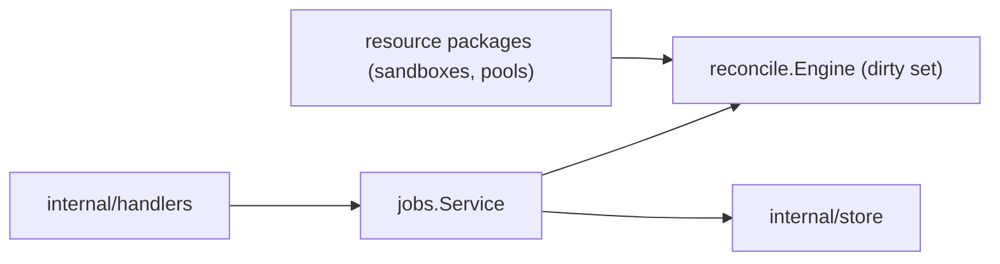

# Jobs Design

`internal/resources/jobs` serves the jobs REST API. There is no job queue:
resource reconciliation rides the level-triggered reconcile engine
(`internal/reconcile`), and this package projects the engine's **dirty set**
into the API's job shape.

## Boundaries

- A "job" is a pending reconcile mark: id `type:resource-id`, status derived
  from claim state and `not_before` (pending / backoff / running).
- `ForceJob` pulls a backed-off mark forward (`MarkDirty`), making it claimable
  immediately.
- Terminal history is not served here: a reconcile's outcome lives on the
  resource itself (`Phase`, `LastOperationStatus`, `ErrorMessage`) and in
  project events.
- Lifecycle **intent** does not live here either: each resource package owns
  its intent writes (generation bump + operation + `MarkDirtyTx`, one
  transaction) — sandboxes in `resources/sandboxes/intents.go`, pools in
  `resources/pools/controlplane.go`.
