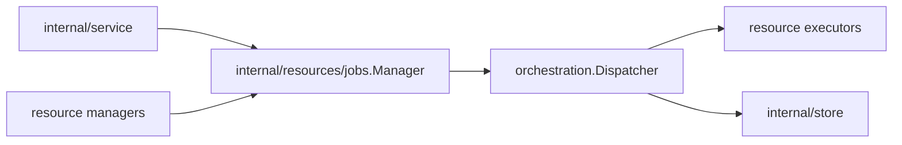

# Jobs Design

`internal/resources/jobs` owns durable job dispatcher infrastructure for the
server. It is resource-neutral: resource packages own payloads, executors, and
lifecycle policy.

## Boundaries

- `Manager` owns dispatcher start/stop, executor registration, wakeup, and queue
  config.
- Resource packages own job payload types and executors, for example
  `sandboxes.SandboxReconcileExecutor`.
- Keep resource lifecycle decisions out of this package except while migration
  code is still being split into resource managers.
