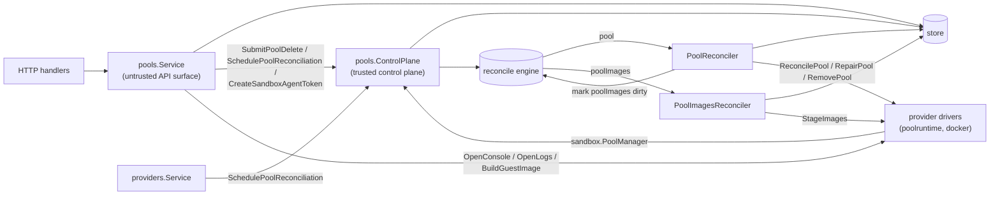

# Pools Design

`internal/resources/pools` owns the `Pool` resource: the user-visible sharing
boundary sandboxes are scheduled into (ADR-0003), and its own runtime host
(ADR-0006). A pool binds to one provider instance at create time, immutably;
the provider instance is backend identity only, while capacity, cache, and the
runtime lifecycle live on the pool.

Pools are the one resource with **two front doors**, because they have two
very different kinds of caller:

## Responsibilities

- `service.go` — pool CRUD, the project default pool, and intent submission.
  Create validates the backing provider instance and schedules the first
  reconcile; update never touches `ProviderInstanceID` (immutable) and
  re-schedules the reconcile so envelope changes converge.
  `SetDefaultPool`/`UnsetDefaultPool` point the project's `DefaultPoolID` at a
  pool or clear it (unset rejects a pool that is not the default). Delete
  requires the pool to be empty of sandboxes (assignment is immutable, so
  there is nothing to drain to), refuses the project's default pool, and
  submits delete intent; the reconciler removes the runtime, then deletes the
  row. The seeded pool is not otherwise special — it is seeded once, at first
  install, and is an ordinary pool afterwards.
  `OpenPoolConsole`, `OpenPoolLogs`, and `BuildPoolGuestImage` also live here
  and check nothing beyond the pool and its provider-instance rows existing:
  they resolve the provider's `sandbox.PoolRuntime` directly, without
  requiring the pool to be ready, registered, or its provider instance
  enabled, because they are asked for when the pool is broken
  (`server/providers/DESIGN.md`). A backend with no pool runtime, no host log
  (`ErrPoolLogsUnsupported`), or no guest image
  (`ErrGuestImageBuildUnsupported`) answers 501.
- `agent_service.go` — the pool agent surface: bootstrap-token registration
  (`RegisterPool`, authenticated by the token itself), heartbeats
  (`UpdatePoolStatus`), sandbox-state and sandbox provisioning-progress
  reports (`ReportPoolSandboxStates`, ADR 0017 §10, relayed to the sandbox
  control plane through `SandboxStateReporter`, which owns sandbox rows),
  resource accounting (`ReportPoolResources`, ADR 0071), and (ADR 0030)
  `MintSandboxAgentStatusTokens`/`ReportSandboxAgentStatus` for the pool's
  standing sandbox-agent status poller. Every call after registration
  verifies the authenticated **pool principal** for that pool, and any
  sandbox ID named is acted on only if that pool hosts it (skipped here, or
  by the store for state/progress batches).
  `MintSandboxAgentStatusTokens` always mints the hardcoded `status:read`
  scope via `ControlPlane.CreateSandboxAgentToken`, never a caller-supplied
  one, so this endpoint can never be used to obtain a broader sandbox-agent
  token. `ReportSandboxAgentStatus` and `ReportPoolResources` write their
  sandbox columns through narrow column updates
  (`store.UpdateSandboxAgentStatus`, `store.UpdateSandboxResources`), not
  `UpdateSandbox`/`WithGeneration` — this telemetry is outside the
  desired/observed generation contract and a whole-row save would risk
  clobbering concurrent desired-state writes. Agent status also moves a
  sandbox's `LastActiveAt` forward from the reported session access.
  `ReportPoolResources` stores the pool-wide half on the pool row and each
  sandbox's half on that sandbox's row. `ReconcilePool` (a manual reconcile
  request from the API) also lives here.
- `controlplane.go` — trusted operations implementing `sandbox.PoolManager`:
  reads for drivers, bootstrap/agent token minting, the schedulable-pool
  placement gate, drift marks (`SchedulePoolReconciliation`, via
  `MarkDirtyDrift`, so it never shortens a failure backoff), intent
  (`SubmitPoolDelete`, and `SchedulePoolRepair`: generation bump + mark, so
  schedulers can tell a pending retry from a settled failure), and
  display-only driver provisioning progress (`ReportPoolProvisionProgress`,
  ADR 0060). There is deliberately no timer form of the pool mark: a
  reconciler's own re-check belongs in its `reconcile.Result`
  (`reconcile.ErrSelfMark`). It also registers both reconcilers
  (`RegisterJobs`), records the server-resolved default sandbox image for
  staging (`SetDefaultSandboxImage`), and purges spent bootstrap tokens hourly
  (`StartBootstrapTokenCleanup`).
- `reconciler.go` — `PoolReconciler` (resource type `pool`, dirty ID
  `projectID/poolID`): converges the pool's single runtime host
  (container/VM/pod) toward its desired state through the provider's
  `PoolRuntime`. A missing or disabled provider instance, or one with no pool
  runtime, converges trivially. A `ReconcilePool` that reports
  `sandbox.ErrPoolNotReachable` — a host that is up but not yet taking traffic,
  such as a container whose healthcheck has not passed — is not a failure at
  all: the pass writes nothing and asks again (`poolHostComingUpRequeue`),
  because repairing it would remove and recreate the container and restart the
  healthcheck something is waiting on. Any other failed `ReconcilePool` on a
  pool with assigned sandboxes is repaired in place (`RepairPool`); a runtime
  whose
  agent never registers within `poolRegistrationTimeout` (2m, armed with
  `RequeueAt` only while waiting) is repaired with a fresh bootstrap token;
  delete refuses while sandboxes are assigned, removes the runtime, and then
  the row. Failure latching follows `EverCreated` (`RegisteredAt` set):
  never-registered pools fail terminally (`failed`, `Ready`/`Schedulable`
  cleared); a created pool keeps its state and records the failure as
  `ErrorMessage` — its runtime keeps serving what it already hosts, so a
  failed convergence is not a phase. An `active` pool that is not yet staged
  gets its `poolImages` resource marked dirty.
- `imagestage.go` — `PoolImagesReconciler` (resource type `poolImages`, dirty
  ID the pool ID): stages the images a sandbox on the project might run — the
  server-resolved default sandbox image plus every harness config's image,
  deduped, minus `:local` tags — onto a ready pool via
  `PoolRuntime.StageImages`. It is its own claimed and leased resource, not
  part of the pool reconcile. Staging is a condition (`ImagesStaged`), never a
  health state: an unstaged pool is active and schedulable. A failure is
  recorded on `ImageStage` and retried after 5m, never returned as a reconcile
  error; a staged pool re-stages every 6h. `ScanDirty` returns only ready,
  unstaged pools. An image the engine loads from the image cache rather than
  pulls is recorded with `ImageStage.Loading`, so a client says *Loading* and
  not a second *Downloading* (ADR 0113).

## Offline is a liveness verdict

`offline` means exactly its ADR 0017 §4 sense: the pool agent stopped
answering and the host is expected back. It is derived from heartbeat
staleness (`LastSeenAt` older than `poolHeartbeatTimeout`, three missed 30s
beats), never from a failed reconcile — a heartbeating pool whose reconcile is
failing is `active` with an `ErrorMessage`, not offline. The reconciler still
owns the write (staleness is checked on every pass, including the 60s drift
scan); a heartbeat arriving at an offline pool marks it dirty so the reconcile
that proves recovery runs promptly. Consumers gate accordingly: placement
(`SchedulablePoolForSandbox`) and sandbox traffic
(`AcquireSandboxHTTPClient`) refuse offline pools — the last-reported
`Ready`/`Schedulable` flags are stale facts from a silent agent — but neither
refuses a pool for an unconverged reconcile.

Reconciliation is level-triggered: intent writers mark `(pool, id)` dirty and
the engine (`internal/reconcile`) drives convergence; `ScanDirty` re-checks
every pool as the drift and lost-mark backstop.

## Who owns which status field

Every pool status field has exactly one writer, and writers must not overlap:

| Fields | Owner | Written by |
| --- | --- | --- |
| `PublicKey`, `KeyType`, `RegisteredAt` | pool agent | `RegisterPool` (bootstrap-token redemption; also stamps `LastSeenAt`) |
| `Ready`, `Schedulable`, `Degraded`, capacity, `Conditions`, `LastSeenAt` | pool agent | `UpdatePoolStatus` heartbeats |
| `Resources`, `ResourcesReportedAt` | pool agent | `ReportPoolResources` |
| `ProvisionProgress`, `ProvisionProgressAt` | provider driver | `ControlPlane.ReportPoolProvisionProgress` |
| `ImagesStaged`, `ImageStage`, `ImageStagedAt` | image staging | `PoolImagesReconciler` |
| `State`, `ErrorMessage`, `ObservedGeneration`, `RuntimeState` | reconciler | `PoolReconciler`, and nothing else |

Health answers "can this host take work right now"; `State`/`ErrorMessage` are
the reconciler's verdict on whether the runtime converged, and
`ObservedGeneration` says the reconciler finished acting on a generation.
Scheduling gates on the health flags plus the offline verdict
(`SchedulablePoolForSandbox`), so no agent call has any reason to write the
reconciler's fields. The telemetry writers (resources, provisioning progress,
image stage) use narrow column updates, never a whole-row save, so they cannot
clobber a concurrent reconcile.

The rule that keeps the split honest: **agent calls write facts and mark the
pool dirty; the reconciler alone writes `State`, `ErrorMessage`, and
`ObservedGeneration`** (ADR 0017 §10 — a report is an observation, never
intent). Registration marks the pool dirty for exactly this reason.

Two rules follow from it:

- Every successful reconcile clears `ErrorMessage` (the offline derivation may
  then record a fresh one for the same pass). Nothing else clears it, and no
  path may skip the clear — skipping it because an error is already recorded
  makes the field a one-way latch.
- The reconciler *derives* `State` on success (`registering` until
  `RegisteredAt`/`Ready`, then `active`) rather than carrying the recorded
  state forward. The create reconcile converges the generation before the agent
  registers, so a drift re-check that preserved `State` would strand a
  registered pool in `registering`.
