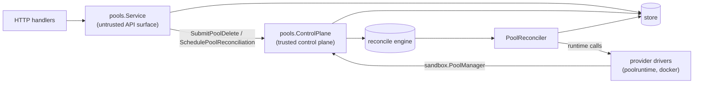

# Pools Design

`internal/resources/pools` owns the `Pool` resource: the user-visible sharing
boundary sandboxes are scheduled into (ADR-0003), and its own runtime host
(ADR-0006). A pool binds to one provider instance at create time, immutably;
the provider instance is backend identity only, while capacity, cache, and the
runtime lifecycle live on the pool.

Pools are the one resource with **two front doors**, because they have two
very different kinds of caller:

## Responsibilities

- `service.go` — pool CRUD plus intent submission. Create validates the
  backing provider instance and schedules the first reconcile; update never
  touches `ProviderInstanceID` (immutable) and re-schedules the reconcile so
  envelope changes converge. Delete requires the pool to be empty of
  sandboxes (assignment is immutable, so there is nothing to drain to),
  refuses the project's default pool, and submits delete intent; the
  reconciler removes the runtime, then deletes the row. The seeded pool is
  not otherwise special — after first install it is an ordinary pool.
- `agent_service.go` — the pool agent surface: bootstrap-token registration
  (`RegisterPool`), heartbeats (`UpdatePoolStatus`), and sandbox-removal
  reports, each verifying the authenticated **pool principal**.
- `controlplane.go` — trusted operations implementing `sandbox.PoolManager`:
  reads for drivers, bootstrap/agent token minting, the schedulable-pool
  placement gate, dirty marks (`SchedulePoolReconciliation`/`...At`), and
  repair intent (`SchedulePoolRepair`: generation bump + mark, so schedulers
  can tell a pending retry from a settled failure).
- `reconciler.go` — `PoolReconciler`: converges the pool's single runtime
  host (container/VM/pod) toward its desired state through the provider's
  `PoolRuntimeReconciler`. Active pools are drift-checked and repaired in
  place when sandboxes are assigned; a runtime whose agent never registers
  within the timeout is repaired with a fresh bootstrap token; delete removes
  the runtime and then the row. Failure latching follows `EverCreated`:
  never-registered pools may fail terminally, created pools drop to the
  retryable offline phase.

Reconciliation is level-triggered: intent writers mark `(pool, id)` dirty and
the engine (`internal/reconcile`) drives convergence; `ScanDirty` re-checks
every pool as the drift and lost-mark backstop.

## Who owns which status field

A pool's status has two writers, and they must not overlap:

| Fields | Owner | Written by |
| --- | --- | --- |
| `PublicKey`, `KeyType`, `RegisteredAt` | pool agent | `RegisterPool` (bootstrap-token redemption) |
| `Ready`, `Schedulable`, `Degraded`, capacity, `Conditions`, `LastSeenAt` | pool agent | `UpdatePoolStatus` heartbeats |
| `State`, `ErrorMessage`, `ObservedGeneration` | reconciler | `PoolReconciler`, and nothing else |

Health answers "can this host take work right now"; `State`/`ErrorMessage` are
the reconciler's verdict on whether the runtime converged, and
`ObservedGeneration` says the reconciler finished acting on a generation.
Scheduling gates on the health flags (`SchedulablePoolForSandbox`), so no agent
call has any reason to write the reconciler's fields.

The rule that keeps the split honest: **agent calls write facts and mark the
pool dirty; the reconciler alone writes `State`, `ErrorMessage`, and
`ObservedGeneration`** (ADR 0017 §10 — a report is an observation, never
intent). Registration marks the pool dirty for exactly this reason.

Two consequences worth stating, because both were bugs:

- Every successful reconcile clears `ErrorMessage`. Nothing else clears it, and
  no path may skip the clear — skipping it because an error is already recorded
  makes the field a one-way latch.
- The reconciler *derives* `State` on success (`registering` until
  `RegisteredAt`/`Ready`, then `active`) rather than carrying the recorded
  state forward. The create reconcile converges the generation before the agent
  registers, so a drift re-check that preserved `State` would strand a
  registered pool in `registering`.
