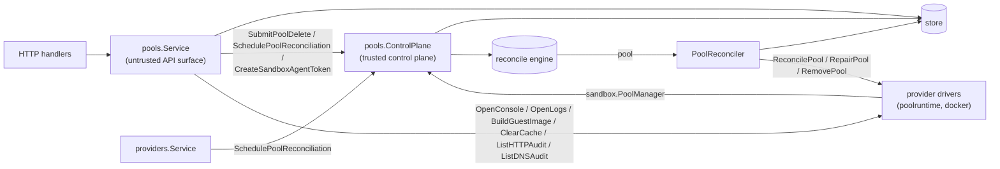

# Pools Design

`internal/resources/pools` owns the `Pool` resource: the user-visible sharing
boundary sandboxes are scheduled into (ADR-0003), and its own runtime host
(ADR-0006). A pool binds to one provider instance at create time, immutably;
the provider instance is backend identity only, while capacity, cache, and the
runtime lifecycle live on the pool.

Pools are the one resource with **two front doors**, because they have two
very different kinds of caller:

## Responsibilities

- `service.go` — pool CRUD, the project default pool, and intent submission.
  Create validates the backing provider instance and schedules the first
  reconcile; update never touches `ProviderInstanceID` (immutable) and
  re-schedules the reconcile so size changes converge. Both refuse a non-zero
  size field the pool's provider does not declare in
  `ProviderDefinition.PoolSizeFields` (`size.go`).
  `SetDefaultPool`/`UnsetDefaultPool` point the project's `DefaultPoolID` at a
  pool or clear it (unset rejects a pool that is not the default). Delete
  requires the pool to be empty of sandboxes (assignment is immutable, so
  there is nothing to drain to), refuses the project's default pool, and
  submits delete intent; the reconciler removes the runtime, then deletes the
  row. The seeded pool is not otherwise special — it is seeded once, at first
  install, and is an ordinary pool afterwards.
  `OpenPoolConsole`, `OpenPoolLogs`, and `BuildPoolGuestImage` also live here
  and check nothing beyond the pool and its provider-instance rows existing:
  they resolve the provider's `sandbox.PoolRuntime` directly, without
  requiring the pool to be ready, registered, or its provider instance
  enabled, because they are asked for when the pool is broken
  (`server/providers/DESIGN.md`). A backend with no pool runtime, no host log
  (`ErrPoolLogsUnsupported`), or no guest image
  (`ErrGuestImageBuildUnsupported`) answers 501.
  `ClearPoolCache` resolves the pool's runtime the same way and calls
  `PoolRuntime.ClearCache`, which reaches the pool agent and waits for it to
  stop the pool's running sandboxes and empty the pool's caches. The agent owns
  the whole operation (`pool-agent/DESIGN.md`); nothing here persists or
  tracks it, and no pool status field records it. An agent too old to have the
  operation (`sandbox.ErrPoolAgentUnsupported`) answers 409 saying so, rather
  than the 404 that reads as a missing pool.
  `ListHTTPAudit` reads the pool proxies' HTTP audit for the whole project and
  merges it newest first, or oldest first from `Since` for a follower reading
  forward (ADR 0130 §§1, 4). Status, blocked and order filters are passed to
  every pool. `After` is per pool, keyed by pool ID, because a row id is only
  ordered within the pool that issued it: each pool is read from its own cursor,
  and a pool the caller has no cursor for is read from the shared time bound,
  which is how a pool whose rows have not been seen yet joins a follow already
  running. It asks the pool `poolId` names;
  otherwise the pool a still-existing sandbox runs on; otherwise every pool in
  the project, because a purged sandbox's requests stay on its pool with no row
  left saying which. The pools' pages are merged by taking heads rather than by
  sorting everything and slicing: a pool reading from its cursor answers in
  write order, so a cut made by time can drop a record the caller's cursor is
  about to move past, and that record is never offered again
  (`mergeAuditPages`). Pools are asked in parallel, each for the whole limit,
  since the newest N can all come from one pool, and each under
  `auditPoolReadTimeout`, so one unreachable host cannot hold the answer. A pool
  being deleted, or whose agent never registered, is reported without being
  asked. The provider reaches the agent without `agentClientForPool`'s
  reconcile-and-wait recovery: a read must not restart the pools it reads. A pool that cannot be read is
  not an error: it is returned in `UnavailablePools` with why, beside what the
  others answered, because a trail silently short a pool reads as complete.
  `ListDNSAudit` reads the DNS queries the pools answered (ADR 0148) through
  the same fan-out and merge — `readAuditPools` and `mergeAuditPages` are
  generic over the trail's row, so the two cannot drift apart — with only a
  name filter of its own.
  `GetHTTPAudit` reads one exchange in full from the one pool named, and
  `OpenHTTPAuditArtifact` streams one recorded body from it,
  under the same no-recovery rule; with a single pool there is no partial
  answer, so a pool that cannot be read is a 503 and a recording that is not
  there is a 404.
- `agent_service.go` — the pool agent surface: bootstrap-token registration
  (`RegisterPool`, authenticated by the token itself), heartbeats
  (`UpdatePoolStatus`), sandbox-state and sandbox provisioning-progress
  reports (`ReportPoolSandboxStates`, ADR 0017 §10, relayed to the sandbox
  control plane through `SandboxStateReporter`, which owns sandbox rows),
  resource accounting (`ReportPoolResources`, ADR 0071), and (ADR 0030)
  `MintSandboxAgentStatusTokens`/`ReportSandboxAgentStatus` for the pool's
  standing sandbox-agent status poller. Every call after registration
  verifies the authenticated **pool principal** for that pool, and any
  sandbox ID named is acted on only if that pool hosts it (skipped here, or
  by the store for state/progress batches).
  `MintSandboxAgentStatusTokens` always mints the hardcoded `status:read`
  scope via `ControlPlane.CreateSandboxAgentToken`, never a caller-supplied
  one, so this endpoint can never be used to obtain a broader sandbox-agent
  token. `ReportSandboxAgentStatus` and `ReportPoolResources` write their
  sandbox columns through narrow column updates
  (`store.UpdateSandboxAgentStatus`, `store.UpdateSandboxResources`), not
  `UpdateSandbox`/`WithGeneration` — this telemetry is outside the
  desired/observed generation contract and a whole-row save would risk
  clobbering concurrent desired-state writes. Agent status also moves a
  sandbox's `LastActiveAt` forward from the reported session access, and
  records the reported `meta` through `store.UpdateSandboxMeta` (ADR 0136); a
  report without it leaves the recorded copy alone.
  `ReportPoolResources` stores the pool-wide half on the pool row and each
  sandbox's half on that sandbox's row. `ReconcilePool` (a manual reconcile
  request from the API) also lives here.
- `controlplane.go` — trusted operations implementing `sandbox.PoolManager`:
  reads for drivers, bootstrap/agent token minting, the schedulable-pool
  placement gate, drift marks (`SchedulePoolReconciliation`, via
  `MarkDirtyDrift`, so it never shortens a failure backoff), intent
  (`SubmitPoolDelete`, and `SchedulePoolRepair`: generation bump + mark, so
  schedulers can tell a pending retry from a settled failure), and
  display-only driver provisioning progress (`ReportPoolProvisionProgress`,
  ADR 0060). There is deliberately no timer form of the pool mark: a
  reconciler's own re-check belongs in its `reconcile.Result`
  (`reconcile.ErrSelfMark`). It also registers the pool reconciler
  (`RegisterJobs`), records the server-resolved default sandbox image for
  staging (`SetDefaultSandboxImage`), and purges spent bootstrap tokens hourly
  (`StartBootstrapTokenCleanup`).
- `reconciler.go` — `PoolReconciler` (resource type `pool`, dirty ID
  `projectID/poolID`): converges the pool's single runtime host
  (container/VM/pod) toward its desired state through the provider's
  `PoolRuntime`. A missing or disabled provider instance, or one with no pool
  runtime, converges trivially. A `ReconcilePool` that reports
  `sandbox.ErrPoolNotReachable` — a host that is up but not yet taking traffic,
  such as a container whose healthcheck has not passed — is not a failure at
  all: the pass writes nothing and asks again (`poolHostComingUpRequeue`),
  because repairing it would remove and recreate the container and restart the
  healthcheck something is waiting on. Any other failed `ReconcilePool` on a
  pool with assigned sandboxes is repaired in place (`RepairPool`); a runtime
  whose
  agent never registers within `poolRegistrationTimeout` (2m, armed with
  `RequeueAt` only while waiting) is repaired with a fresh bootstrap token;
  delete refuses while sandboxes are assigned, removes the runtime, and then
  the row. Failure latching follows `EverCreated` (`RegisteredAt` set):
  never-registered pools fail terminally (`failed`); a created pool keeps its state and records the failure as
  `ErrorMessage` — its runtime keeps serving what it already hosts, so a
  failed convergence is not a phase. The reconciler supplies the default sandbox
  image and the project's harness
  images to the provider. The engine loads local cache entries before starting
  a pool agent, reporting `preloading_images` through provisioning progress.
  The provider calls the reconciler's `begin` callback before replacing a runtime,
  which records `registering` and closes placement even if old heartbeats still
  report ready. There is no background image reconciler or staging condition.
- `images.go` builds the deduplicated project image set and holds the
  server-resolved default image. Development `:local` images are handled by the
  development image sync.

## Health is independent of runtime reconciliation

The API's `health` is derived by `model.Pool.Health` at the point of use:
`unknown` until a status report arrives in the current server run, `ready` or
`not_ready` from a fresh report, and `offline` after 90s without one. Startup
stamps `HealthCheckStartedAt` on every pool before workers start, preserving
registration, identity, lifecycle, and the previous observations. The startup
stamp gives a pool 90s to report before unknown becomes offline. New pools use
their creation time for that deadline.

Only `UpdatePoolStatus` stamps `StatusReportedAt`; registration, image builds,
and other telemetry cannot establish or renew health. `LastSeenAt` retains its
existing registration/heartbeat diagnostic meaning. The nullable timestamp
columns migrate additively; an old row without a status timestamp is unknown
until its agent reports. No backfill should certify an old report as fresh.

`services.PoolToAPI` exposes health and masks stale `Ready`/`Schedulable` flags,
including pools nested in sandbox responses. Clients accept an omitted health
field from older servers as `unknown`. Placement and sandbox traffic use the same `Pool.IsReady` gate. Fresh health permits placement
even if a blocked runtime reconcile still carries an older `offline` state.
API health does not wait for runtime reconciliation. Placement additionally
keeps pending/registering runtimes gated through image preload. The reconciler's existing `State`/`ErrorMessage` remains its lifecycle
verdict; it may record offline on its own later pass. Startup grants the first
heartbeat the same 90s grace before that pass may derive another offline error.
`ReconciledAt` records when a runtime attempt settles. Waiters ignore saved
failures older than `HealthCheckStartedAt`, including legacy rows without this
nullable timestamp; current runtime failures still terminate the wait. Telemetry
cannot refresh a runtime verdict.

Reconciliation is level-triggered: intent writers mark `(pool, id)` dirty and
the engine (`internal/reconcile`) drives convergence; `ScanDirty` re-checks
every pool as the drift and lost-mark backstop.

## Who owns which status field

Every pool status field has exactly one writer, and writers must not overlap:

| Fields | Owner | Written by |
| --- | --- | --- |
| `HealthCheckStartedAt` | server startup | `Store.BeginPoolHealthChecks`, before workers/listeners |
| `PublicKey`, `KeyType`, `RegisteredAt` | pool agent | `RegisterPool` (bootstrap-token redemption; also stamps `LastSeenAt`) |
| `Ready`, `Schedulable`, `Degraded`, capacity, `Conditions`, `LastSeenAt`, `StatusReportedAt` | pool agent | `UpdatePoolStatus` heartbeats |
| `Resources`, `ResourcesReportedAt` | pool agent | `ReportPoolResources` |
| `ProvisionProgress`, `ProvisionProgressAt` | provider driver | `ControlPlane.ReportPoolProvisionProgress` |
| `State`, `ErrorMessage`, `ObservedGeneration`, `RuntimeState`, `ReconciledAt` | reconciler | `PoolReconciler`, and nothing else |

Health answers "can this host take work right now"; `State`/`ErrorMessage` are
the reconciler's verdict on whether the runtime converged, and
`ObservedGeneration` says the reconciler finished acting on a generation.
Scheduling gates on current health and the schedulable flag, with
pending/registering runtimes gated until image preload finishes
(`SchedulablePoolForSandbox`), so no agent call has any reason to write the
reconciler's fields. The telemetry writers (resources and provisioning progress) use narrow column updates, never a whole-row save, so they cannot
clobber a concurrent reconcile.

The rule that keeps the split honest: **agent calls write facts and mark the
pool dirty; the reconciler alone writes `State`, `ErrorMessage`, and
`ObservedGeneration`** (ADR 0017 §10 — a report is an observation, never
intent). Registration marks the pool dirty for exactly this reason.

Two rules follow from it:

- Every successful reconcile clears `ErrorMessage` (the offline derivation may
  then record a fresh one for the same pass). Nothing else clears it, and no
  path may skip the clear — skipping it because an error is already recorded
  makes the field a one-way latch.
- The reconciler *derives* `State` on success (`registering` until
  `RegisteredAt`/`Ready`, then `active`) rather than carrying the recorded
  state forward. The create reconcile converges the generation before the agent
  registers, so a drift re-check that preserved `State` would strand a
  registered pool in `registering`.
