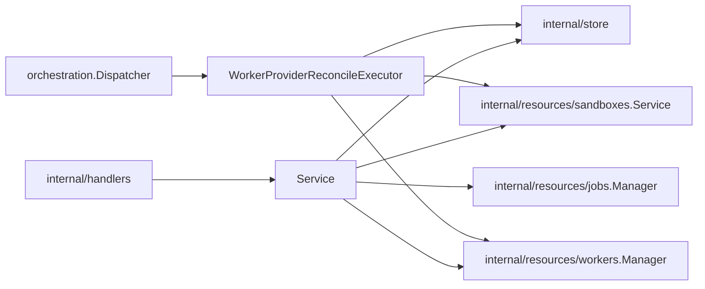

# Providers Design

`internal/resources/providers` owns provider-instance API behavior, startup
reconciliation, provider-instance job payloads, and provider-instance
reconciliation.

## Boundaries

- `Service` validates provider instance API requests and coordinates provider
  runtime ensure behavior.
- Simple provider CRUD may call store directly.
- Startup reconciliation and worker enqueue behavior must go through the job
  manager when durable jobs are enabled.
- `WorkerProviderReconcileExecutor` owns payload decode and provider-instance
  reconciliation. Keep provider job execution logic in the executor unless a
  dependency has clear ownership elsewhere.
- Provider-instance reconciliation may compare provider inventory with worker
  rows before sizing the pool. When inventory finds a worker/runtime mismatch,
  it should enqueue the affected worker reconcile job and defer pool sizing until
  that worker job completes and requeues provider reconciliation.
