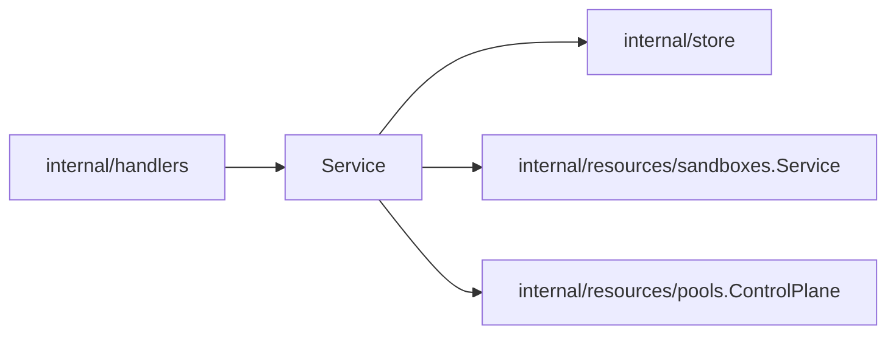

# Providers Design

`internal/resources/providers` owns provider-instance API behavior and startup
reconciliation. A provider instance is backend identity only — type,
credentials, connection config. Capacity, sharing policy, and observed runtime
status belong to `Pool` (`internal/resources/pools`).

## Boundaries

- `Service` validates provider instance API requests and coordinates provider
  runtime ensure behavior.
- Simple provider CRUD may call store directly.
- Provider instance deletion must refuse deletion while pools are still bound
  to the instance: pools bind immutably at create, and sandboxes and runtimes
  hang off the pools. Delete the pools first.
- Startup reconciliation (`EnsureExistingSandboxProviderInstances`) resolves
  every enabled instance so each registered provider can schedule its pools'
  reconciles.
- Provider status reports availability only. Worker-derived status summaries
  are pool status, computed by `internal/resources/pools`. Do not infer or
  expose sandbox "capabilities" from optional interface assertions; callers
  that need a feature-specific provider operation should depend on that
  operation directly.
