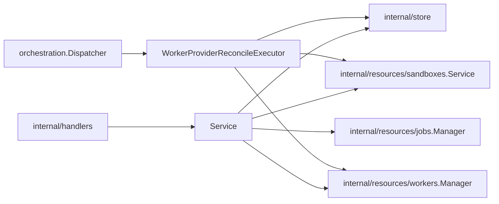

# Providers Design

`internal/resources/providers` owns provider-instance API behavior, startup
reconciliation, provider-instance job payloads, and provider-instance
reconciliation.

## Boundaries

- `Service` validates provider instance API requests and coordinates provider
  runtime ensure behavior.
- Simple provider CRUD may call store directly.
- Startup reconciliation and worker enqueue behavior must go through the job
  manager when durable jobs are enabled.
- Provider instance deletion must refuse deletion while sandboxes or workers are
  still associated with the provider. Disable or drain first; worker and sandbox
  reconciliation owns clearing those stateful references.
- `WorkerProviderReconcileExecutor` owns payload decode and provider-instance
  reconciliation. Keep provider job execution logic in the executor unless a
  dependency has clear ownership elsewhere.
- Provider-instance reconciliation sizes the worker pool. Runtime drift
  detection is owned by provider drivers and should enqueue affected worker
  reconcile jobs directly when it detects mismatches.
