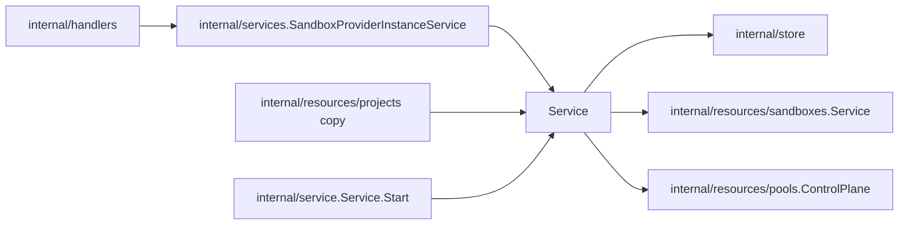

# Providers Design

`internal/resources/providers` owns provider-instance API behavior, the
provider-type catalog, and startup reconciliation. A provider instance is
backend identity only — type, name, non-secret connection config, and a
disabled flag (`model.SandboxProviderInstance`). Capacity, sharing policy, and
observed runtime status belong to `Pool` (`internal/resources/pools`).

## Boundaries

- `Service` validates provider instance API requests and coordinates provider
  runtime ensure behavior. It reaches the provider registry through
  `SandboxCatalogService` (catalog plus `sandbox.ProviderManager`).
- Simple provider CRUD may call store directly.
- Create requires a type, validates config with
  `ProviderManager.ValidateProviderConfig`, persists, then `ResolveInstance`s
  so the new instance's provider initializes immediately. Update validates
  config against the stored type and persists name, config, and `Disabled`;
  type is immutable. Update does not re-resolve: the manager rebuilds a cached
  provider on the next resolve because the cache is keyed by `UpdatedAt`.
- Project copy creates the copied instances through this service
  (`CreateSandboxProviderInstance`), so they get the same validation and
  resolve.
- Provider instance deletion must refuse deletion (409) while pools are still
  bound to the instance: pools bind immutably at create, and sandboxes hang off
  the pools. Delete the pools first.
- Startup reconciliation (`EnsureExistingSandboxProviderInstances`), run from
  `internal/service.Service.Start` once the reconcile engine is up, resolves
  every enabled instance in every project. Resolving runs the provider's
  factory and `Initialize`, and a pool-backed provider's `Initialize` schedules
  each of its pools' reconciles. An error fails server start.
- `EnqueueProviderPools` marks every pool bound to one instance dirty through
  `pools.ControlPlane.SchedulePoolReconciliation`.
- Provider status reports availability only (`sandbox.ProviderStatus`:
  available, state, message, details, from the required `Provider.Status`). It
  is per registered provider type and surfaced only in the catalog, under the
  item's `capabilities` field; the instance API returns the stored instance
  with no status. Host readiness, capacity, and convergence are pool status,
  owned by `internal/resources/pools`. Do not infer or expose sandbox
  "capabilities" from optional interface assertions; callers that need a
  feature-specific provider operation should depend on that operation
  directly.
