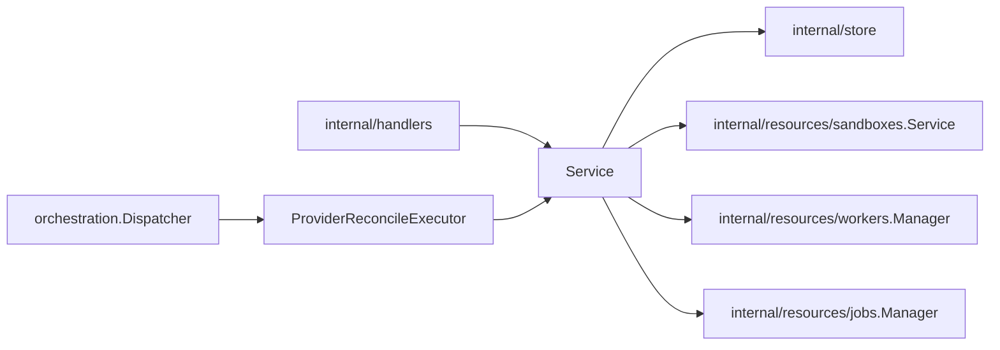

# Providers Design

`internal/resources/providers` owns provider-instance API behavior, startup
reconciliation, provider-instance job payloads, and provider-instance
reconciliation.

## Boundaries

- `Service` validates provider instance API requests and coordinates provider
  runtime ensure behavior.
- Simple provider CRUD may call store directly.
- Startup reconciliation and worker enqueue behavior must go through the job
  manager when durable jobs are enabled.
- `ProviderReconcileExecutor` should only decode the payload and call the
  provider reconciler interface.
