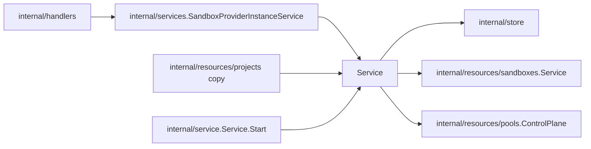

# Providers Design

`internal/resources/providers` owns provider-instance API behavior, the
provider-type catalog, and startup reconciliation. A provider instance is
backend identity only — type, name, non-secret connection config, and a
disabled flag (`model.SandboxProviderInstance`). Capacity, sharing policy, and
observed runtime status belong to `Pool` (`internal/resources/pools`).

## Boundaries

```mermaid
flowchart LR
    handlers[internal/handlers] --> contract[internal/services.SandboxProviderInstanceService]
    contract --> service[Service]
    projects[internal/resources/projects copy] --> service
    startup[internal/service.Service.Start] --> service
    service --> store[internal/store]
    service --> sandboxCatalog[internal/resources/sandboxes.Service]
    service --> pools[internal/resources/pools.ControlPlane]
```

- `Service` validates provider instance API requests and coordinates provider
  runtime ensure behavior. It reaches the provider registry through
  `SandboxCatalogService` (catalog plus `sandbox.ProviderManager`).
- Simple provider CRUD may call store directly.
- Create requires a type and validates it and its config with
  `ProviderManager.ValidateProviderConfig`, which refuses a type the manager
  cannot resolve (no factory and no registered provider; a definition alone
  does not count). Either refusal is a 400 before anything is written. It then
  persists and `ResolveInstance`s so the new instance's provider initializes
  immediately. A resolve that fails is the backend not coming up (the config
  already passed validation), so it answers 502 and deletes the row again, on
  a context the request's cancellation does not reach: a failed create leaves
  nothing behind. The row is written first because the provider cache is keyed
  on its ID, and resolving runs provider I/O that must not hold the write
  transaction. Create refuses such an instance while startup keeps one (below)
  because create is the one moment the caller can still be told; a persisted
  instance was already accepted. Update validates config against the stored
  type (400 on refusal) and persists name, config, and `Disabled`; type is
  immutable. Update does not re-resolve: the manager rebuilds a cached
  provider on the next resolve because the cache is keyed by `UpdatedAt`.
- Project copy creates the copied instances through this service
  (`CreateSandboxProviderInstance`), so they get the same validation and
  resolve.
- Provider instance deletion must refuse deletion (409) while pools are still
  bound to the instance: pools bind immutably at create, and sandboxes hang off
  the pools. Delete the pools first.
- Startup reconciliation (`EnsureExistingSandboxProviderInstances`), run from
  `internal/service.Service.Start` once the reconcile engine is up, resolves
  every enabled instance in every project. Resolving runs the provider's
  factory and `Initialize`, and a pool-backed provider's `Initialize` schedules
  each of its pools' reconciles. An instance that does not resolve is logged
  and does not fail server start — it belongs to one project, and a stopped
  server cannot serve the API that would disable or delete it. Its pools are
  marked dirty instead, so their reconciles retry the resolve with the
  engine's backoff and carry the error. Only a store error fails the start.
- `EnqueueProviderPools` marks every pool bound to one instance dirty through
  `pools.ControlPlane.SchedulePoolReconciliation`.
- Provider status reports availability only (`sandbox.ProviderStatus`:
  available, state, message, details, from the required `Provider.Status`). It
  is per registered provider type and surfaced only in the catalog, under the
  item's `capabilities` field; the instance API returns the stored instance
  with no status. Host readiness, capacity, and convergence are pool status,
  owned by `internal/resources/pools`. Do not infer or expose sandbox
  "capabilities" from optional interface assertions; callers that need a
  feature-specific provider operation should depend on that operation
  directly.
