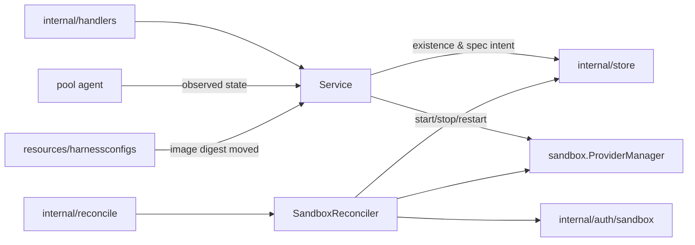
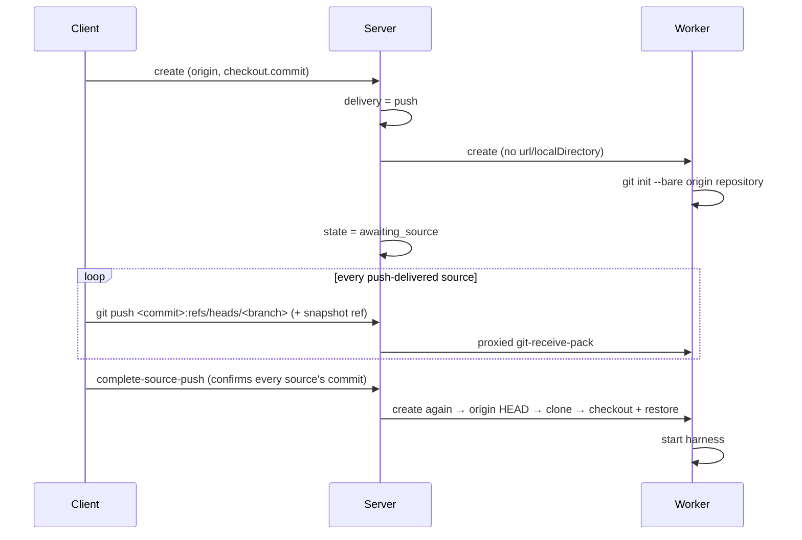

# Sandboxes Design

`internal/resources/sandboxes` owns sandbox API behavior, sandbox lifecycle
reconciliation, sandbox provider catalog access, and sandbox runtime trust
integration.

## Boundaries

- `Service` exposes sandbox API use cases and may call store directly for simple
  reads or non-orchestrated updates.
- Every sandbox carries a harness config (ADR 0032, as amended by ADR 0048).
  `resolveHarnessConfigID` resolves it at create: an explicit
  `harnessConfigId`, or a `--harness` name (slug first, then display name) →
  the project default → 409. A deleted default counts as no default. A
  sandbox's image is its harness config's pinned `Image`/`ImageDigest`; the
  server default image (`SetDefaultSandboxImage`) applies only when no harness
  image does, which means config mode without a caller image, or a config that
  declares none.
- Sandboxes that have no harness config converge by *upgrade*, not by
  migration. The target comes from the reserved `shell` built-in
  (`fallbackHarnessConfig`). Such a sandbox reports `available` regardless of
  its digest, because what the upgrade changes for it is adopting the config.
  Taking the upgrade writes the config as well as re-pinning the image, and
  until it does, the sandbox says so in its own listing.
- The upgrade rule has exactly one implementation,
  `services.SandboxUpgradeTarget`. Two callers use it: the read path that
  reports an available upgrade, and `Service.currentImageRepin`, which resolves
  the change that `UpgradeSandbox`, `RepairSandbox`, and
  `UpgradeHarnessConfigSandboxes` apply. Sharing it means a sandbox cannot
  accept an upgrade its listing says it does not have.
- A sandbox name is unique within its project (`idx_sandbox_project_name`),
  like a pool's or a harness config's. It is an addressable handle, not a
  label: `discobox admin ssh-config` emits it as an `ssh_config` `Host` alias, and
  ssh applies the first matching block, so a second sandbox answering to the
  same name would silently take the first one's connections. `CreateSandbox`
  checks the name and returns 409 so the common case is a readable error; the
  index is the authority that closes the race between two concurrent creates.
  Names free up on delete, since deletes are hard deletes (ADR 0010).
- Existence and spec intent goes through `recordSandboxIntent`: generation bump,
  desired state, and dirty mark in one transaction.
- `SandboxReconciler` converges existence and spec, and nothing else.
- Provider runtime operations belong in reconciliation or in an explicit
  instruction, never in handlers or raw stores.

## Power is not orchestrated

`start`, `stop`, and `restart` are instructions forwarded to the pool agent
(`power.go`). They write no lifecycle state and bump no generation. Their
responses carry the sandbox as it read *before* the instruction took effect, so
a caller learns the outcome by re-reading the sandbox once the agent's report
has landed. `DesiredState` answers existence only: `present`,
`archived`, or `deleted`. Start, stop, and restart are refused with 409 on an
archived sandbox — it has no container to power.

## Attach waits, acquire does not

`AcquireSandboxHTTPClient` is the choke point every route onto a sandbox goes
through, and it answers now: the sandbox exists, and its pool is up.

`AwaitSandboxHTTPClient` (`attach_wait.go`) is the same acquire for a caller
that means "I want to use this sandbox now" — the exec attach, or an exec
create request with `wait=ready`. `AwaitSandboxHTTPClientForServer` is the same
wait for a call the server makes itself, with no caller scopes to check:
putting a job to the project's judge, which bounds it with `judge.ReachWait`
so a judge whose pool has not reported since a server restart is waited on
rather than refused.
It waits for a sandbox that is still being provisioned instead of refusing it,
which is what lets a client create a sandbox and attach to it in the next call
rather than polling for readiness (ADR 0039 tier 1).

- The wait polls, because what it waits on is a row (ADR 0081). Every pass
  re-reads authoritative state and asks again, so the transition that opens the
  gate has no window to land in unseen.
- Its stall budget is restarted by `provisioningMark`: the gate (the sandbox's
  lifecycle state and convergence, its runtime state, the pool's state and
  readiness) plus the counters that tick while a long provision proceeds (the
  sandbox's pull progress, the pool's own provisioning and image staging). It is
  deliberately not the rows' `updated_at` — the pool's status heartbeat and the
  complete sync's restamp move that on a timer, and a budget they refreshed
  could never expire.
- Three refusals are "not yet": no runtime state naming a pool, a pool that is
  not taking traffic (`sandbox.ErrPoolNotReachable`), and a sandbox that is
  reachable but not usable yet. The pool refusal comes from either side of the
  acquire: the gate reads the pool row, and the provider's driver refuses a
  host whose container is being replaced or whose healthcheck has not passed,
  which the row cannot see because it reads ready until the agent is noticed
  gone. The service answers both with 409. The host refusal carries its own
  ceiling (`sandboxPoolHostWaitCeiling`) because the stall budget cannot bound
  it: a failed acquire marks the pool for reconcile, and every reconcile stamps
  the pool progress the budget reads as movement, so the wait would renew
  itself for as long as the pool kept reconciling. Every
  other refusal is an answer and is returned immediately, as is any refusal for
  a sandbox that is archived, on its way out, or failed and settled — no write
  will clear those. A failed sandbox whose generation is unobserved is a retry
  in flight (an upgrade or repair recorded new intent), and is waited for.
- Reachable is not usable, and the gap is push-delivered source. Such a sandbox
  has a container — and so a runtime state naming its pool — from the moment it
  parks at `awaiting_source`, so the acquire succeeds while its workspace is
  still empty; attaching then would auto-start it and launch the harness against
  an unmaterialized workspace. So the wait also holds while the sandbox is
  parked, and while its generation is unobserved — the window after
  complete-source-push in which the reconciler materializes what was pushed.
  The push itself goes through the git proxy, which does *not* wait, so the
  delivery a wait is waiting on can never be blocked by it.
- A caller's deadline also ends the wait, and is answered like the stall
  budget and the host ceiling: with the last refusal, which names what never
  became true. A cancel is the caller leaving, and gets the context's error.
- The budget is a stall timeout, not a duration cap. Progress restarts it, so an
  image pull that keeps reporting takes as long as it takes while a sandbox that
  has gone silent gives up. Tiers below take budgets that fit inside it, so the
  innermost stage to stall is the one that reports.

Only this tier waits on control-plane facts; what the container and the sandbox
agent are doing is waited on by the tiers that can see them
(`pool-agent/DESIGN.md`, `sandbox-agent/DESIGN.md`).

## Existence is three-valued

`archived` is not a power state but a third form of existence: as data, with no
container (ADR 0022 §1). See [ADR 0022](../../../../docs/adr/0022-sandbox-deletion-is-archive-then-confirmed-purge.md).

| API call | Desired state | Shape |
| --- | --- | --- |
| `DELETE /sandboxes/{id}` | `archived` | orchestrated, 202 |
| `POST .../unarchive` | `present` | orchestrated, 202 |
| `POST .../purge` | `deleted` | **converges in the request**, 204 |
| `POST .../repair` | `present` | **converges in the request**, 200 + start instruction |

Delete archives, because getting a sandbox out of the way is the common request
and the recoverable one. `archive.go` holds the archive branch and retention;
`reconciler.go` holds the rest.

Purge is the one existence change that is not fire-and-forget. Its whole content
is a destructive side effect on a machine the control plane does not own, and a
202 would be a promise the server could not later verify — the row it would check
against is the thing being deleted. So `PurgeSandbox` records intent through the
ordinary `recordSandboxIntent` and then drives that sandbox's reconcile inline,
returning the provider's answer. It is not a second deletion path: the intent and
its dirty mark are durable before the inline attempt starts, so a purge that
fails or loses its client still converges in the background. The row is deleted
only after the provider confirms the data is gone.

Repair (ADR 0035) is archive, unarchive, and start as one operation, for a
sandbox that is wedged — typically a settled failure whose container or
disposable pool-host state is broken while its durable tree is fine. It is one
present-intent whose generation is named by `Sandbox.RepairGeneration`; for
exactly that generation, and only until it converges, `ensure` runs the
provider's `Archive` teardown before the ordinary create, so the rebuild starts
from the retained tree. Recording the intent is what clears a latched
`ErrorMessage`.

The teardown is gated on the repair not having landed yet, not on the
generation alone. `ensure` also runs on observation — "your container is gone"
arrives with the generations already in agreement — so a converged repair
generation would otherwise re-archive a healthy sandbox on every attach, and
leave it settled as archived while its row still read `ready`. Like purge, the request
drives the reconcile inline so the caller gets the verdict; unlike everything
else here, a clean converge is followed by the same start instruction an
explicit start sends — still an instruction, never stored intent.

That same intent carries the re-pin an upgrade would (ADR 0064): repair always
rebuilds on the harness config's current image. `currentImageRepin` is the one
resolver both operations write through, so they cannot pin differently, and
`imageRepin.apply` is what each hands `recordSandboxIntent`. The two differ only
in what an unavailable target means — upgrade 409s, because the re-pin is what
it was asked for; repair proceeds on the pin it has, because the re-pin is a
rider on a rebuild that is happening anyway.

`UpgradeHarnessConfigSandboxes` is the automatic author of that same upgrade
(ADR 0082). `resources/harnessconfigs` calls it wherever a harness config's
`ImageDigest` moves, and it re-pins the config's present, settled sandboxes
that are `ready` and observed `stopped`, or `failed` and observed `stopped` or
never observed at all — the eligibility query is
`Store.ListStoppedSandboxesForHarnessConfig`, and whether each is actually
behind is still `SandboxUpgradeTarget`'s answer, never restated in SQL.
A failed sandbox is included (ADR 0121): the re-pin is intent, so it clears the
latched error and the reconciler retries the create on the new image — at most
once per digest move, since only a pin that differs from the new digest is
re-pinned. It is the plain upgrade, not a repair: no teardown, no start. A
sandbox still owed a client push is skipped, because the retry could only park
it at `awaiting_source` again.

There is no automatic-upgrade code path, only an automatic author of the upgrade
every sandbox already had: the same `imageRepin`, the same
`recordSandboxIntent`, the same generation bump, so the pool agent cannot tell
one from a typed `POST .../upgrade`. Delivery is therefore also unchanged — the
re-pin moves the manifest fingerprint, the pool agent rebuilds the container that
no longer matches, and because it found that container stopped it leaves the
replacement stopped (ADR 0021 §3). Nothing here starts anything.

The reconciler still never moves a pin (ADR 0021 §2's rule as narrowed by 0082):
the pin moves only in a recorded intent, and this adds an author of that intent
rather than a new place it moves. `Project.SandboxUpgradePolicy` (`manual`) opts
a project out; empty means the server default, which is `automatic`.

Retention: an archived sandbox is purged once it has been archived longer than
`Project.ArchiveRetentionSeconds`. A project that has not set one follows the
server-wide default as it changes, rather than being frozen to whatever it was
at creation. That default is the server config's `archiveRetention`
(`DISCOBOX_ARCHIVE_RETENTION` takes precedence), else `DefaultArchiveRetention`
(24h), and it reaches the reconciler through `WithArchiveRetention`.
`task dev` sets that variable to 15m, because a development tree costs as much
disk as a production one and is discarded many times a day; the setting is a
default and not a ceiling, so a project that chose its own keeps it. The
deadline derives from `StateChangedAt` and is never stored — the same reason the
source-push timeout derives its own — and is armed by returning it as
`reconcile.Result.RequeueAt`. `ScanDirty` also returns expired archives, because an archived
sandbox has converged and the generation comparison is blind to it by design, so
a lost mark would otherwise mean data kept forever.

Two rules keep archived sandboxes inert:

- The pool agent's complete sync omits them, exactly as it omits a sandbox whose
  container was lost. `ApplySandboxStateReports` skips them outright — recording
  `stopped` would hand the reconciler drift to repair, and `ensure` would rebuild
  the container the archive just removed.
- The pool agent refuses to start them on demand, so an exec cannot quietly
  undo an archive.

Observed state arrives on the agent's reporting channel and lands in
`observations.go`. Two rules there are load-bearing:

- A report never writes intent. Not desired state, not a generation — including
  the report that a sandbox's container is gone, which is news about the world
  rather than a change to what was asked for.
- A complete sync distinguishes "stopped" from "no container", which record the
  same runtime state. Only the second needs a rebuild, and it gets one through a
  dirty mark plus the reconciler's idempotent ensure.

## Two state fields, one writer each

A sandbox's existence and its power are decided by different components, so
they are stored in different columns (ADR 0034). Neither writer touches the
other's field:

| Field | Values | Owner |
| --- | --- | --- |
| `State` | `pending`, `awaiting_source`, `ready`, `failed`, `archived`, `deleted` | `SandboxReconciler`, and nothing else |
| `RuntimeState` | `starting`, `running`, `stopping`, `stopped`, empty | `Store.ApplySandboxStateReports`, and nothing else |
| `ErrorMessage`, `ErrorReason`, `ObservedGeneration` | — | `SandboxReconciler` |

`ready` means the container has been converged against the spec. It says
nothing about power; empty `RuntimeState` means no agent has reported yet,
which is not `stopped`.

The rule is enforced in the store, not by convention: `Store.UpdateSandbox`
omits `observedSandboxColumns` from every write. Those are the runtime state,
its anchor, the report watermark, provisioning progress, and resource
accounting. Without that rule, any caller that loads a sandbox, performs a slow
operation, and saves it back replays a stale observation. A reconcile saving
across a slow `provider.Create`, for example, would push a sandbox observed
`running` back to its pre-create value until the next 60s complete sync.

Two consequences worth stating:

- **`SandboxIsLive` takes the sandbox**, not a state string: the question spans
  both fields, and an archived sandbox is never live however it was last
  observed.
- **`displayState` is the composition** and the only thing clients should read
  (`services.SandboxDisplayState`). Existence answers first; the runtime axis
  fills in what the container is doing once existence is settled at `ready`.

`ErrorReason` classifies `ErrorMessage` for a client that acts on the failure
rather than only showing it, and is set and cleared with it (`RecordFailure`,
`ClearFailure`, `RecordIntent`). The one reason today is `image_unavailable`
(`failureReason`): the pool cannot obtain the image the sandbox is pinned to
(`sandbox.ErrImageUnavailable`). A retry cannot get past that and an upgrade
can, so the API reports it beside `upgrade.available` and a client offers the
upgrade. The reconciler still does not re-pin on its own (see above).

`ensure` creates the container and does not start it. The exception is a
sandbox that has never run — `pending`, or `awaiting_source` resuming after its
push — because asking for a sandbox means asking for one that runs. A rebuild
after the container was lost stays stopped until something uses it, and the
pool agent starts it on demand when that happens.

See [ADR 0017](../../../../docs/adr/0017-resource-state-is-desired-and-observed-with-no-operations.md)
§§9–13.

## A discobox is portable

`transfer.go` moves a discobox between servers (ADR 0123). Export and import are
the two halves, and between them they have one rule everything else follows
from: **what travels is what a container rebuild already preserves**, so an
import is the ordinary create against a restored tree — the unarchive path — and
not a second way to bring a sandbox into being.

| | Route | Shape |
| --- | --- | --- |
| `ExportSandbox` | `GET .../sandboxes/{id}/export` | streams `manifest.json` + `tree/` + `SHA256SUMS` as one tar |
| `ImportSandbox` | `POST .../sandboxes/import` | consumes one, answers with the sandbox and its warnings |

Both are hand-wired in `internal/server/sandbox_transfer.go` rather than
declared in the OpenAPI contract, for the reason the git proxy is: the body is
an unbounded opaque stream. The archive format is
[`internal/sandboxexport`](../../sandboxexport), read and written by the server
alone, so the CLI only ever moves bytes.

A `.dbox` whose `SHA256SUMS` is missing or does not match surfaces from
`Provider.ImportTree`, because the tree is streamed to the pool as it is read,
and is answered as a 400 about the archive rather than an error about the pool
(ADR 0123 §8). No row is created: the failure lands before `createSandboxIntent`.

- **The manifest carries `model.SandboxManifest` whole**, not a chosen subset.
  That struct is already the complete answer to "does this describe the
  container?", so a spec field added there travels from the day it is added.
  Two of its fields are not taken as they arrive: `HarnessConfigID` is cleared
  on export and resolved by slug on import, because an ID names a row on one
  server and nothing on another; and `Image`/`ImageDigest` are re-pinned to the
  destination harness config's, exactly as a create takes them from there. The
  image cannot come from the archive — `buildCreateOptions` reads
  `RunCommand`, `Files`, `Volumes` and `Env` off the harness config row, so an
  image from one harness and a command from another is a container that starts
  and a harness that does not.
- **`Origin` travels beside the manifest.** It is a fact about the client, not
  the server, and a move does not change which machine's checkout the discobox
  belongs to. Two things need it: `OriginKey` is re-derived from it, which is
  what makes `discobox ls` in that repository list the moved discobox; and
  `buildCreateOptions` gates the per-source data key on it, so an import
  without it comes up with the primary's `/.discobox/data-per-source/<slug>`
  private to the discobox (see `pool-agent/DESIGN.md`) rather than the
  source's shared data, and its references' absent.
- **No secret value ever enters an archive.** Bindings travel as
  `{env, secret name}`; anonymous secrets (minted from an inline value,
  referenced only by ID) and agent-requested bindings do not travel at all. On
  import, each binding resolves against this project's secret of that name, and
  what cannot be matched is a `Warnings` entry rather than a refusal.
- **Export refuses a running sandbox** here and again in the pool agent. The
  agent is the authority — it can see the container, while this can only see
  what was last reported — and the row-level refusal exists for the message,
  since the control plane knows the discobox's name and "stop it first" is
  worth saying before two network hops rather than after them. The `--stop` the
  CLI offers is the caller's, not something taken on their behalf. An archived
  sandbox exports fine: it is a tree with no container, which is exactly the
  shape an export reads.
- **Export passes the sandbox's pin** (`Image`/`ImageDigest`, as a
  `sandbox.ImageRef`) to `Provider.ExportTree`. The tree is read by the sandbox
  agent's export mode in the image the sandbox runs, and an archived sandbox, or
  one whose create failed, has no container left on the pool to name it
  (ADR 0129 §1). Not the harness config's current image: that agent did not
  write the tree.
- **Import restores the tree before the row exists**, and refuses before it
  restores. The row is what wakes the reconciler, so the order is: resolve pool,
  harness and every secret binding — which is everything that can say no — then
  `Provider.ImportTree`, then `createSandboxIntent`. Nothing between the upload
  and the write reaches the store except the name index, which closes a race
  two concurrent imports could otherwise win together. Refusing after the
  upload would charge the user a whole workspace for a 400, and in a transfer
  the source is already stopped. There is no new lifecycle state and no
  completion call — see ADR 0123 §3 for why parking was rejected, and for what
  an import that dies in the middle leaves behind.
- **An imported source keeps its exported delivery** and is stamped
  `SourceDeliveredAt`. `resolveSourceDelivery` is deliberately not run: delivery
  is already written into the bytes that were restored, and re-deciding it would
  either contradict the tree or park the sandbox waiting for a push nobody will
  make (ADR 0123 §4).

`transfer` is a client-side pipe between two servers' routes, not a
server-to-server copy; the CLI holds both credentials and the reachability
(ADR 0123 §6). A completed move archives the source (ADR 0022 §2), so it is
recoverable and collected by the project's ordinary retention.

## Created by a discobox

A discobox may create discoboxes through the discobox API, in the sandbox role
([ADR 0140](../../../../docs/adr/0140-a-discobox-reaches-the-discobox-api-through-its-pool-with-a-fixed-role.md)).
What it creates is created as the user who created it (`auth.ActingUserID`),
and it may give the new discobox uses of project secrets — grants minted in
the create's own transaction (see the secrets package's
[DESIGN.md](../secrets/DESIGN.md#a-discobox-created-with-uses)). It may not give
inline secrets, which put a value inside the new discobox where anything in it
could read it. Nothing about the discobox records which discobox created it,
and nothing is authorized or cascades by it.

## Display name

`Sandbox.displayName` is what a listing calls a sandbox, computed on the server
(`services.SandboxDisplayName`) so `discobox ls`, the console, and any other
client agree: the window title the primary terminal last set, the configured
name until one has, and the sandbox ID when it has no name either. The title is
what the harness says the work is about, which tells two sandboxes apart better
than two generated names do.

It reads the title out of the last agent-status report already on the row
(ADR 0030) — nothing is woken to name a listing — and it is display only. Name
resolution and rename still act on `config.name`, which is left untouched
beside it.

## Meta

A sandbox's description and tags live in the sandbox, in its meta file, and the
row holds a copy (ADR 0136): the `description` column, `tags`, and
`meta_observed_at`, stamped on the sandbox's clock. `UpdateSandboxMeta` carries
a change to the sandbox agent (`PATCH .../meta`, as `exec:write`) and records
what it answers; the status report (pools) records what the file holds. Either
write lands only when newer, and both are observed columns `UpdateSandbox`
omits. Until the first report the description is the create-time one, which
the reconciler also hands the pool as the seed for the file. `ListSandboxes`
filters on the recorded tags in Go. Export writes the copy into the spec and
import restores it unobserved; the file itself travels in the tree.

## Source delivery

Each materialized source also receives an opaque source-data key before the
provider boundary. It is the origin-key derivation (`originkey.Of`) applied to
the client host ID and that source's normalized `GitSource.Root()`, which makes
the primary source's key the sandbox's origin key (`model.SandboxOriginKey`,
ADR 0111); source-code references get independent identities from their own
roots. An
incomplete host/source identity opts out rather than sharing under an ambiguous
key. The pool runtime uses the key only to select durable pool-local storage and
exposes that storage inside a sandbox by source slug; no control-plane or
runtime component interprets its contents. The keys are folded into the
create's spec fingerprint (`sourceDataFingerprint`), so a container built
without those mounts is rebuilt.

A sandbox's source reaches it one of two ways, stated on `GitSource.Delivery`
and decided by the server. Delivery is never inferred from which source fields
are set: a source with nothing to clone from is a malformed request and fails.

- `clone` — the sandbox fetches the source itself, from a remote URL or from a
  local directory bind-mounted into the pool host.
- `push` — the client pushes the source into the sandbox's own Git repository.

A remote URL always clones. A local directory clones only when **both** of these
hold, and `sourceNeedsPush` answers `push` otherwise:

- the provider instance exposes the source's path to its sandboxes (the
  directory lies under one of `ProviderDefinition.LocalSourceRoots`);
- the client is on this machine (`Origin.HostID` equals the server's, via
  `internal/hostid`) — and is not a sandbox. A sandbox's origin is its own
  claim, and it can read the user's off any discobox's record, so a create
  from a sandbox decides delivery with no origin at all: its local sources are
  always pushed ([ADR 26-09-24-630](../../../../docs/adr/26-09-24-630-a-discobox-delivers-the-source-of-the-discoboxes-it-creates.md) §3).
  For the same reason it may not name a host path by URL — `file://` or a bare
  path, which the pool agent would clone as itself (`refuseHostURLs`); only
  network schemes are a remote.

Neither implies the other — a Docker provider on a remote server binds fine,
just not to the caller's files. Unknowns resolve to `push`: a needless push is slow, a bind of
an unreachable path fails.

Reachability is a property of the path, not of the provider. A Docker instance
carries the host directories its `hostMounts` name into its pool workers and
nothing else, so a checkout outside them — `/workspace/src` on an instance
mounting `/home` — is as unreachable as one on another machine, and is
delivered by `push` rather than failing in the pool agent with
`repository '/host/…' does not exist`. The roots come from the engine that
makes those mounts (`dockerworker.Engine.HostMounts`), so the claim and the
mounts cannot drift. A backend whose pools are VMs answers the same question
with whatever it shares into the guest — the macOS `vz` provider exports
`/Users` read-only over virtiofs and publishes that — so what a root means never
changes, only what makes a path reachable.

The decision is made per source, for the primary `Source` and every
`SourceCodeReferences` entry alike: a reference is a local directory the sandbox
either binds or cannot see, exactly as the primary source is, and one the
sandbox cannot reach is exactly as undeliverable. A sandbox can therefore bind
its primary source and still wait for a push of a reference, or the other way
round.

`GitSource.NoLocalRepository`, `GitSource.NoLocalCommits` and
`GitSource.NoLocalGitDirectory` each force `push` ahead of both checks. The first
says the directory the source came from is in no Git repository at all; the
second says it is a repository `git init` left with no commits, whose empty base
commit the client synthesized. Either way there is nothing at that path to clone
however reachable it is, and only the client holds the source. The third says the
repository's `.git` is not its Git directory — a linked worktree or submodule
checkout — and a bound origin is only ever that directory, never the working tree
around it, whose ignored files are the ones a developer keeps out of git. All
three are facts about the client's filesystem, which the server cannot see and
the client cannot get wrong; the decision they feed is still made here, which is
why a client still may not ask for `push` outright.

They stay separate fields because only `NoLocalRepository` also means the commits
are gone once that create is over — its repository was built for the run and
deleted with it. A source resolved from a repository with no commits, or from a
worktree, keeps its objects in the user's own repository, so the client can still
deliver it later. See
[ADR 0045](../../../../docs/adr/0045-a-directory-with-no-repository-is-delivered-by-push.md),
[ADR 0083](../../../../docs/adr/0083-a-repository-with-no-commits-is-uncommitted-work-on-an-empty-base.md)
and [ADR 0093](../../../../docs/adr/0093-a-local-sources-origin-is-its-git-directory.md).

The push transport is the sandbox Git proxy
(`internal/server/sandbox_git_proxy.go` → `pool-agent/githttp`); delivery adds
no transport of its own. Each source has its own repository there, addressed by
its slug.
The commit is fixed at create in `Checkout.Commit`; `complete-source-push` only
confirms it, and a mismatch is refused.

Completion is one report for the whole sandbox, not one per source: the client
pushes every push-delivered source and then names them all, keyed by slug, in a
single `complete-source-push`. Resuming per source would start the harness
against a workspace still missing the sources not yet pushed, so the report is
refused unless it covers every one of them — a missing source, an unknown slug,
or a commit that is not the one the source names all leave the sandbox parked.
`SourceDeliveredAt` therefore stays one timestamp: it records that the client
finished delivering, which is the only moment the sandbox can act on.

Waiting is bounded (`sourcePushTimeout`, 30m): `StateChangedAt` anchors the
deadline and the reconcile returns it as `reconcile.Result.RequeueAt`, which
wakes the sandbox to fail it.
The anchor is stamped only on a real state change, so neither a reconcile that
re-parks nor a repeated runtime report can push the deadline out.

Both deadlines are returned rather than marked. A reconciler that marks its own
resource can never settle — see the engine's
[self-marking rule](../../reconcile/DESIGN.md#self-marking).

See [ADR 0001](../../../../docs/adr/0001-sandbox-origin-and-remote-source-push.md).

## Runtime loss

A sandbox whose container disappears is reported by omission from the pool
agent's next complete sync. The service records the observed state, marks the
sandbox dirty, and the reconciler rebuilds the container from the persisted
spec — leaving it stopped, because nothing has asked for it to run.

Duplicate reports, reports from a pool the sandbox has left, and reports older
than the recorded watermark are no-ops.

## Image-backed harnesses

A sandbox selects a persisted image-backed `HarnessConfig`. The selected image
overrides a caller-supplied generic sandbox image. Providers receive only the
harness identity and project-configured non-secret file overlay; run, relaunch,
config, and static file metadata stay inside the image.

`harnessMode` is persisted sandbox intent. Normal/omitted `run` mode applies the
harness secret requirement gate before scheduling, binding each of the harness
config's secrets to its declared env name. `config` mode skips that gate so the
image-owned interactive command can collect required credentials, and instead
binds the secrets a previous configure run created under
`harness.ConfigurePreviousEnvPrefix` (`applyPreviousConfigureSecrets`) — the
same sentinels, under `PREV_`-prefixed names so the harness CLI cannot quietly
authenticate with the old credential. See
`resources/harnessconfigs/DESIGN.md`.

Secret assignments commit in the same transaction as the sandbox row and its
dirty mark (`createSandboxIntent`): the mark wakes the reconciler on commit, so
a reconciler that could observe the sandbox without its assignments would
launch it with no secrets. The miss would be permanent — assignments are
deliberately excluded from the spec fingerprint (see
`SandboxManifest.Fingerprint`), so late-arriving rows never read as drift, and
nothing re-pushes the primary harness's sentinels to a running sandbox. For the
same reason the reconciler fails the reconcile when it cannot read the
assignments or the harness config, rather than degrading to a secretless
launch.

`ensure` also rebinds the sandbox's assignments to its harness config's current
bindings (`rebindSandboxSecretRows`) before building the create options. That
catches a binding change the live fan-out (`RebindHarnessConfigSecrets`) missed
while the sandbox was down.

## The Sandbox's Own Address

The create options carry `DISCOBOX_ADDRESS` (`endpoint.EnvSandboxAddress`):
`discobox://<server-peer-id>/<sandbox-id>`, the address a process inside hands
somebody to reach this discobox. The peer ID is the one `GET /peer` serves
(`WithServerPeerID`), passed only when the server listens on iroh: a peer ID is
dialed over nothing else (ADR 0116 §1), and ADR 0117 keeps an always-present ID
from being handed out as an address. It overrides a caller-set value of the
same name.

Like the trust key it is outside the spec fingerprint, and a container's env is
fixed when the container is built. A sandbox that existed before the server
began listening on iroh — or before this variable existed — has none until
something else rebuilds its container; stop and start reuse it. The reverse holds too:
a value, once set, is never updated or removed, so a sandbox built while the
server listened on iroh keeps its address after the server stops listening
there or its peer ID changes (a lost `iroh_endpoint_key`), and that address
then reaches nothing.

## Creation While Pool Health Is Unknown

Create accepts and persists the requested pool assignment without requiring
current health. The pool-backed provider waits for `Pool.IsReady` and the
schedulable report before launching the sandbox. The sandbox stays pending;
client narration reads pool provisioning progress, falling back to "waiting
for the pool agent to become ready". Fresh health resumes creation, even while
the pool lifecycle verdict still reflects a previous server run. Concrete pool
failures and a silent startup timeout propagate to the sandbox error.
