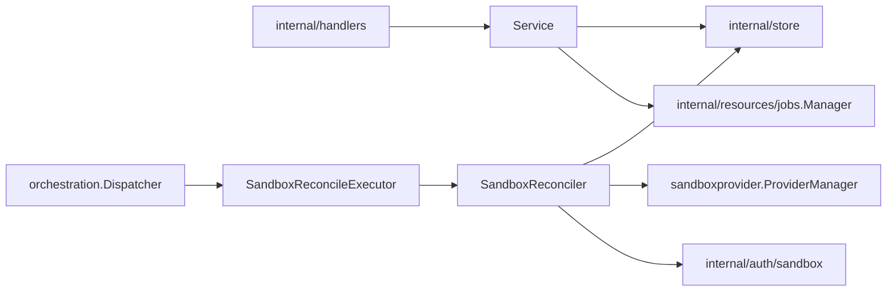

# Sandboxes Design

`internal/resources/sandboxes` owns sandbox API behavior, sandbox lifecycle
reconciliation, sandbox provider catalog access, and sandbox runtime trust
integration.

## Boundaries

- `Service` exposes sandbox API use cases and may call store directly for simple
  reads or non-orchestrated updates.
- Lifecycle intent must go through durable job submission and generation guards.
- `SandboxReconcileExecutor` should stay thin: decode payload, assert
  generation, and call the reconciler.
- Provider runtime operations belong in reconciliation, not in handlers or raw
  stores.
