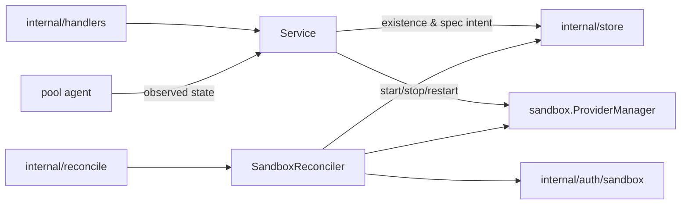

# Sandboxes Design

`internal/resources/sandboxes` owns sandbox API behavior, sandbox lifecycle
reconciliation, sandbox provider catalog access, and sandbox runtime trust
integration.

## Boundaries

- `Service` exposes sandbox API use cases and may call store directly for simple
  reads or non-orchestrated updates.
- Existence and spec intent goes through `recordSandboxIntent`: generation bump,
  desired state, and dirty mark in one transaction.
- `SandboxReconciler` converges existence and spec, and nothing else.
- Provider runtime operations belong in reconciliation or in an explicit
  instruction, never in handlers or raw stores.

## Power is not orchestrated

`start`, `stop`, and `restart` are instructions forwarded to the pool agent
(`power.go`). They write no lifecycle state and bump no generation, and their
responses carry no state — a caller learns the outcome from the project event
the agent's report produces. `DesiredState` answers existence only: `present`
or `deleted`.

Observed state arrives on the agent's reporting channel and lands in
`observations.go`. Two rules there are load-bearing:

- A report never writes intent. Not desired state, not a generation — including
  the report that a sandbox's container is gone, which is news about the world
  rather than a change to what was asked for.
- A complete sync distinguishes "stopped" from "no container", which record the
  same state. Only the second needs a rebuild, and it gets one through a dirty
  mark plus the reconciler's idempotent ensure.

`ensure` creates the container and does not start it. The exception is a
sandbox that has never run — `pending`, or `awaiting_source` resuming after its
push — because asking for a sandbox means asking for one that runs. A rebuild
after the container was lost stays stopped until something uses it, and the
pool agent starts it on demand when that happens.

See [ADR 0017](../../../../docs/adr/0017-resource-state-is-desired-and-observed-with-no-operations.md)
§§9–13.

## Source delivery

A sandbox's source reaches it one of two ways, stated on `GitSource.Delivery`
and decided by the server. Delivery is never inferred from which source fields
are set: a source with nothing to clone from is a malformed request and fails.

- `clone` — the sandbox fetches the source itself, from a remote URL or from a
  local directory bind-mounted into the pool host.
- `push` — the client pushes the source into the sandbox's own Git repository.

`sourceNeedsPush` requires **both** that the provider instance runs sandboxes on
this filesystem (`ProviderDefinition.LocalSourceBind`) and that the client is on
this machine (`Origin.HostID` equals the server's, via `internal/hostid`).
Neither implies the other — a Docker provider on a remote server binds fine,
just not to the caller's files. Unknowns resolve to `push`: a needless push is
slow, a bind of an unreachable path fails.

The push transport is the pre-existing sandbox Git proxy
(`internal/server/sandbox_git_proxy.go` → `pool-agent/githttp`); delivery adds
no transport. The commit is fixed at create in `Checkout.Commit`;
`complete-source-push` only confirms it, and a mismatch is refused.

Waiting is bounded: `StateChangedAt` anchors the deadline and the engine's
future-dated mark wakes the sandbox to fail it. The anchor is stamped only on a
real state change, so neither a reconcile that re-parks nor a repeated runtime
report can push the deadline out.

See [ADR 0001](../../../../docs/adr/0001-sandbox-origin-and-remote-source-push.md).

## Runtime loss

A sandbox whose container disappears is reported by omission from the pool
agent's next complete sync. The service records the observed state, marks the
sandbox dirty, and the reconciler rebuilds the container from the persisted
spec — leaving it stopped, because nothing has asked for it to run.

Duplicate reports, reports from a pool the sandbox has left, and reports older
than the recorded watermark are no-ops.

## Image-backed harnesses

A sandbox selects a persisted image-backed `HarnessConfig`. The selected image
overrides a caller-supplied generic sandbox image. Providers receive only the
harness identity and project-configured non-secret file overlay; run, relaunch,
config, and static file metadata stay inside the image.

`harnessMode` is persisted sandbox intent. Normal/omitted `run` mode applies the
harness secret requirement gate before scheduling, binding each of the harness
config's secrets to its declared env name. `config` mode skips that gate so the
image-owned interactive command can collect required credentials, and instead
binds the secrets a previous configure run created under
`harness.ConfigurePreviousEnvPrefix` (`applyPreviousConfigureSecrets`) — the
same sentinels, under `PREV_`-prefixed names so the harness CLI cannot quietly
authenticate with the old credential. See
`resources/harnessconfigs/DESIGN.md`.
