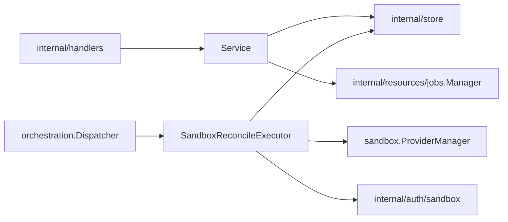
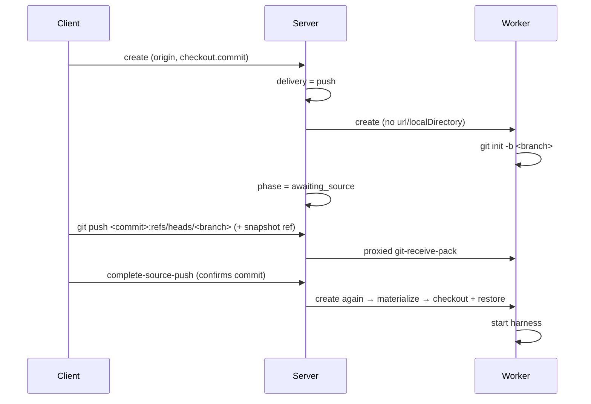

# Sandboxes Design

`internal/resources/sandboxes` owns sandbox API behavior, sandbox lifecycle
reconciliation, sandbox provider catalog access, and sandbox runtime trust
integration.

## Boundaries

- `Service` exposes sandbox API use cases and may call store directly for simple
  reads or non-orchestrated updates.
- Lifecycle intent must go through durable job submission and generation guards.
- `SandboxReconcileExecutor` owns payload decode, generation assertions, and
  sandbox lifecycle reconciliation.
- Provider runtime operations belong in reconciliation, not in handlers or raw
  stores.

## Source delivery

A sandbox's source reaches it one of two ways, stated on `GitSource.Delivery`
and decided by the server. Delivery is never inferred from which source fields
are set: a source with nothing to clone from is a malformed request and fails.

- `clone` — the sandbox fetches the source itself, from a remote URL or from a
  local directory bind-mounted into the worker.
- `push` — the client pushes the source into the sandbox's own Git repository.

`sourceNeedsPush` requires **both** that the provider instance runs sandboxes on
this filesystem (`ProviderDefinition.LocalSourceBind`) and that the client is on
this machine (`Origin.HostID` equals the server's, via `internal/hostid`).
Neither implies the other — a Docker provider on a remote server binds fine,
just not to the caller's files. Unknowns resolve to `push`: a needless push is
slow, a bind of an unreachable path fails.

The push transport is the pre-existing sandbox Git proxy
(`internal/server/sandbox_git_proxy.go` → `worker-agent/githttp`); delivery adds
no transport. The commit is fixed at create in `Checkout.Commit`;
`complete-source-push` only confirms it, and a mismatch is refused.

Waiting is bounded: `PhaseChangedAt` anchors the deadline and the engine's
future-dated mark wakes the sandbox to fail it. The anchor is stamped only on a
real phase change, so a reconcile that re-parks cannot push the deadline out.

See [ADR 0001](../../../../docs/adr/0001-sandbox-origin-and-remote-source-push.md).

## Worker-observed runtime loss

Worker-backed providers report an out-of-band container removal through the
authenticated worker control-plane route. The sandbox service verifies the
worker assignment, atomically records stopped intent (generation bump plus stop
operation), and marks the sandbox dirty. Stop reconciliation treats a missing
runtime as drift: it recreates the sandbox from persisted intent and state, then
stops the retained runtime so observed and desired state converge on `stopped`.
Duplicate, stale-worker, and already-deleting reports are no-ops.

## Image-backed harnesses

A sandbox selects a persisted image-backed `HarnessConfig`. The selected image
overrides a caller-supplied generic sandbox image. Providers receive only the
harness identity and project-configured non-secret file overlay; run, relaunch,
config, and static file metadata stay inside the image.

`harnessMode` is persisted sandbox intent. Normal/omitted `run` mode applies the
harness secret requirement gate before scheduling. `config` mode skips that
gate so the image-owned interactive command can collect required credentials.
