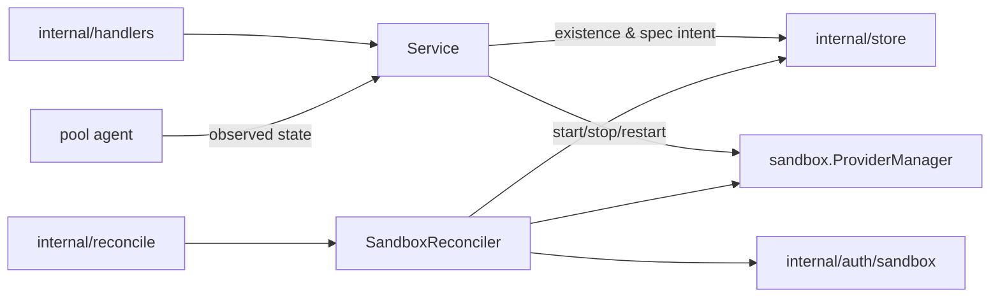

# Sandboxes Design

`internal/resources/sandboxes` owns sandbox API behavior, sandbox lifecycle
reconciliation, sandbox provider catalog access, and sandbox runtime trust
integration.

## Boundaries

- `Service` exposes sandbox API use cases and may call store directly for simple
  reads or non-orchestrated updates.
- Every sandbox carries a harness config (ADR 0025). Resolution at create is
  one chain that always terminates: explicit `--harness` → the project default
  → the reserved `shell` built-in, which is also where a deleted default lands.
  There is no second image path: a sandbox's image is its harness config's.
- Sandboxes created before that rule converge by *upgrade*, not by migration.
  One with no harness config reports `available` regardless of its digest —
  what the upgrade changes for it is adopting the config — and taking the
  upgrade writes the config as well as re-pinning the image. Until it does, it
  says so in its own listing.
- The upgrade rule has exactly one implementation,
  `services.SandboxUpgradeTarget`, called both by the read path that reports an
  available upgrade and by `UpgradeSandbox` which applies one. They were
  separate implementations and drifted: a sandbox could accept an upgrade the
  listing said it did not have.
- A sandbox name is unique within its project (`idx_sandbox_project_name`),
  like a pool's or a harness config's. It is an addressable handle, not a
  label: `disco box ssh-config` emits it as an `ssh_config` `Host` alias, and
  ssh applies the first matching block, so a second sandbox answering to the
  same name would silently take the first one's connections. `CreateSandbox`
  checks the name and returns 409 so the common case is a readable error; the
  index is the authority that closes the race between two concurrent creates.
  Names free up on delete, since deletes are hard deletes (ADR 0010).
- Existence and spec intent goes through `recordSandboxIntent`: generation bump,
  desired state, and dirty mark in one transaction.
- `SandboxReconciler` converges existence and spec, and nothing else.
- Provider runtime operations belong in reconciliation or in an explicit
  instruction, never in handlers or raw stores.

## Power is not orchestrated

`start`, `stop`, and `restart` are instructions forwarded to the pool agent
(`power.go`). They write no lifecycle state and bump no generation, and their
responses carry no state — a caller learns the outcome from the project event
the agent's report produces. `DesiredState` answers existence only: `present`,
`archived`, or `deleted`. Start, stop, and restart are refused with 409 on an
archived sandbox — it has no container to power.

## Existence is three-valued

`archived` is not a power state but a third form of existence: as data, with no
container (ADR 0022 §1). See [ADR 0022](../../../../docs/adr/0022-sandbox-deletion-is-archive-then-confirmed-purge.md).

| API call | Desired state | Shape |
| --- | --- | --- |
| `DELETE /sandboxes/{id}` | `archived` | orchestrated, 202 |
| `POST .../unarchive` | `present` | orchestrated, 202 |
| `POST .../purge` | `deleted` | **converges in the request**, 204 |

Delete archives, because getting a sandbox out of the way is the common request
and the recoverable one. `archive.go` holds the archive branch and retention;
`reconciler.go` holds the rest.

Purge is the one existence change that is not fire-and-forget. Its whole content
is a destructive side effect on a machine the control plane does not own, and a
202 would be a promise the server could not later verify — the row it would check
against is the thing being deleted. So `PurgeSandbox` records intent through the
ordinary `recordSandboxIntent` and then drives that sandbox's reconcile inline,
returning the provider's answer. It is not a second deletion path: the intent and
its dirty mark are durable before the inline attempt starts, so a purge that
fails or loses its client still converges in the background. The row is deleted
only after the provider confirms the data is gone.

Retention: an archived sandbox is purged once it has been archived longer than
`Project.ArchiveRetentionSeconds` (default `DefaultArchiveRetention`, 24h). The
deadline derives from `StateChangedAt` and is never stored — the same reason the
source-push timeout derives its own — and is armed by returning it as
`reconcile.Result.RequeueAt`. `ScanDirty` also returns expired archives, because an archived
sandbox has converged and the generation comparison is blind to it by design, so
a lost mark would otherwise mean data kept forever.

Two rules keep archived sandboxes inert:

- The pool agent's complete sync omits them, exactly as it omits a sandbox whose
  container was lost. `ApplySandboxStateReports` skips them outright — recording
  `stopped` would hand the reconciler drift to repair, and `ensure` would rebuild
  the container the archive just removed.
- The pool agent refuses to start them on demand, so an exec cannot quietly
  undo an archive.

Observed state arrives on the agent's reporting channel and lands in
`observations.go`. Two rules there are load-bearing:

- A report never writes intent. Not desired state, not a generation — including
  the report that a sandbox's container is gone, which is news about the world
  rather than a change to what was asked for.
- A complete sync distinguishes "stopped" from "no container", which record the
  same runtime state. Only the second needs a rebuild, and it gets one through a
  dirty mark plus the reconciler's idempotent ensure.

## Two state fields, one writer each

A sandbox's existence and its power are decided by different components, so
they are stored in different columns (ADR 0034). Neither writer touches the
other's field:

| Field | Values | Owner |
| --- | --- | --- |
| `State` | `pending`, `awaiting_source`, `ready`, `failed`, `archived`, `deleted` | `SandboxReconciler`, and nothing else |
| `RuntimeState` | `starting`, `running`, `stopping`, `stopped`, empty | `Store.ApplySandboxStateReports`, and nothing else |
| `ErrorMessage`, `ObservedGeneration` | — | `SandboxReconciler` |

`ready` means the container has been converged against the spec. It says
nothing about power; empty `RuntimeState` means no agent has reported yet,
which is not `stopped`.

The rule is enforced in the store, not by convention: `Store.UpdateSandbox`
omits `observedSandboxColumns` (the runtime state, its anchor, and the report
watermark) from every write. Without that, any caller that loads a sandbox,
performs a slow operation, and saves it back replays a stale observation — the
reconciler did exactly that across a ~5s `provider.Create`, pushing a sandbox
observed `running` back to `pending` until the next 60s complete sync.

Two consequences worth stating:

- **`SandboxIsLive` takes the sandbox**, not a state string: the question spans
  both fields, and an archived sandbox is never live however it was last
  observed.
- **`displayState` is the composition** and the only thing clients should read
  (`services.SandboxDisplayState`). Existence answers first; the runtime axis
  fills in what the container is doing once existence is settled at `ready`.

`ensure` creates the container and does not start it. The exception is a
sandbox that has never run — `pending`, or `awaiting_source` resuming after its
push — because asking for a sandbox means asking for one that runs. A rebuild
after the container was lost stays stopped until something uses it, and the
pool agent starts it on demand when that happens.

See [ADR 0017](../../../../docs/adr/0017-resource-state-is-desired-and-observed-with-no-operations.md)
§§9–13.

## Source delivery

A sandbox's source reaches it one of two ways, stated on `GitSource.Delivery`
and decided by the server. Delivery is never inferred from which source fields
are set: a source with nothing to clone from is a malformed request and fails.

- `clone` — the sandbox fetches the source itself, from a remote URL or from a
  local directory bind-mounted into the pool host.
- `push` — the client pushes the source into the sandbox's own Git repository.

`sourceNeedsPush` requires **both** that the provider instance runs sandboxes on
this filesystem (`ProviderDefinition.LocalSourceBind`) and that the client is on
this machine (`Origin.HostID` equals the server's, via `internal/hostid`).
Neither implies the other — a Docker provider on a remote server binds fine,
just not to the caller's files. Unknowns resolve to `push`: a needless push is
slow, a bind of an unreachable path fails.

The push transport is the pre-existing sandbox Git proxy
(`internal/server/sandbox_git_proxy.go` → `pool-agent/githttp`); delivery adds
no transport. The commit is fixed at create in `Checkout.Commit`;
`complete-source-push` only confirms it, and a mismatch is refused.

Waiting is bounded: `StateChangedAt` anchors the deadline and the reconcile
returns it as `reconcile.Result.RequeueAt`, which wakes the sandbox to fail it.
The anchor is stamped only on a real state change, so neither a reconcile that
re-parks nor a repeated runtime report can push the deadline out.

Both deadlines are returned rather than marked. A reconciler that marks its own
resource can never settle — see the engine's
[self-marking rule](../../reconcile/DESIGN.md#self-marking).

See [ADR 0001](../../../../docs/adr/0001-sandbox-origin-and-remote-source-push.md).

## Runtime loss

A sandbox whose container disappears is reported by omission from the pool
agent's next complete sync. The service records the observed state, marks the
sandbox dirty, and the reconciler rebuilds the container from the persisted
spec — leaving it stopped, because nothing has asked for it to run.

Duplicate reports, reports from a pool the sandbox has left, and reports older
than the recorded watermark are no-ops.

## Image-backed harnesses

A sandbox selects a persisted image-backed `HarnessConfig`. The selected image
overrides a caller-supplied generic sandbox image. Providers receive only the
harness identity and project-configured non-secret file overlay; run, relaunch,
config, and static file metadata stay inside the image.

`harnessMode` is persisted sandbox intent. Normal/omitted `run` mode applies the
harness secret requirement gate before scheduling, binding each of the harness
config's secrets to its declared env name. `config` mode skips that gate so the
image-owned interactive command can collect required credentials, and instead
binds the secrets a previous configure run created under
`harness.ConfigurePreviousEnvPrefix` (`applyPreviousConfigureSecrets`) — the
same sentinels, under `PREV_`-prefixed names so the harness CLI cannot quietly
authenticate with the old credential. See
`resources/harnessconfigs/DESIGN.md`.

Secret assignments commit in the same transaction as the sandbox row and its
dirty mark (`createSandboxIntent`): the mark wakes the reconciler on commit, so
a reconciler that could observe the sandbox without its assignments would
launch it with no secrets. The miss would be permanent — assignments are
deliberately excluded from the spec fingerprint (see
`SandboxManifest.Fingerprint`), so late-arriving rows never read as drift, and
nothing re-pushes the primary harness's sentinels to a running sandbox. For the
same reason the reconciler fails the reconcile when it cannot read the
assignments or the harness config, rather than degrading to a secretless
launch.
