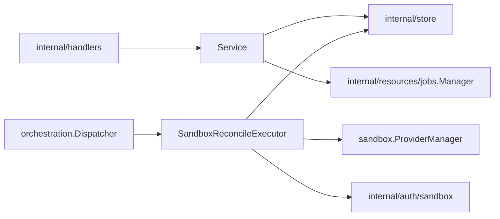

# Sandboxes Design

`internal/resources/sandboxes` owns sandbox API behavior, sandbox lifecycle
reconciliation, sandbox provider catalog access, and sandbox runtime trust
integration.

## Boundaries

- `Service` exposes sandbox API use cases and may call store directly for simple
  reads or non-orchestrated updates.
- Lifecycle intent must go through durable job submission and generation guards.
- `SandboxReconcileExecutor` owns payload decode, generation assertions, and
  sandbox lifecycle reconciliation.
- Provider runtime operations belong in reconciliation, not in handlers or raw
  stores.

## Image-backed harnesses

A sandbox selects a persisted image-backed `HarnessConfig`. The selected image
overrides a caller-supplied generic sandbox image. Providers receive only the
harness identity and project-configured non-secret file overlay; run, relaunch,
config, and static file metadata stay inside the image.

`harnessMode` is persisted sandbox intent. Normal/omitted `run` mode applies the
harness secret requirement gate before scheduling. `config` mode skips that
gate so the image-owned interactive command can collect required credentials.
