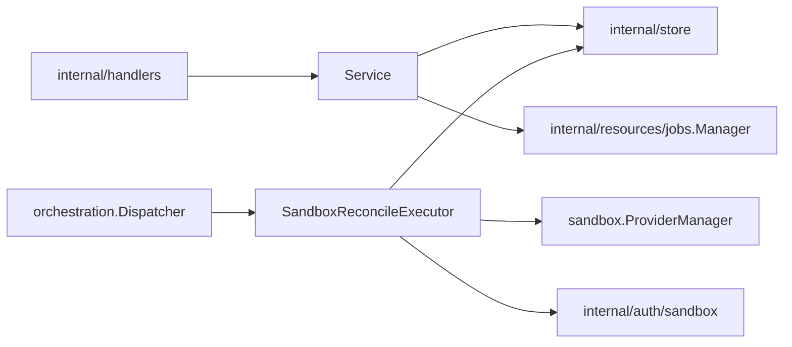

# Sandboxes Design

`internal/resources/sandboxes` owns sandbox API behavior, sandbox lifecycle
reconciliation, sandbox provider catalog access, and sandbox runtime trust
integration.

## Boundaries

- `Service` exposes sandbox API use cases and may call store directly for simple
  reads or non-orchestrated updates.
- Lifecycle intent must go through durable job submission and generation guards.
- `SandboxReconcileExecutor` owns payload decode, generation assertions, and
  sandbox lifecycle reconciliation.
- Provider runtime operations belong in reconciliation, not in handlers or raw
  stores.

## Inline harness config

A sandbox create request may carry an ad hoc `harnessConfig` (`model.InlineHarnessConfig`:
install/run/relaunch commands, files, secret declarations) directly, instead of
referencing a persisted `HarnessConfig` by ID. This lets a caller launch a sandbox
whose primary terminal runs a fully specified, one-off harness process with no
project-scoped HarnessConfig record — used by the harness config definition
`configure` step (see
[`../harnessconfigs/DESIGN.md`](../harnessconfigs/DESIGN.md)), and available to any
other caller with the same need.

`Sandbox.InlineHarnessConfig` takes precedence over `Sandbox.HarnessConfigID` when
resolving the sandbox's primary terminal. Resolution happens once, centrally,
in `createOptionsFromSandbox` (`reconciler.go`): inline configs build
`ResolvedHarnessConfig` directly (no built-in definition to resolve against,
since they are already fully specified) under the synthetic ID
the synthetic ID `inline`; referenced configs resolve through `harnessdefs.Resolve`
as before. Providers consume `CreateOptions.ResolvedHarnessConfig` uniformly and
do not need their own inline-vs-referenced branching.
