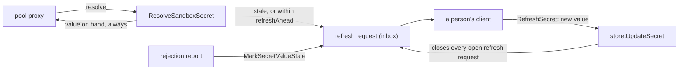

# Secrets Design

This package owns credentials: their storage, the approval lifecycle that
authorizes them, and the two ways a sandbox comes to use one. It also owns host
trust ([below](#host-trust)), the other thing an agent asks a person for.

Cleartext leaves the control plane through exactly one door — `ResolveSandboxSecret`,
called by a pool agent's proxy for one sentinel and one destination host. An
approved answer names the secret beside its value, which the proxy records on
the request it swaps the value into
([ADR 26-10-01-240](../../../../docs/adr/26-10-01-240-a-swapped-request-records-the-secrets-it-spent.md)).
Every other surface here deals in sentinels, requests, and grants.

## Grants authorize; requests are the inbox

A `SecretGrant` is the durable authorization: a secret, a scope (sandbox,
harness config, or project), a host, and an expiry. A `SecretRequest` is only a
question someone asked, and approving one mints a grant. Revoking the grant
takes the credential away even though the request row stays approved — the
request is history, the grant is the authority.

## Two species of request

They share a table and are handled apart on purpose (ADR 0031 §5). Declared uses
are what tells them apart (`SecretRequest.FromProtocol`).

| | Reactive | Protocol-originated |
| --- | --- | --- |
| Origin | The proxy hit an unresolvable sentinel | An agent asked, through the agent credentials protocol |
| Carries | type, host, sandbox | plus name, env var, justification, declared uses, and optionally the lifetime asked for |
| Approval mints | a grant at the chosen scope | a sandbox-scoped, host-scoped grant with minted use IDs, and a stable binding |

A protocol-originated ask that repeats an open one — same sandbox, variable,
host, well-known ID and purpose, and the same uses and lifetime — is answered
with the open request rather than a second inbox item (`asksTheSame`). An ask
for other uses of the same credential is a request of its own: folding it into
the open one would drop the uses it named while telling the agent it had asked.

A third species shares the table and is not an ask for a grant at all: a
**refresh request** (`Reason: refresh`, `SecretRequest.IsRefresh`) asks for a new
value of a token the project holds. It is never approved; see
[below](#a-token-may-expire-and-suggest-its-renewal).

The lifetime an agent asks for (`SecretRequest.GrantTTL`) is recorded, never
enforced: it is what the window opens on and what an approval that names no
lifetime grants (`defaultApprovalTTL`: the ask, else `agentcreds.DefaultGrantTTL`,
an hour, fitted within the secret's limit), so approving reads nothing first; an
approval that names one still takes whatever lifetime it is sent. It is not checked against a
secret's limit at the ask, because which secret answers is the approval's
choice. Zero is no ask, not forever.

It is bounded, though, at `agentcreds.MaxGrantTTLSeconds` — thirty days — and an
ask outside `1..max` is a 400. The bound is not about what a grant may be; it is
about what a *suggestion* may be. An ask becomes the answer a human is shown
already chosen, so an unbounded one is how forever arrives under another name: a
ten-year ask a keystroke away from approval, or one large enough to overflow the
duration the window converts it to and land back at zero.

The proxy's ask is deduplicated to one pending request per sandbox, secret, and
host. An agent's ask is deduplicated per sandbox, variable, well-known ID,
purpose, and set of hosts — the same hosts in another order are the same ask
(ADR 26-10-02-393 §3). A request made through the API (`CreateSecretRequest`) is the reactive
species without a sandbox: it names a type and host, and is approved on the spot
when a project-wide grant on a matching secret already covers it.

Approving a protocol request is stricter than approving a reactive one, and the
strictness is refused rather than silently relaxed:

- **A concrete host is mandatory.** `FindLiveGrant` matches the destination the
  proxy actually observed, so the hosts are what stop a token being swapped
  toward somewhere it was not approved for. A wildcard grant stays an explicit
  administrative act via `discobox secret grant create`.
- **Sandbox scope only.** The agent asked on behalf of one sandbox; approving it
  project-wide would answer a question nobody asked.
- **Use IDs are always minted here.** A requester supplies descriptions, never
  IDs, so an agent cannot name the use it will later present. An approver may
  rewrite the descriptions; supplied IDs are dropped either way.

**An approval is one write.** Rebinding the answering secret and setting its
grant limit (`secretHost`, `secretMaxGrantTTLSeconds`) ride on the approval. The
secret is re-read inside the transaction, the change is applied to it, and the
grant is checked against the result. Only the fields sent are written, so a
concurrent edit to the other one stands. The change, the grant, the agent
binding, and the request marked approved share one transaction. A refusal
anywhere, such as a variable a live grant still delivers from another secret or
a request answered concurrently, leaves none of them behind. A gate's host cannot change, as in `UpdateSecret`.
A discobox answering the inbox approves with the secret as it is, because its
role changes no secret. It sees and answers only the requests it owns — filed by
a discobox it created: the sandbox role decides that for one request by its ID,
and `ListSecretRequests` filters the listing with `store.OwnedBy`
([ADR 26-09-30-782](../../../../docs/adr/26-09-30-782-a-discobox-answers-its-own-discoboxes-requests-within-what-it-may-delegate.md) §2).

### A request and its grant name a list of hosts

`SecretRequest.Hosts` and `SecretGrant.Hosts` are lists (ADR 26-10-02-393): one
credential a tool sends to unrelated sites — Copilot CLI's GitHub token, at
`api.github.com` and `githubcopilot.com` — is one ask, one grant, one use. A
grant covers a destination any of its hosts covers (`hostscope.CoversAny`); no
hosts is the wildcard. Every check reads the list: the grant lookup, the secret
binding (each host inside it, `guardGrantHosts`), the delegation a discobox
approves under (`hostscope.CoversEvery`), and `ApprovedUse`, which names the
one host covering this destination so the judge is told where *this* request
is approved for.

`hosts` is the only spelling on the API (ADR 26-10-02-393 §4). A body that
leaves it out takes the default — the secret's host for a grant, the request's
hosts for an approval — and one that sends an empty list names none, which is
how a grant asks for the wildcard (`askedHosts`).

## Two ways to reach the agent credentials shape

A credential the sandbox cannot read — no environment variable, no
`secrets.json`, no sentinel in the proxy's match set — is a `SandboxSecret`
marked `AgentRequested` plus a grant carrying uses. Nothing else produces it,
and the two halves are what make it work: the flag keeps the credential out of
the sandbox, and the uses are what `discobox-access` names to take a value
(`ListLiveAgentGrants` matches only a grant that has some).

**The grant may be wider than the binding.** A grant carrying uses is matched
at any of the three scopes — the discobox, its harness config, or the project —
because the per-discobox part is only the binding, and that is minted lazily:
`ListLiveAgentCredentials` starts from the grants covering this discobox and
ensures each has a sentinel bound here, the first time that discobox's agent
asks what it may use. A grant on a project cannot bind in advance, since the
boxes it covers may not exist yet. Minting on a read path is deliberate; the
alternative is a reconciler chasing every discobox against every grant,
including ones nobody has created.

Two grants naming one environment variable cannot both be delivered, so the
narrower scope keeps it and the wider is passed over — silently swapping which
credential an agent's next command carries is the surprise this flow exists to
prevent. The variable itself lives on the grant (`SecretGrant.EnvName`) for the
same reason the binding is lazy: at project scope there is no binding yet to
carry the name.

Two paths mint that pair, and they mint the same thing:

- **Approving an agent's request**, which is the flow ADR 0031 describes: the
  agent says what it needs and why, and a person answers.
- **`CreateSecretGrant` with uses**, the pre-approval: somebody who already
  knows the answer grants it ahead of the asking. It carries the same
  obligations — concrete hosts, use IDs minted here, and an environment
  variable naming where the wrapped command receives it — but may sit at any of
  the three scopes. A sandbox-scoped one binds immediately, and a failed binding
  deletes the grant, as a failed approval leaves none; a wider one binds lazily as
  above.

A grant with no uses is the ordinary standing kind: it authorizes the sentinel
the sandbox is already provisioned with, which anything in the sandbox can
read. An environment variable without uses is refused rather than ignored:
there is no delivery to name.

## Well-known credentials

A request may name a well-known credential by ID, from the root `wellknown`
registry. `wellknown.go` owns it.

- **An ask by ID** carries the name, variable, and host the ID names
  (`wellKnownAsk`); an ask that spells out something the ID contradicts is
  refused. The ID's host is the site, and an ask may name a host beneath it —
  `api.github.com` under `github.com` — which is the narrower ask, not a
  contradiction. The request keeps `WellKnownID`, which is part of the key an open
  ask is reused under: a plain ask for the same variable and host binds
  differently, so it is a different ask.
- **Approval binds by ID** (`wellKnownSecret`). The ID resolves to the project
  secret marked with it (`Secret.WellKnownID`); an approval that names no
  secret and finds no mark is refused. The first approval that goes through
  marks the secret it bound, so nobody is asked again which secret answers the
  ID — written last, once the grant is minted and bound, so a secret whose
  approval failed never becomes the answer. A later approval may still name
  another secret, which answers that one request and marks nothing.
- **A secret may be created for an ID** (`CreateSecretBody.wellKnownId`,
  `answersWellKnown`): the mark the first approval would set, set by the
  person storing it, so no request ever asks which secret answers. A token
  only; an ID another secret already answers is a 409, and a gate is refused,
  since its secret is made by approving a request for it.
- **A gate has nothing behind it** (`wellknown.Credential.Gate`; today
  `ai.discobox.sandbox`, the discobox API —
  [ADR 0140](../../../../docs/adr/0140-a-discobox-reaches-the-discobox-api-through-its-pool-with-a-fixed-role.md)).
  Approving one names no secret: the first approval creates the project's gate
  secret (`gateSecret`), marked with the ID, whose value is random filler, and
  every later grant of it is of that secret — grants and bindings are always
  of a secret. `ResolveSandboxSecret` never hands a gate's secret out; the pool
  admits a live use of it at its host instead. Its value and host are not
  edited (`UpdateSecret` refuses both): access is taken back by revoking its
  grants, or deleting it. Listings mark it as a gate. A free-form ask for a gate's host
  is refused (`reservedHostAsk`): only an ask by its ID may open it. A gate
  is handed on only by a person (`gateGivenOnlyByAPerson`): a discobox may not
  approve a request for one, nor give one at create by its ID or its secret's.

## A discobox created with uses

A create may give the new discobox uses of project secrets
(`CreateSandboxBody.grants`), each naming a secret and a variable, or a
well-known credential by its ID (`sandboxGrantTarget`). An ID is read as an ask
by ID is — its variable and host are its own, a host may only narrow it — and
answers with the project secret marked for it, so only the person who first
approved the ID chooses that secret. A gate is not given this way: the discobox
API lets its holder give credentials in turn, so a person grants it.
`PrepareSandboxGrants` checks each as a person's
grant of the same shape is checked — a concrete host within the secret's
binding (`guardGrantHosts`), a lifetime within its limit (`guardGrantTTL`), at
least one use, one credential per variable — and builds the use grants and
agent bindings without storing them; the sandbox create stores them in the
transaction that stores the discobox, so a create that cannot give them all
creates nothing. A grant a sandbox makes records the sandbox as its granter
(`grantedByOf`).

A discobox giving them is held to what it may hand on, as when it approves a
request
([ADR 26-09-30-782](../../../../docs/adr/26-09-30-782-a-discobox-answers-its-own-discoboxes-requests-within-what-it-may-delegate.md)
§1): each grant is made under a live delegation grant it holds of that secret,
covering the host and fitting the lifetime it named (`delegationsOf`,
`delegationsFitting`), whose uses the judge finds its uses within — chosen as
an approval's is ([below](#delegation-grants)), every grant at once, once
every grant has passed what can refuse it without the judge
(`judgeDelegations`, the new discobox as `ForSandboxID`). A lifetime it did
not name is then fitted to the delegation chosen. The create's transaction
holds each grant to its delegation again (`HoldDelegations`), so a delegation
revoked in between creates nothing.

## Delegation grants

A grant's `Purpose` is what it authorizes its holder to do: `use` the
credential, or `delegate` it to other discoboxes.
One or the other, never both: a person approving a grant agrees to one thing,
and a discobox that needs both holds two grants.

- **A delegation grant authorizes nothing its holder sends.** It binds no
  sentinel, is offered by no broker listing, and is skipped by every lookup
  that hands a credential out (`FindLiveGrant`, `ListLiveAgentGrants`;
  `SecretGrant.MayUse`).
- **It is one discobox's, with uses** (`guardPurpose`, in `mintGrantAs`
  beside the host and lifetime guards): a grant wider than a discobox has
  nobody in particular to delegate it, and one without uses has nothing a
  delegation could name.
- **An agent may ask for one.** An agent credentials request carries a
  `Purpose` (`SecretRequest.Purpose`, `use` unless the agent asked to
  delegate), and approving it mints a grant with that purpose. An ask to
  delegate binds nothing on approval, and is its own question rather than a
  retry of an open ask to use (`FindPendingAgentCredentialRequests` keys on it).
  Only a person approves one: a discobox never hands on the power to hand on.
- **It bounds what its holder hands on by approving**
  ([ADR 26-09-30-782](../../../../docs/adr/26-09-30-782-a-discobox-answers-its-own-discoboxes-requests-within-what-it-may-delegate.md)
  §3, `delegated_approval.go`). A discobox approving one of its discoboxes'
  requests answers it with the secret of a live delegation grant it holds
  (`ListLiveDelegationGrants`), not by choosing among the project's — its
  `ListSecrets` holds only those (`store.DelegatedTo`): one that
  covers the host asked for, of the secret marked for a well-known credential,
  and — when it was delegated more than one that fits — the one it names.
- **An approval is made under one delegation that holds it.** Of that
  secret's delegations, those the lifetime fits are candidates
  (`delegationsFor`, `delegationsFitting`): one the approver named must end no
  later than the delegation, and one nobody named needs a delegation with
  time left. Whether the uses handed on — the request's, or the ones the
  approver narrowed them to — fall within a delegation's uses is a reading, so
  it is asked of the project's judge (`judgeDelegations`, through
  `services.JudgeService.JudgeDelegation`) before the transaction — last,
  after every check that can refuse without it — once per candidate, each on
  its own: never against several delegations' uses together, which no one
  delegation the grant is bounded by, held to, and traced to would hold.
  The approval is made under the longest-lived the judge says yes to.
  - **Asks go one after another, and the first yes ends them**, so the one
    allow verdict an approval leaves names the delegation it was made under,
    and the project's judge — shared with every request — is asked no more
    than the choice needs. They share one deadline
    (`services.DelegationBound`) that fits the pool gate's two minutes.
    Candidates whose uses read the same are asked once, of the longest-lived.
  - **Anything but an explicit yes refuses**, including no judge at all. A
    refusal under every candidate names each one's reason; a judge that could
    not answer about one, when none said yes, is the refusal given instead,
    since that one might have.
  - **The chosen delegation is read again** by its ID in the approval's
    transaction (`delegatedTTL`): still live and covering the host, with the
    uses the judge read, a lifetime nobody named fitted to its remaining time
    and one the approver named refused if it does not fit.

  The delegation verdict names the delegation grant
  (`GrantID`) and the request being approved (`SecretRequestID`), and the
  request names the grant the approval minted: that chain is how a handed-on
  grant is traced to the delegation that allowed it. A request that names no uses is a person's, since a grant without
  uses authorizes everything sent to its host.

## The agent credentials broker

`agentcredentials.go` is the control-plane half of ADR 0031. A pool agent calls
it for one of its own sandboxes, and every entry point re-derives the sandbox
from the calling pool rather than trusting the caller about which sandbox it
speaks for. Nothing here returns a value.

The binding it creates on approval is a `SandboxSecret` marked `AgentRequested`,
and that flag is the whole of its difference: it never reaches the sandbox
environment, `secrets.json`, or the proxy's sentinel set. It exists so the pool
agent's ephemeral sentinels have a stable one to translate back to. The store
enforces this rather than each caller — `ListInjectedSandboxSecrets` is what
every injection path uses, and `ListSandboxSecrets` returns everything for the
few callers that need the full picture.

**A binding outlives its grant, and holds its variable only while a grant
delivers it.** Revoking or lapsing a grant leaves the binding (it goes with the
discobox), and a binding with no live grant gives the discobox nothing: a resolve
hands a value out only under one. So `store.BindAgentSecret`, which every path
that binds an existing discobox goes through — approval, a sandbox-scoped
`CreateSecretGrant`, and the lazy binding in `ListLiveAgentCredentials` — rebinds
a variable held by another secret when no live use grant at any scope covering
the discobox (`store.SandboxGrantScopes`) names that secret for that variable.
While one does, it refuses with a 409 naming that grant, which is the one to
revoke; the lazy binding passes the contested grant over instead, so one
variable two grants name does not fail every credential the discobox has. The
check and the rebind share a transaction holding the binding's row, so an
approval of the bound secret committing alongside cannot be rebound out from
under. A first bind has no row to lock, so one that loses the race to create
it binds once more, finding the winner's row, and a second collision is a 409. A discobox being created has nothing bound yet, and its bindings are
built with `store.NewAgentBinding` and stored with it. A standing grant of the
same secret does not hold it: it authorizes the injected sentinel, never this
one. A rebind mints a fresh sentinel, so an activation minted under the old
secret resolves to nothing rather than to the new one. Revocation does not
reach into the pool agent's proxy: a cached value is re-resolved in the
background on its first use past the proxy's refresh interval (30s) and is
never held past its activation (5m) or the proxy's cache ceiling, so a revoked
grant's value outlives it by that interval, not until its old expiry.

The entry points:

- **`ListSandboxCredentials`** — what the agent may use: the live grants with
  uses covering this discobox, each with its (lazily minted) binding.
- **`CreateSandboxCredentialRequest`** — records the ask as a pending request
  and returns at once; the caller polls. An identical pending ask (same
  sandbox, env var, host, well-known ID, purpose) is reused rather than
  duplicated.
- **`GetSandboxCredentialRequest`** — a sandbox's own protocol request and, once
  approved, its grant. `AgentCredentialRequestStatus` reports an approval whose
  grant has since been revoked as `denied`.
- **`ApprovedUse` / `ApprovedCredentialUse`** — what a request, or a command,
  is judged against: the approved sentence, the credential's name and the host,
  read from the live grant, never from what a pool sent. `ApprovedUse` also
  matches a host trust's use for its host; `ApprovedCredentialUse` matches only
  a credential's, since only one of those takes a value. Verdicts are recorded
  by `judges`, not here, against the grant these hand it (ADR 26-09-22-838 §3).
  Rows of kind `command` and origin `sandbox`, with `Volunteered`, predate that:
  a discobox's own judge's word, relayed by its pool, and kept readable.
- **`ListCredentialVerdicts`** — the read side, for a project's members rather
  than a pool: every recorded verdict in the project, of every kind, newest
  first, narrowed by kind, sandbox, use, grant, allow/deny and a start time. It never looks the sandbox
  up. A verdict outlives its sandbox's purge, and the sandboxes whose trail is
  worth reading are often the ones already gone, so the sandbox is a filter on
  the recorded ID and the route is `/projects/{projectId}/credential-verdicts`
  rather than one under the sandbox (ADR 0130 §5). Verdicts are removed only
  when their project is deleted.
- **`ListSecretRefreshEvents`** — the refresh trail (ADR 26-09-25-122 §6), at
  `/projects/{projectId}/secret-refreshes`: each refresh request as its
  `asked` event at `CreatedAt` and, once closed, its `answered` or `dismissed`
  event at `ClosedAt`. Two events rather than one row because the trail is read
  forward by time and a request changes after it is asked. Both times are
  stamped in UTC, as a verdict's is, because the bounds are compared in SQL; the
  limit is exact because requests are ordered by their event nearest the
  reading edge. Never a value; the answer is the client's account.

A protocol request is always recorded as type `token`. Both types carry their
current value in `Value.Token`, the one field `ResolveSandboxSecret` emits, so
either works through this flow.

## Host trust

`hosttrusts.go` is the control-plane half of
[ADR 0149](../../../../docs/adr/0149-a-host-certificate-is-trusted-for-one-sandbox-when-a-person-pins-it.md):
an agent's ask, relayed by its pool, to trust a host whose certificate the
pool's egress refuses. It sits here because it is the broker's act — an ask, a
person's approval, uses the judge reads — about a different thing, and it
reuses the broker's pool-ownership check and use minting. It is its own
resource all the same: `HostTrustRequest` and `HostTrust` are their own
tables, served through `services.HostTrustService`, and nothing in a
credential path reads them.

- **The chain is the pool's.** `CreateSandboxTrustRequest` records the chain
  the pool observed and a CA the agent supplied, which the pool has already
  checked the chain verifies against. The sandbox's word about the host is
  never stored.
- **A pin names something the request offers.** `ApproveTrustRequest` refuses
  a `ca` pin that is not a CA in the chain or the supplied one, and a
  `leaf-spki` pin that is not the leaf's key; with none named it takes
  `DefaultTrustPin` — the supplied CA, then a self-signed CA in the chain,
  then the leaf's key. The trust carries the pinned CA's PEM for the proxy.
- **Only a person approves one**: a sandbox principal is refused, since a pin
  decides who the sandbox's credentials for that host are handed to.
- **A trust is one sandbox's and always lapses.** Its routes are under the
  sandbox, it is deleted with the sandbox (`deleteSandboxHostTrustsTx`), and
  its lifetime runs from an hour by default to thirty days at most.
- **`ListPoolHostTrusts`** is what a pool's proxy enforces: the live trusts of
  every sandbox on it. A revoked or lapsed trust leaves it, and a poll of the
  request that minted it answers `denied`, as a revoked grant does.

The window's inbox is `GET /projects/{projectId}/approval-requests`, a read
model in the handlers over this resource's `ListSecretRequests` and
`ListTrustRequests`: one call per server per beat, each item answered on its
own resource's routes.

## Three types, all doing work

A secret is a **token**, an **oauth** credential, or an **exchange** credential,
and nothing else.

`token` is one opaque string, not named after an HTTP scheme: the proxy swaps
the value into whatever header the sandbox put it in — `x-api-key`,
`PRIVATE-TOKEN`, `Authorization` — so a name like `bearer` would state a
requirement nothing enforces. `oauth` is a token that rotates, and the
distinction is load-bearing: `ensureFresh` refreshes a near-expired access
token on resolve and the resolution's expiry is capped by the token's own
(ADR 0011). `exchange` is fields a person stores, such as an API key, that the
server trades for a short-lived token (ADR 26-10-08-452; see
[Exchange](#exchange)). All three swap identically, because the current token
of each lives in the same field.

There is no username/password or private-key type: cleartext leaves only
through `ResolveSandboxSecret`, which emits `Value.Token`, so such a credential
has no path into a sandbox. `migrateSecretTypes` (in `internal/database`'s
`DB.Migrate`, at every startup) holds stored data to these types: it renames
`bearer` rows to `token` and deletes `git` and `ssh` ones with the grants,
requests, and bindings standing on them. The API validates the enum on the way
out as well as in, so one row left behind would fail to serialize and take the
whole secret listing with it.

## What the API says about a credential

The value goes in and never comes back. `SecretValue` is a request shape only:
the token, and for an OAuth credential the refresh token, token URL, client id,
client secret, scopes, subscription type and access-token expiry. That is enough to register
one by hand — a credential captured somewhere else, or rotated outside a
configure flow — rather than only through a harness's login.

What comes back is `Secret.oauth`: where it renews, whose client it is, what the
grant may do, which plan it belongs to, when the access token goes stale, and
whether it can renew itself at all. Never the access token, never the refresh
token. It is read out of the encrypted value on the way past, because that is
where the metadata was captured with the tokens; a value that cannot be
decrypted leaves the summary empty rather than failing the read.

`oauth` means *renews itself*. Creating one without a refresh token and a token
URL is refused: what has been handed over is a token that will expire and stay
expired, and the type would promise a refresh nothing can perform.

A refresh is the client's to authenticate, as the code exchange was (RFC 6749
§6). A public client (PKCE, no secret) refreshes with its client id alone; a
confidential one also needs its client secret, which whoever ran the sign-in
hands over with the tokens (ADR 26-10-07-005 §4: discobot signs in, discobox
refreshes). It is sealed with the rest of the value, sent as `client_secret`
in the refresh body when present, carried through every rotation, and never
returned. The server runs no authorization flow of its own.

## A token may expire, and suggest its renewal

A `token` may carry a lifetime (`TTL`) and a refresh command
([ADR 26-09-25-122](../../../../docs/adr/26-09-25-122-a-token-may-expire-and-suggest-the-command-that-renews-it.md)).
Delivery and renewal are separate loops, and `refresh.go` owns both halves here.

- **Delivery never waits.** Resolve serves the stored value, capping the
  resolution at the value's stale time (`Secret.StaleTime`: an expiry the value
  carried, else `ValueUpdatedAt + TTL`). A stale value is still served, for
  `staleResolutionTTL`, because a lifetime is an estimate and the upstream is the
  authority.
- **Renewal is asked for, not performed.** A resolve of a value stale or within
  `refreshAhead` of it opens one refresh request per secret, naming the
  discobox that last needed it. The command is advice to the client that
  answers: nothing on this side runs it, and nothing checks a value came from it.
- **Any value write answers it.** `store.UpdateSecret` stamps `ValueUpdatedAt`
  on a replaced value unless the writer stamped it already, and closes every
  open refresh request (`via: update`). `RefreshSecret` closes them first with
  the client's own account of the value (`SecretRefreshAnswer`), and when it
  names a request, the first answer wins: one already answered is a 409 and
  writes nothing.
- **A refusal of a renewable token is not a rejection.** `Secret.Renewable`
  tokens skip `judgeRejection`: the value is marked stale and a refresh request
  opened (`renewableRejection`), except within `rejectionAfterRenewal` of a
  write, when the report may be about the value just replaced.
- **A command's value lasts 5m unless named otherwise**, or what its
  well-known credential says (`wellknown.Credential.RefreshTTL`,
  `defaultRefreshTTL`): GitHub's token lasts until revoked, so a day.
- **One open refresh request per secret**, held by a partial unique index
  (`idx_secret_request_open_refresh`), so two resolves racing past the find
  cannot both open one; the loser's create conflict is "already open".
- **The value's fields have their own writer.** `store.UpdateSecret` leaves
  `value_updated_at` and `value_expires_at` out of a write that keeps the value,
  so a rename read before a rejection cannot put back what the rejection
  marked; `MarkSecretValueStale` refuses, in its `WHERE`, a value written within
  `rejectionAfterRenewal`.
- **A discobox never reads a refresh command or answer.** The sandbox role lists
  secrets and requests for names and bindings (ADR 0140 §4); a command a person
  wrote can name a vault path or carry a credential, so it and the answer
  recorded against a request are withheld from a sandbox principal
  (`withholdRenewalFromSandbox`, `withholdAnswerFromSandbox`).
- **Only a person renews.** A command is a secret write, which the sandbox role
  lists none of. A discobox may not approve, dismiss, or answer a refresh
  request; approving one is refused for anybody, since there is no grant to mint.

## A secret's host is a binding somebody set

`Secret.Host` is optional and is only ever set explicitly — `--host` at create
or update, the approval dialog proposing the host a request named, or a harness
configure command naming the host of a secret it outputs. Nothing infers it:
the provider table in the root `secretformat` package describes how a
credential is *shaped*, so a sentinel can byte-mimic it, and says nothing
about where it belongs. A host guessed from four leading characters is a
binding nobody chose, and being wrong in the narrow direction is how the
credential that plainly answers a request becomes the one an approver cannot
pick.

A secret that carries one may be used for that host and the hosts beneath it,
and nowhere else. That is checked twice, because the two checks answer
different questions:

- **`guardGrantHosts`, when a grant is minted** — refuses an approval that
  would point the credential outside its binding at any of the grant's hosts,
  which is the typo worth catching while somebody is still looking at it.
- **`ResolveSandboxSecret`, when the value is handed out** — the same test
  against the destination the proxy observed, so a grant written before the
  binding existed does not outlive it.

A secret with no host is unconstrained by this, and the grant is what scopes it.
A binding stays one host: a credential sent to unrelated sites is an unbound
secret whose grants list them (ADR 26-10-02-393 §2).

## A secret's grant limit is a ceiling, not a default

`Secret.MaxGrantTTL` is the longest a grant on that credential may live, and the
lifetime a standing grant takes when nobody names one. Both jobs, one number: the
value a person reads on the row is the value that binds. An approval that names
no lifetime is fitted within it rather than given it: it grants what the agent
asked for, else an hour.

`guardGrantTTL` enforces it beside `guardGrantHosts`, in `mintGrantAs`, for the
same reason: the lifetime arrives from an approval, a pre-approval, or the
in-sandbox flow, and a rule enforced in one of those is a rule the other two
walk around. Over the limit is refused, and so is a grant that never expires —
that case is named separately in the message, because it is not "longer"
arithmetically and it is the one an approver reaches for.

**Zero is the meaningful value "no limit"**, not an unset field: grants on such
a credential may live forever, which is how an unlimited credential says so out
loud. Two consequences follow. The column carries no GORM `default`, since GORM
omits a zero-valued field from an INSERT when one exists and would quietly
substitute an hour for "no limit"; the service owns the default a creator who
names none receives (`defaultMaxGrantTTLSeconds`, an hour). And every writer
says the lifetime explicitly rather than dropping a zero, or the same
substitution happens a layer higher.

Lowering a limit binds what is granted next, not what already stands: a live
grant is an authorization somebody made, and it is revoked deliberately rather
than shortened behind their back.

**A harness's own credential carries no limit.** The configure flow creates the
secret, binds it, and grants it at harness scope with no expiry — a harness that
stops working an hour after it was configured is a harness nobody configured —
so a ceiling there would describe a lifetime that grant does not have, and would
refuse the next grant somebody writes for it. That grant is minted through the
store rather than through `mintGrantAs`, which is why the limit never applied to
it either way; stating the zero is what makes the record agree with the
authorization. `liftConfiguredSecretGrantLimits` zeroes the limit on
configure-created secrets, and only on rows still carrying the old 3600 column
default, so a limit somebody chose is kept.

## What a host scope covers

A host on a grant, a secret, or an approved use is a **scope**, read by the
root [`hostscope`](../../../../hostscope) package: it covers itself and
everything beneath it, and never its parent. `github.com` answers for
`api.github.com`; `api.github.com` answers for neither `github.com` nor
`uploads.github.com`.

The relation is one-way because the two directions are not the same act.
Narrowing a credential to a host under its binding is the approver being
careful. Widening one to the host above it hands the credential to a different
service — the one the site's other subdomains belong to — which is what the
binding said it was not for.

Every check reads it and they must agree: `FindLiveGrant` matching the
destination the proxy observed, `ResolveSandboxSecret` holding that destination
inside the secret's binding, `guardGrantHosts` refusing a grant outside it, and
the pool agent's activation check. `FindLiveGrant` therefore matches the host
in Go rather than in SQL, and prefers the narrowest covering grant
(`hostscope.Specificity`). Hosts are stored through `hostscope.Normalize`
(lowercased, no port), the form the proxy reports.

## A refused credential is recorded, and only the unfixable kind

`rejections.go` is the control-plane half of [ADR 0132](../../../../docs/adr/0132-a-credential-rejected-after-its-retry-is-recorded-against-its-secret.md).
A pool agent's proxy reports what an upstream made of a credential it swapped
in — `rejected`, `rejected-after-retry`, or `accepted` — and this decides
whether that needs a person. The proxy cannot: it knows a value was refused,
and whether that is recoverable depends on what kind of credential it is and
whether it can be renewed, neither of which it may ever be told.

The judgment, in one line each: a `token` has nothing to renew, so the refusal
is the answer; an `oauth` credential is **renewed first**, past
`oauthRefreshSkew` and through the same singleflight as every other refresh,
because an access token can die before its stated expiry while its refresh token
is perfectly good. A renewal that produced a new token clears everything and
says nothing — the proxy dropped its cached copy on the way here, so the next
request carries the new value.

**Only an answer is a verdict** (`renewal`, in `oauth.go`). A 4xx from the token
endpoint is a refusal and is recorded; an unreachable or 5xx endpoint, a value
that will not decrypt, and a forced refresh that joined a *non*-forced one on
the shared singleflight are all `renewalUnavailable` — nothing is recorded, and
the next report tries again. Recording one of those would ask a person to redo a
sign-in they do not need, and then suppress the renewal that would have worked.

Three windows bound the work, and they are deliberately different lengths: the
proxy reports one rejection a minute, a standing rejection is re-judged no more
often than `rejectionJudgeCooldown` (5m), and a renewal stands for
`rejectionRefreshCooldown` (10m, `renewedRecently`, in memory). The last is the
longest because it guards a refresh token that rotates on use, and it is what
stops the quiet failure: a lapsed subscription can hold a good refresh token, so
every rejection would renew happily, read as recovered, record nothing, and be
refused again a minute later — forever, with nothing on screen.

What is stored is live state, not history: one `SecretRejection` per secret and
host, cleared when the value is replaced, when an `accepted` report retracts it,
and when nothing has re-reported it for `rejectionStaleAfter` (30m, dropped on
the read). That last one matters because a clearance can only come from the
proxy process that reported the rejection: restart the pool agent, or delete the
discobox that hit the failure, and a credential fixed upstream would otherwise
keep a band nobody can dismiss.

Replacing a value clears the rejections on it in `store.UpdateSecret`, which is
the one point every writer passes through — the secrets service and the harness
configure flow's update-in-place both — and the test is against what is stored
rather than the shape of what arrived, so it holds with a sealer and without
one. The harness that owns a credential is derived at read time from
`ConfiguredSecretIDs` and the config's bindings rather than stored, because
every path that would have to clear a stored copy belongs to the secret.

## Sentinel shape

Sentinels are minted from the secret's `Format` through the root
`secretformat` package, so a placeholder is byte-shape-identical to a real
provider key. Both the stable binding here and the pool agent's ephemeral
sentinels come from that one function (`secretformat.MintSentinel`); a
sentinel shaped by different rules at each end would be distinguishable from the
real thing.

A `Format` nobody set is the value's shape, and the store keeps it so: it is
re-read on every write of the secret (`sealSecretForWrite`), the OAuth refresh's
value-only write included (`UpdateSecretValueIfUnchanged`), for every writer
and every type — an OAuth secret's access token is in `Token` — so the harness
configure flow's raw rows carry one too. `Store.RefreshSecretFormats` runs at
startup as the upgrade path: it re-reads every such row, so a shape stored under
an older provider table (`sk-ant-{alnum:5}-` before the kind marker was kept) is
corrected without anybody replacing the value. A person may set a format instead
(`format` on create and update, bounded by `secretformat.ParseChosen`);
`FormatSet` then keeps it through every write and the startup pass, and setting
it to empty clears it. Minters read it through `Store.SentinelFormat`. A changed
format reaches every sentinel minted after it — a new sandbox's, and the pool
agent's per-use ones — but not the stable sentinel already in a running
sandbox's environment, which is minted once and stored.

## OAuth

An OAuth secret's access token rides in `SecretValue.Token` so the proxy swap is
identical to a token's. It is refreshed server-side on resolve when near
expiry, collapsed onto one upstream refresh by a singleflight group so a
rotating refresh token is spent once, persisted behind an `updated_at` guard so
a concurrent rotation elsewhere wins rather than being clobbered, and the
resolution's expiry is capped by the token's own so the proxy re-resolves as it
ages out. A failed refresh serves the token on hand; only having no token at
all fails the resolve. See ADR 0011.

The refresh request is JSON unless the secret records
`tokenRequestEncoding: form`, which sends it form-encoded as RFC 6749 defines
(xAI's endpoint requires it). JSON stays the default because every secret stored
before the field existed was refreshed that way. The encoding is recorded at
capture and never guessed at refresh time: a refresh token rotates on use, so a
request retried in the other encoding may be spending a token the first attempt
already spent. See ADR 0127 §3.

## Exchange

An exchange credential's renewal is OAuth's with a different request
(ADR 26-10-08-452). `renew.go` owns what the two share: renewal on resolve
within `tokenRenewSkew`, one renewal per secret at a time (`renewing`), the
`updated_at` guard, the resolution's expiry capped by the token's own, the
token on hand served when a renewal fails, and `forceRenew` on a rejection.
`oauth.go` makes OAuth's refresh request; `exchange.go` makes the exchange, by
the recipe `recipe.go` reads.

- **The recipe is the secret's** (`Secret.ExchangeRecipe`, a column, shown on
  read as `exchange.recipe`): the https endpoint, the body and headers built
  from the stored fields, and where the token and its expiry are in the
  answer. The fields themselves are sealed in the value.
- **A key goes only where its token may go** (`checkRecipe`): the URL's host
  sits inside the secret's binding, which an exchange secret must have, and a
  new binding — by an update or by an approval — is held to the recipe.
  `tokenHTTPClient` follows no redirect, since a 307 would re-send the key to
  whatever it names.
- **An exchange never reaches an internal address** (`internalAddress`):
  loopback, private, CGNAT, link-local, unspecified, multicast. The recipe's
  host is resolved and refused at create and at every exchange, and
  `exchangeClient` checks the address the direct dial connects to, so a name
  that resolves inward the second time is still refused; a dial to the
  configured proxy is left alone. A recipe is somebody's to write, and the
  server's own network position is not theirs.
- **A recipe changes only with the key** (`UpdateSecret`), so a stored key is
  never pointed at a new endpoint, and only a person gives one
  (`exchangeRecipe` refuses a sandbox principal).
- **Stored fields are exchanged before they are stored** (`firstExchange`), on
  create and on a replaced value: a key the endpoint refuses is a 400 to the
  person storing it, and the sentinel takes the token's shape, not the key's.
- **Nothing is spent by an exchange**, unlike a refresh token, so one may be
  repeated; the singleflight still keeps concurrent resolves to one exchange.
  A token whose lifetime neither the answer nor the token states is trusted
  for `exchangeUnknownLifetime`, not renewed on every resolve.
- **A 429 is not a refusal**, for an exchange or an OAuth refresh
  (`refusedStatus`): it says nothing about the credential.
- **A refused exchange is `refresh-failed`**: the key is dead and a person
  replaces it. A refused token whose exchange then succeeds is recovered.
