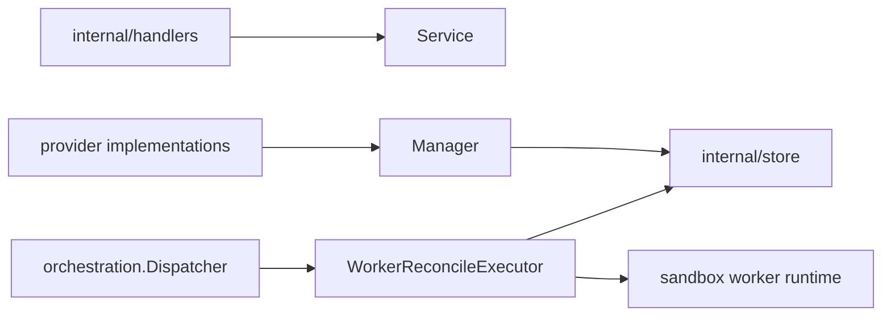

# Workers Design

`internal/resources/workers` owns worker API behavior, worker/provider-facing
management, and worker lifecycle reconciliation.

## Boundaries

- `Service` handles worker registration, listing, and authenticated status
  updates.
- `Manager` is the narrow provider-facing interface for worker creation,
  bootstrap tokens, scheduling lookup, worker/provider reconcile enqueueing, and
  cleanup decisions.
- `WorkerReconcileExecutor` owns payload decode, generation assertions, and
  worker lifecycle reconciliation.
- Worker runtime cleanup/launch decisions must preserve generation checks.
- Worker lifecycle and runtime-state repair must happen in worker reconcile jobs.
  Provider inventory checks may enqueue worker reconciliation for mismatches, but
  must not directly mark workers failed, active, deleted, or recovered.
