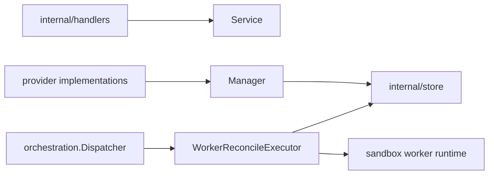

# Workers Design

`internal/resources/workers` owns worker API behavior, worker/provider-facing
management, and worker lifecycle reconciliation.

## Boundaries

- `Service` handles worker registration, listing, and authenticated status
  updates.
- `Manager` is the narrow provider-facing interface for worker creation,
  bootstrap tokens, scheduling lookup, worker/provider reconcile enqueueing, and
  cleanup decisions.
- `WorkerReconcileExecutor` owns payload decode, generation assertions, and
  worker lifecycle reconciliation.
- Worker runtime cleanup/launch decisions must preserve generation checks.
- Worker lifecycle and runtime-state repair must happen in worker reconcile jobs.
  Driver-owned drift checks may enqueue worker reconciliation for mismatches,
  but must not directly mark workers failed, active, deleted, or recovered.
- Workers are stateful. `Manager.DeleteWorker`, registration-expiry cleanup, and
  `WorkerReconcileExecutor` must refuse worker deletion while any sandbox row is
  still assigned to the worker. Runtime providers may replace the underlying
  VM/container during active worker reconciliation, but that must preserve the
  worker row and worker ID.
- Failed worker reconciliation should mark the worker failed/unschedulable and
  allow provider reconciliation to launch replacement capacity. It must not
  delete the worker unless the worker never registered and has no assigned
  sandboxes.
- Worker repair is separate from worker delete. Active worker reconciliation may
  call `RepairWorker` when normal runtime reconciliation fails and sandboxes are
  assigned to the worker. Delete reconciliation must not call repair; an
  occupied worker delete is a failed delete.
