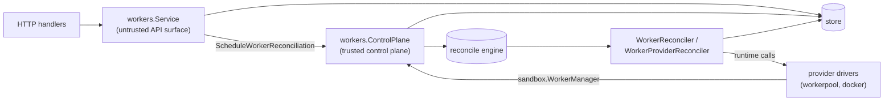

# Workers Design

Workers are the one resource with **two front doors**, because they have two
very different kinds of caller. Same resource, two dialects:

| | `workers.Service` | `workers.ControlPlane` |
| --- | --- | --- |
| Caller | HTTP handlers | provider drivers (via `sandbox.WorkerManager`) |
| Input trust | untrusted — trim, validate, authorize principals | trusted — ids come from persisted rows |
| Errors | `apperrors` with HTTP status codes | plain domain errors |
| Powers | read/annotate | lifecycle intent writes, credential minting, dirty marks |

The split is behavioral, not organizational: both define `ListWorkers` with the
same signature but different contracts (the Service validates and speaks HTTP;
the control plane is a raw read). Merging them would hand one method name to
two callers with incompatible expectations.

## Responsibilities

- `service.go` — API behavior: worker registration, status updates (verifies
  the calling **worker principal**), list with project validation, manual
  reconcile requests.
- `controlplane.go` — trusted operations: intent writes (create/drain/delete =
  generation bump + operation + `MarkDirtyTx`, one transaction), bootstrap and
  agent tokens, scheduling re-marks, expired-registration cleanup. Registers
  both reconcilers on the engine.
- `reconciler.go` — `WorkerReconciler`: converges one worker (launch, repair,
  delete via the driver), chains a provider re-mark after every run so the pool
  re-evaluates its scaling math.
- `provider_reconciler.go` — `WorkerProviderReconciler`: converges one
  provider's worker **pool** (scaling); lives here because pools are made of
  workers and the reconciler drives this package's control plane.
- `cleanup.go` — periodic purge of long-deleted worker rows.

Reconciliation is level-triggered: intent writers mark `(type, id)` dirty and
the engine (`internal/reconcile`) drives convergence; see that package's
DESIGN.md for claiming, backoff, supersede, and scan semantics.
