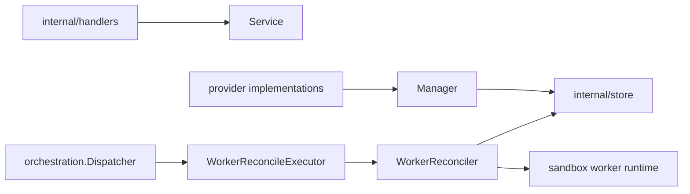

# Workers Design

`internal/resources/workers` owns worker API behavior, worker/provider-facing
management, and worker lifecycle reconciliation.

## Boundaries

- `Service` handles worker registration, listing, and authenticated status
  updates.
- `Manager` is the narrow provider-facing interface for worker creation,
  bootstrap tokens, scheduling lookup, and cleanup decisions.
- `WorkerReconcileExecutor` decodes worker jobs and calls `WorkerReconciler`.
- Worker runtime cleanup/launch decisions must preserve generation checks.
