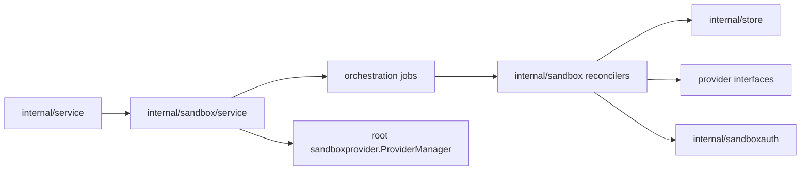
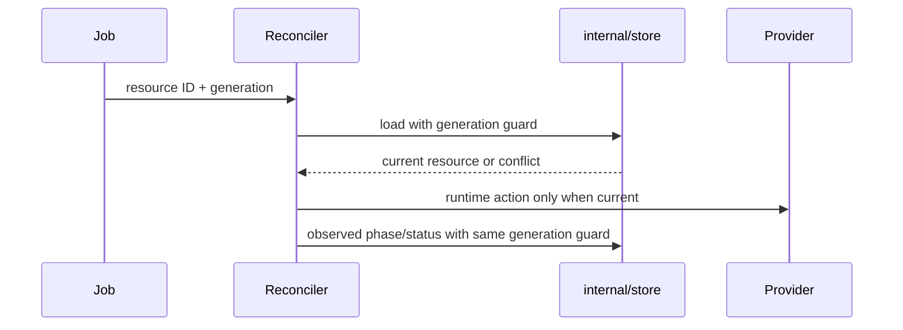

# Sandbox Control Design

`internal/sandbox` owns server-side sandbox and worker reconciliation. It bridges
persisted control-plane intent to provider runtime operations. It should not own
HTTP route registration, API DTO decoding, or raw database setup.

## Boundaries

- `internal/service` records desired state and submits jobs.
- `internal/sandbox/jobs` creates durable orchestration payloads and submitters.
- `SandboxReconciler` and `WorkerReconciler` execute generation-scoped jobs.
- Provider implementations perform runtime mechanics behind provider interfaces.

## Generation-Scoped Reconciliation

Reconcilers must load resources with the job's target generation. If the resource
is missing, reconciliation is complete. If the generation has changed, return an
orchestration superseded result instead of mutating runtime state.

Every progress update should preserve this generation guard. Stale jobs must not
mark newer intent as observed.

## Sandbox Operations

Sandbox desired states map to reconciler actions:

| Desired state / counter | Reconciler action |
| --- | --- |
| `running` | Ensure runtime exists and is running. |
| `running` with pending restart generation | Stop then start runtime. |
| `stopped` | Stop runtime but keep provider state. |
| `deleted` | Remove runtime/provider state and mark deletion observed. |

Provider `ErrNotFound` and `ErrNotRunning` can be treated as idempotent for stop
or delete paths where absence already satisfies intent. Capacity errors should be
recorded on the resource so clients can see the failed operation.

## Provider Resolution

Prefer resolving providers through the root `sandboxprovider.ProviderManager` using the sandbox's provider
instance. A single injected provider is only for tests or narrow compatibility
paths. Provider code must depend on root/provider contracts and narrow server-
provided interfaces, not server internals.

## Sandbox Access Trust

When sandbox auth is configured, start/restart flows ensure the creating user has
a project/user trust key and pass the public key to runtime creation as
`DISCOBOX_TRUST_KEY`. Token issuing and key storage rules live in
`internal/sandboxauth/DESIGN.md`.
