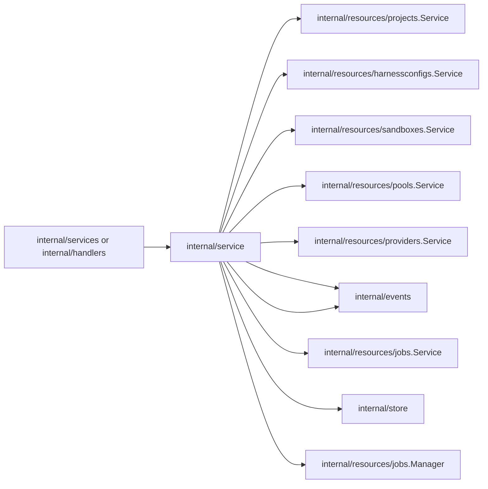
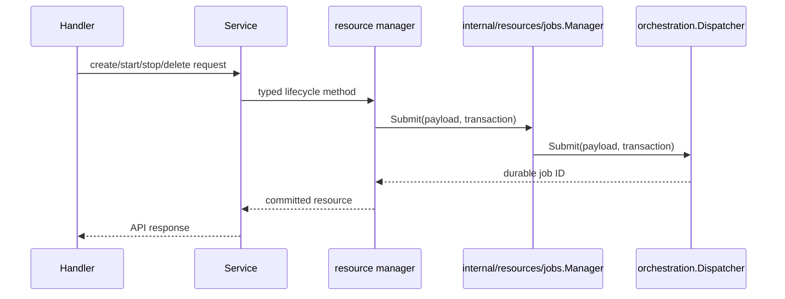

# Service Design

`internal/service` aggregates API-facing resource services and owns process-level
service startup. Resource-specific API behavior lives in resource packages under
`internal/resources`.

## Boundaries



The root service should:

1. Compose resource services and managers.
2. Initialize default project/user/config data.
3. Register resource executors with `internal/resources/jobs.Manager`.
4. Start the job manager, then run startup reconciliation.
5. Provide compatibility wrappers required by `internal/services.Services`.

Keep these responsibilities out of `internal/service`:

- HTTP decoding/encoding and route registration.
- Raw GORM/database access.
- Provider runtime operations such as start, stop, restart, and delete.
- Long-running reconciliation loops.

## Resource Services

Resource packages expose their own service/manager/executor types:

```text
internal/resources/sandboxes.Service
internal/resources/sandboxes.SandboxReconcileExecutor
internal/resources/pools.Service
internal/resources/pools.Manager
internal/resources/pools.WorkerReconcileExecutor
internal/resources/providers.Service
internal/resources/providers.WorkerProviderReconcileExecutor
internal/resources/harnessconfigs.Service
internal/resources/events.Service
internal/resources/jobs.Service
internal/resources/projects.Service
```

The root `internal/service.Service` should stay a thin aggregator. It may call
stores directly for default data initialization, but API resource behavior should
belong to the resource package that owns that resource.

## Startup Lifecycle

`Service.Start(ctx)` owns service-level startup work. It should register
application job executors with the injected job manager, start that manager, and
then evaluate startup reconciliation such as existing sandbox provider
instances. `internal/server` may construct `internal/resources/jobs.Manager` and
pass it in, but the job manager should not depend on `*service.Service` or know
which executors the service needs.

The job manager remains dispatcher infrastructure: start/stop, registration
storage, and wakeup notification. Startup reconciliation decisions belong in the
resource service because they are application policy, not dispatcher behavior.

## Intent Transactions

Accepted API intent must be committed atomically with the project event and the
durable reconcile job that observes it.



Do not publish live-only events for accepted intent without also writing the
resource state and durable job record.

## Sandbox Lifecycle Intent

Sandbox lifecycle is modeled as desired-state reconciliation. The API records the
user's desired steady state, the observed phase, and the latest user intent that
requested reconciliation.

| Field | Meaning |
| --- | --- |
| `desiredState` | User intent: `running`, `stopped`, or `deleted`. |
| `phase` | Observed lifecycle phase displayed to clients. |
| `activeOperation` | Operation currently queued or running. |
| `lastOperationStatus` | State of the latest lifecycle operation/job. |
| `generation` | Monotonic desired-state generation. |
| `observedGeneration` | Latest generation fully handled by reconciliation. |
| `restartGeneration` | Monotonic user intent counter for restarts. |
| `restartedGeneration` | Latest restart generation completed by reconciliation. |

Operation intent mapping:

| API action | Desired state | Initial phase | Active operation |
| --- | --- | --- | --- |
| create | `running` | `pending` | `create` |
| start | `running` | `starting` | `start` |
| stop | `stopped` | `stopping` | `stop` |
| restart | `running` with `restartGeneration++` | `starting` | `restart` |
| delete | `deleted` | `deleting` | `delete` |

Restart is not a steady desired state. It increments `restartGeneration` while
keeping `desiredState=running`.

## Provider Catalog and Pool Wiring

`internal/service` may compose provider catalogs and pool managers because it
sits at the application boundary. Provider implementations must receive narrow
interfaces or root contracts; they must not depend on `server/internal` packages.

Pool-backed provider support should go through
`internal/resources/pools.Manager`, which adapts `internal/store` and typed
pool job-manager methods to the narrow interfaces expected by provider code.

## Error Mapping

Use root/shared sentinel errors for cross-module conditions and map persistence
errors to API errors at the service boundary. Do not leak database-specific errors
or GORM errors to handlers.
