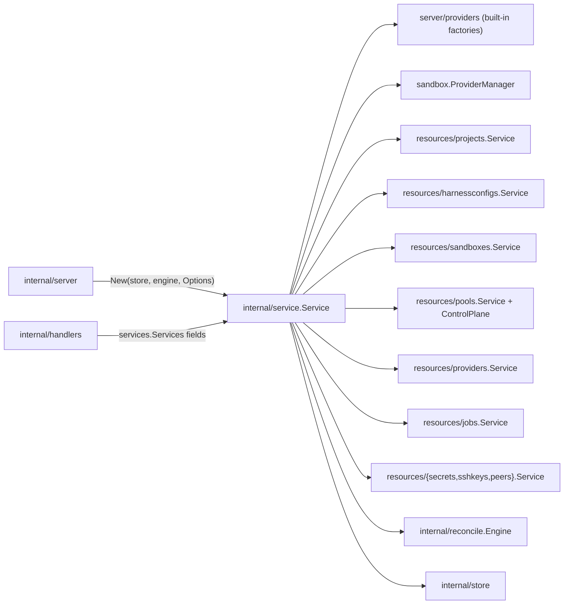
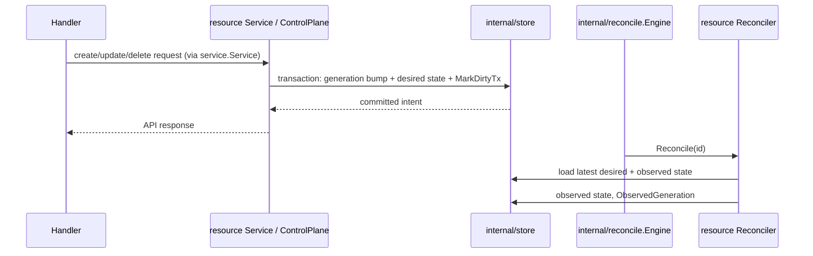

# Service Design

`internal/service` aggregates API-facing resource services and owns process-level
service startup, shutdown, and default data. Resource-specific API behavior lives
in resource packages under `internal/resources`.

## Boundaries



`Service` embeds one implementation of each `internal/services` contract
(`ProjectService`, `HarnessConfigService`, `SandboxService` via
`*sandboxes.Service`, `SandboxProviderInstanceService`, `PoolService`,
`JobService`, `SecretService`, `SSHKeyService`, `PeerService`).
`internal/server.NewApp` assigns the one `*Service` to every field of
`services.Services`, so API calls reach the resource package directly.

The root service should:

1. Build the `sandbox.ProviderManager`, `pools.ControlPlane`, and built-in
   provider factories, then compose the resource services around them.
2. Initialize default user/project/harness/provider/pool data.
3. Register resource reconcilers with the injected `reconcile.Engine`.
4. Start the engine, then run startup reconciliation.
5. Fan process-wide settings out to the resource types that need them
   (`SetDefaultSandboxImage`, `SetHostID`, `SetSandboxAuthManager`,
   `SetWorkerAgentAuthManager`).

Keep these responsibilities out of `internal/service`:

- HTTP decoding/encoding and route registration.
- Raw GORM/database access.
- Provider runtime operations such as start, stop, restart, and delete.
- Long-running reconciliation loops.

## Resource Services

Resource packages expose their own service/control-plane/reconciler types:

```text
internal/resources/sandboxes.Service            (+ SandboxReconciler)
internal/resources/pools.Service
internal/resources/pools.ControlPlane           (+ PoolReconciler, PoolImagesReconciler)
internal/resources/providers.Service
internal/resources/harnessconfigs.Service       (also the harnessConfig reconciler)
internal/resources/jobs.Service
internal/resources/projects.Service
internal/resources/secrets.Service
internal/resources/sshkeys.Service
internal/resources/peers.Service
```

The root `internal/service.Service` should stay a thin aggregator. It may call
stores directly for default data initialization, but API resource behavior should
belong to the resource package that owns that resource.

## Startup Lifecycle

`internal/server.NewApp` constructs the `reconcile.Engine` and passes it to
`New`; the engine does not depend on `*service.Service` or know which
reconcilers the service needs. `NewApp` then applies the setters, calls
`InitializeDefaults`, and calls `Start`.

`Service.Start(ctx)`:

1. Registers reconcilers: `sandbox` (`sandboxes.Service.RegisterJobs`, with
   `Options.SandboxReconcileJobConcurrency`), `harnessConfig`
   (`harnessconfigs.Service`, so in-flight configure flows survive a restart),
   and `pool` plus `poolImages` (`pools.ControlPlane.RegisterJobs`).
2. Starts the engine.
3. Starts the pool bootstrap-token cleanup owned by `pools.ControlPlane`.
4. Runs `providers.Service.EnsureExistingSandboxProviderInstances`, resolving
   every enabled provider instance; on failure it stops the engine and returns
   the error.

`Service.Stop(ctx)` stops the engine first, waiting for in-flight reconciles,
then shuts down the provider manager so providers release backend resources
(for example a wslc pool VM session) deterministically.

The engine is runner infrastructure: registration, claiming, and wakeup
([`internal/reconcile/DESIGN.md`](../reconcile/DESIGN.md)). Startup
reconciliation decisions belong in the resource service because they are
application policy, not engine behavior.

## Default Data

`InitializeDefaults(ctx, userID, ...)` runs on every boot and is idempotent:

- Upserts the local user and resolves the user's default project by membership
  and the `Default` flag, creating it with a generated ID on first boot.
- Seeds the built-in harness configs (`harnessconfigs.Service.SeedBuiltIns`).
- Installs a default sandbox provider instance and a `Default` pool (set as the
  project's `DefaultPoolID`) exactly once, gated on the
  `defaults.default_sandbox_provider.installed` `server_state` row rather than on
  the records. After that they are ordinary user-owned records; deleting them is
  permanent. The provider type follows the host OS: `docker` on Linux, `vz` on
  macOS, `wslc` on Windows, and a disabled `unsupported` instance elsewhere.
  `WithoutDefaultProviderInstallation` skips this step.

`EnsureHarnessAvailable` delegates to `harnessconfigs`; `internal/server` calls
it after `NewApp` and refuses to serve when the default project has no harness.

## Intent Transactions

Accepted API intent is committed atomically with the reconcile engine's dirty
mark that drives it (transactional outbox).



Each resource package owns its intent writes; `internal/resources/jobs` only
projects the pending dirty set as API jobs
([`internal/resources/jobs/DESIGN.md`](../resources/jobs/DESIGN.md)).

## Sandbox Lifecycle Intent

Sandbox lifecycle is desired-state reconciliation over the shared
`model.ResourceLifecycle` fields: `desiredState` (existence only: `present`,
`archived`, or `deleted`), `state`, `generation`, `observedGeneration`,
`stateChangedAt`, and `errorMessage`. Power (start, stop, restart) is not
orchestrated: those are instructions forwarded to the pool agent and bump no
generation. The intent mapping, archive/purge/repair, and power rules are owned by
[`internal/resources/sandboxes/DESIGN.md`](../resources/sandboxes/DESIGN.md).

## Provider Catalog and Pool Wiring

`internal/service` composes the provider catalog and pool control plane because
it sits at the application boundary. `New` calls
`server/providers.RegisterBuiltInSandboxProviderFactories` with the provider
manager, the `pools.ControlPlane`, and the provider-facing `Options`
(development image sync, control-plane streams, listen endpoints, server
defaults, wslc command).

Pool-backed providers reach the control plane only through
`pools.ControlPlane`, which implements the narrow `sandbox.PoolManager`
interface handed to provider drivers
([`internal/resources/pools/DESIGN.md`](../resources/pools/DESIGN.md)). Providers
must not depend on resource services.

## Error Mapping

Server-owned sentinels live in `internal/apperrors`. Resource packages map store
errors to API errors (`apperrors.NotFound`, see
[`internal/resources/DESIGN.md`](../resources/DESIGN.md#not-found-mapping)). Do not
leak database-specific errors or GORM errors to handlers.
