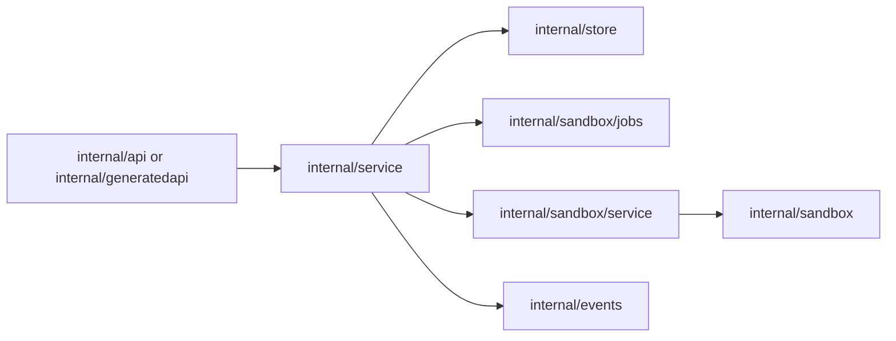
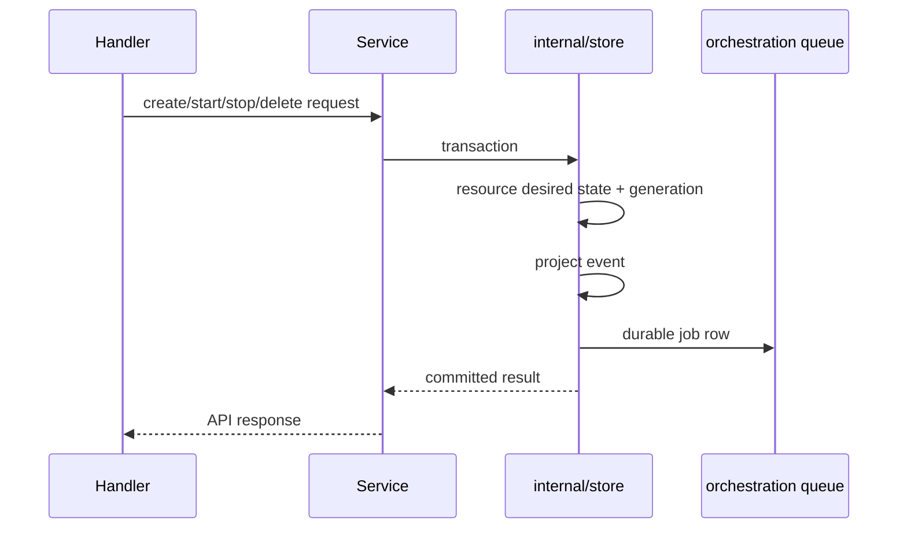

# Service Design

`internal/service` implements API-facing business logic. It translates decoded API
commands into validated resource intent changes, default data initialization, and
provider catalog behavior. It should not contain transport details, raw GORM
queries, or provider runtime mechanics.

## Boundaries

Service methods should:

1. Validate parent resources and request shape.
2. Load or build root `model` resources.
3. Persist intent through `internal/store` transactions.
4. Emit project events and submit reconcile jobs with the same accepted intent.
5. Return API-shaped results or API-level errors.

Keep these responsibilities out of `internal/service`:

- HTTP decoding/encoding and route registration.
- Raw GORM/database access.
- Provider runtime operations such as start, stop, restart, and delete.
- Long-running reconciliation loops.

## Intent Transactions

Accepted API intent must be committed atomically with the project event and the
durable reconcile job that observes it.

Do not publish live-only events for accepted intent without also writing the
resource state and durable job record.

## Sandbox Lifecycle Intent

Sandbox lifecycle is modeled as desired-state reconciliation. The API records the
user's desired steady state, the observed phase, and the latest user intent that
requested reconciliation.

| Field | Meaning |
| --- | --- |
| `desiredState` | User intent: `running`, `stopped`, or `deleted`. |
| `phase` | Observed lifecycle phase displayed to clients. |
| `activeOperation` | Operation currently queued or running. |
| `lastOperationStatus` | State of the latest lifecycle operation/job. |
| `generation` | Monotonic desired-state generation. |
| `observedGeneration` | Latest generation fully handled by reconciliation. |
| `restartGeneration` | Monotonic user intent counter for restarts. |
| `restartedGeneration` | Latest restart generation completed by reconciliation. |

Operation intent mapping:

| API action | Desired state | Initial phase | Active operation |
| --- | --- | --- | --- |
| create | `running` | `pending` | `create` |
| start | `running` | `starting` | `start` |
| stop | `stopped` | `stopping` | `stop` |
| restart | `running` with `restartGeneration++` | `starting` | `restart` |
| delete | `deleted` | `deleting` | `delete` |

Restart is not a steady desired state. It increments `restartGeneration` while
keeping `desiredState=running`.

## Provider Catalog and Worker Wiring

`internal/service` may compose provider catalogs and worker-store adapters because
it sits at the application boundary. Provider implementations must receive narrow
interfaces or root contracts; they must not depend on `server/internal` packages.

Worker-backed provider support should go through `workerStore`, which adapts
`internal/store` and worker job submitters to the interfaces expected by provider
code.

## Error Mapping

Use root/shared sentinel errors for cross-module conditions and map persistence
errors to API errors at the service boundary. Do not leak database-specific errors
or GORM errors to handlers.
