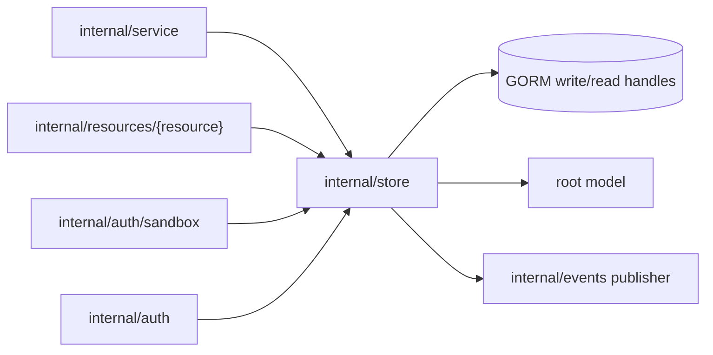
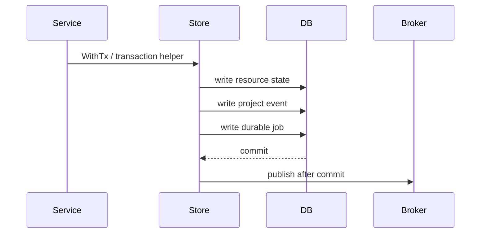

# Store Design

`internal/store` owns application persistence. It is the only server package that
should issue resource-level GORM queries or write resource/project-event/job
records directly.

## Boundaries

- Accept database handles directly during construction.
- Keep GORM types and query details inside this package.
- Scope resource queries by project/user/worker IDs as appropriate.
- Return root/shared sentinel errors through package aliases for compatibility.

## Transaction Rules

Intent changes must use store transactions when resource state, project events,
and durable job records belong to one accepted command.

Publish live events only after the database commit succeeds. During a transaction,
queue after-commit events instead of publishing immediately.

## Resource Scope

Every resource query must use the store-owned GORM handles rather than opening or
resolving databases itself. Project-owned resources should filter by `project_id`;
worker credentials should filter by `worker_id`; user-owned resources should
filter by `user_id`.

Do not add database-routing or request-context identity assumptions to store
methods. Pass the resource boundary explicitly through method parameters or use
IDs already carried by persisted rows.

Resource-specific store wrappers expose a consistent typed lifecycle shape for
the job manager: `Get`, `Create`, `UpdateWithGeneration`, `ID`, `Reload`, and
`Generation`, while delegating raw GORM queries to this package's existing
resource methods. Transaction-scoped wrappers must embed the transaction store
so resource writes and durable job appends stay atomic.

## Error Contract

`ErrNotFound` and `ErrGenerationConflict` alias root `apperrors` sentinels so
other modules can compare errors without importing server internals. New shared
error conditions should be added to the root module, then aliased here if store
callers need package-local compatibility.

Map database-specific not-found errors to `ErrNotFound` at the store boundary.
Use `ErrGenerationConflict` when a generation-guarded read or write proves the
job/request is stale.

## File Organization

Keep files split by resource area:

| File area | Responsibility |
| --- | --- |
| `projects.go`, `users.go` | Project/user lookup and defaults. |
| `agent_configs.go` | Agent config definition and instance persistence. |
| `sandboxes.go` | Sandbox desired/observed lifecycle persistence. |
| `providers_workers.go` | Provider instance, worker, token, and scheduling persistence. |
| `events.go`, `resource_events.go` | Project event rows and event snapshots. |
| `jobs.go` | Durable orchestration job models. |
| `transactions.go` | Transaction helpers and after-commit behavior. |
