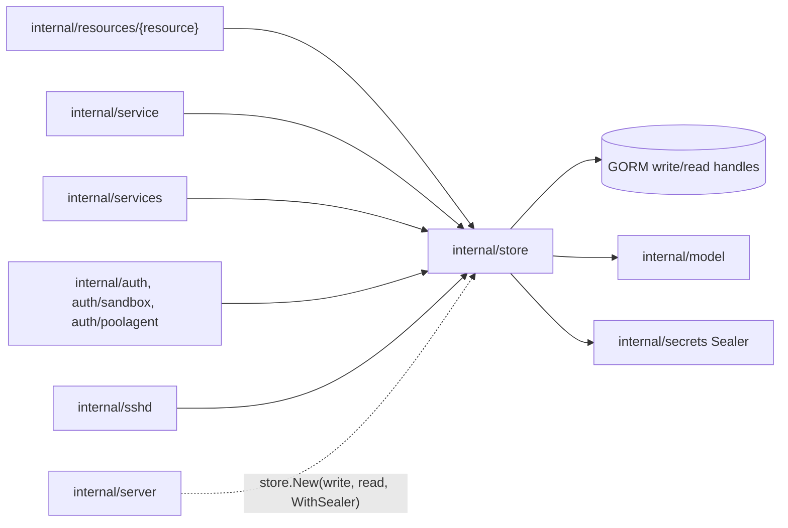
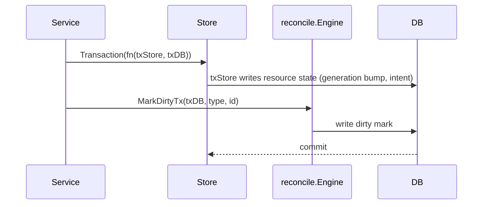

# Store Design

`internal/store` owns application persistence. It is the only server package that
should issue resource-level GORM queries or write resource rows directly. The one
exception is the reconcile engine's dirty marks, which `internal/reconcile` writes
itself — inside a store transaction when they commit with intent.

## Boundaries

- Construct with `New(write, read, ...Option)`; a nil read handle falls back to
  the write handle. `internal/server` wires it, and `cmd/discobox-secret-dump`
  builds its own.
- Keep GORM types and query details inside this package.
- Scope resource queries by project/user/pool IDs as appropriate.
- Re-export the server-owned `apperrors` sentinels through package aliases.

## Transaction Rules

`Store.Transaction(ctx, fn(txStore, txDB))` runs `fn` in one write
transaction. `txStore` is a `Store` bound to the transaction; `txDB` is the raw
handle, passed on to `reconcile.Engine.MarkDirtyTx` so the dirty mark commits with
the intent that caused it.

Use a transaction only where two statements must commit together: intent plus
its dirty mark, a create plus its secret assignments, a delete plus its
cascades (`DeleteProject`, `DeleteSecret`, `DeleteSandbox`,
`DeleteHarnessConfig`), a state-report batch. A mutation that is a single
statement does not need one. Nothing is published on commit: a waiting caller
re-reads the rows rather than being told
([ADR 0081](../../../docs/adr/0081-project-events-are-not-persisted-and-the-wait-polls.md)).

## Conditional Writes

- `WithGeneration` / `WithPoolGeneration` (and `UpdatePoolWithGeneration`)
  guard reads and writes on the resource generation; a write that matches no
  row returns `ErrGenerationConflict`.
- `UpdateSecretValueIfUnchanged` (guarded on `updated_at`) and
  `UpdateSecretRequestIfPending` (guarded on status) return
  `ErrGenerationConflict` the same way.

## Field Ownership on Whole-Row Writes

A resource whose status has more than one writer must not be saved by writing
every column from an in-memory copy. The copy was read before whatever the
caller just did, and a concurrent writer's update lands in that window — so the
save silently replays a stale value.

- `Store.UpdateSandbox` omits `observedSandboxColumns` (runtime state and its
  report watermark, provisioning progress, resources); only
  `ApplySandboxStateReports`, `ApplySandboxProgressReports`, and
  `UpdateSandboxResources` write them. See
  [`resources/sandboxes/DESIGN.md`](../resources/sandboxes/DESIGN.md) for who
  owns what and
  [ADR 0034](../../../docs/adr/0034-sandbox-state-and-runtime-state-are-separate-fields.md)
  for the incident.
- Agent telemetry is written as narrow column updates, never a row `Save`:
  `UpdateSandboxAgentStatus`, `UpdateSandboxResources`,
  `RecordPoolProvisionProgress`, `RecordPoolResources`, `RecordPoolImageStage`.
- Pool status ownership is split between agent calls (`RegisterPool`,
  `UpdatePoolStatus`) and the reconciler; see
  [`resources/pools/DESIGN.md`](../resources/pools/DESIGN.md).

When a new field gains a second writer, narrow the write rather than relying on
callers to be careful.

## Resource Scope

Every resource query must use the store-owned GORM handles rather than opening or
resolving databases itself. Project-owned resources should filter by `project_id`;
pool bootstrap tokens should filter by `pool_id`; user-owned resources should
filter by `user_id`. Peers and `server_state` rows are server-wide and carry no
project scope. `*ByID` lookups (`GetPoolByID`, `GetSandboxByID`,
`GetHarnessConfigByID`) skip project scope and are for trusted control-plane
paths that hold only an ID (agent auth, reconcile dirty IDs).

Lookups by ID go through `firstByID`, which also resolves a unique prefix of a
generated ID; a non-unique prefix is `ErrNotFound`.

Pool deletion guards depend on sandbox assignment checks. `CountSandboxesForPool`
counts every `sandboxes` row with that `pool_id`, and the pool service and
reconciler treat that count as the authoritative stateful assignment; do not infer
emptiness from pool health, driver drift detection, or runtime state.
`DeletePool` itself only removes the row.

Deletes are real row deletes, not tombstones; `hard_delete_test.go` guards
against `gorm.DeletedAt` reappearing on a model.

Do not add database-routing or request-context identity assumptions to store
methods. Pass the resource boundary explicitly through method parameters or use
IDs already carried by persisted rows.

Typed resource views — `Store.Sandboxes()` (`SandboxStore`) and
`Store.SandboxProviderInstances()` (`SandboxProviderInstanceStore`) — expose
`Get`, `Create`, `Update`, `ID`, `Reload`, and `Transaction` (sandboxes add
`UpdateWithGeneration` and `Generation`), delegating to the `Store` methods. They
embed the store, and their `Transaction` rebinds it to the transaction, so their
writes stay atomic with anything else written in it.

## Secret Sealing

With `WithSealer`, the store encrypts secret material on write and decrypts it
only on request: `secrets.encrypted_value` (`OpenSecretValue`) and
`sandboxes.secret_state` (`OpenSandboxSecretState`). Plaintext rows pass through
unchanged. Deleting secrets (directly, with an anonymous sandbox assignment, or
with the project) nulls `encrypted_value` before removing the row.

## Error Contract

`ErrNotFound` and `ErrGenerationConflict` alias server-owned `apperrors`
sentinels so store callers can compare errors through this package without
depending on implementation details. `ErrInUse` is store-owned: a delete
refused because a live resource still references the target
(`DeleteHarnessConfig` with sandboxes on it).

Map database-specific not-found errors to `ErrNotFound` at the store boundary
(`mapNotFound`). Use `ErrGenerationConflict` when a generation-guarded or
otherwise conditional read or write proves the request is stale.

## File Organization

Keep files split by resource area:

| File area | Responsibility |
| --- | --- |
| `store.go` | `Store`, `New`, `WithSealer`, handle resolution, error aliases. |
| `transactions.go` | `Store.Transaction`. |
| `id_lookup.go` | `firstByID`: exact or unique-prefix ID lookup. |
| `projects.go`, `users.go` | Projects, members, per-user defaults, users, project user keys. |
| `harness_configs.go`, `harness_config_secret_bindings.go` | Harness configs and their secret env bindings. |
| `sandboxes.go` | Sandbox desired-state persistence, `SandboxStore`, reconcile scans, archive expiry, agent-status/resource telemetry. |
| `sandbox_state_reports.go` | Pool-agent state and provisioning-progress reports (the observed columns' only writer). |
| `providers.go` | Provider instance persistence and `SandboxProviderInstanceStore`. |
| `pools.go` | Pool persistence: CRUD, agent registration and heartbeats, bootstrap tokens, telemetry, the schedulable-pool placement gate, and pool-scoped sandbox counts. |
| `secrets.go`, `secret_grants.go` | Secrets (sealed values), secret requests, and host-scoped grants. |
| `sandbox_secrets.go` | Sandbox secret assignments and agent credentials. |
| `credential_verdicts.go` | Recorded credential verdicts per sandbox. |
| `ssh_keys.go` | Project SSH keys. |
| `peers.go` | Enrolled peers, looked up by ID or validated prefix. |
| `server_state.go` | Server-wide key/value markers (e.g. one-time seeding). |
