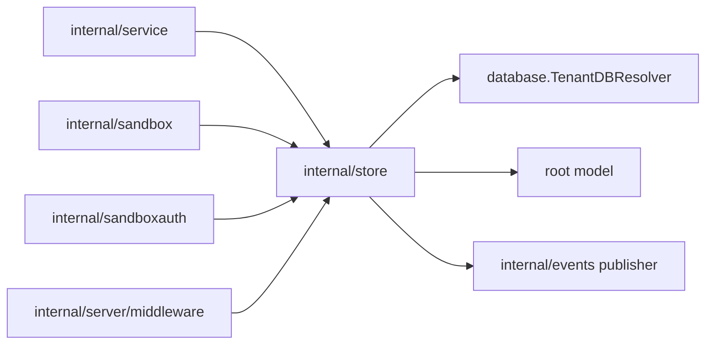
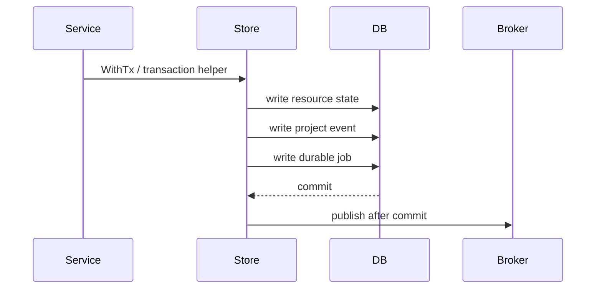

# Store Design

`internal/store` owns tenant-aware persistence. It is the only server package
that should issue resource-level GORM queries or write resource/project-event/job
records directly.

## Boundaries

- Accept tenant-scoped database handles through `TenantDBResolver`.
- Use `tenantctx` or an explicit default tenant only to resolve the tenant DB.
- Keep GORM types and query details inside this package.
- Return root/shared sentinel errors through package aliases for compatibility.

## Transaction Rules

Intent changes must use store transactions when resource state, project events,
and durable job records belong to one accepted command.

Publish live events only after the database commit succeeds. During a transaction,
queue after-commit events instead of publishing immediately.

## Tenant Scope

Every resource query must resolve the tenant database before touching tenant
resources. The tenant ID normally comes from request context middleware. Tests and
single-tenant startup paths may use `WithDefaultTenantID` when there is no request
context.

Do not use the global database for tenant-owned runtime data. Global data belongs
in `internal/database` global migrations and startup/default initialization.

## Error Contract

`ErrNotFound` and `ErrGenerationConflict` alias root `apperrors` sentinels so
other modules can compare errors without importing server internals. New shared
error conditions should be added to the root module, then aliased here if store
callers need package-local compatibility.

Map database-specific not-found errors to `ErrNotFound` at the store boundary.
Use `ErrGenerationConflict` when a generation-guarded read or write proves the
job/request is stale.

## File Organization

Keep files split by resource area:

| File area | Responsibility |
| --- | --- |
| `projects.go`, `users.go` | Project/user lookup and defaults. |
| `agent_configs.go` | Agent config definition and instance persistence. |
| `sandboxes.go` | Sandbox desired/observed lifecycle persistence. |
| `providers_workers.go` | Provider instance, worker, token, and scheduling persistence. |
| `events.go`, `resource_events.go` | Project event rows and event snapshots. |
| `jobs.go` | Tenant-local durable orchestration job models. |
| `transactions.go` | Transaction helpers and after-commit behavior. |
