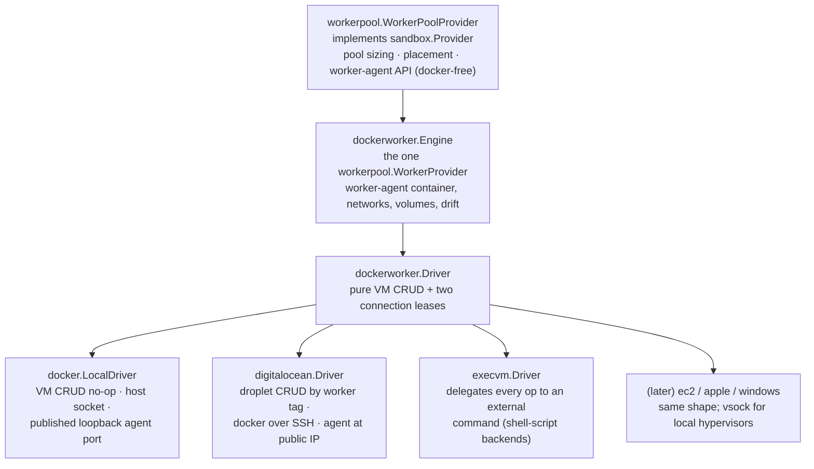

# Sandbox Provider Design

This package contains concrete sandbox provider implementations and factory
registration. It consumes `server/internal/sandbox` for the Go-level provider
interface, provider manager, typed `WorkerManager` control-plane surface, and
shared provider types. It also consumes server-owned persistence models and the
worker-agent package for worker boot metadata.

Providers own runtime mechanics only; services own persistence, authorization,
orchestration, and API shape.

## Runtime References

`SandboxRef` carries `project_id` and `sandbox_id`.

- `project_id` scopes provider placement, shared caches, VM selection, resource
  settings, and cleanup.
- `sandbox_id` identifies the managed runtime resource.

## Provider Layers

Docker container management is the invariant: every worker backend ends with
"run the worker-agent container in some Docker daemon." Backends differ only in
VM CRUD and how to reach that daemon and the worker-agent API.



`server/providers/workerpool.WorkerPoolProvider` is the registered
`sandbox.Provider` for worker-backed provider instances. It owns worker pool
sizing, worker selection, capacity waits, bootstrap credential minting, and
user-sandbox operations through the worker-agent API. Docker never appears at
this layer or above: the boundary contract downward is the
`workerpool.WorkerProvider` interface, and the runtime contract for sandboxes
is the worker-agent HTTP API reached through `transport.HTTPClientLease`.

`workerpool.WorkerProvider` is a five-method interface: `Close`,
`EnsureWorker`, `RepairWorker`, `RemoveWorker`, and
`AcquireWorkerAgentClient`. `dockerworker.Engine` is its only implementation.
The engine owns everything Docker: launching the worker-agent container with
boot env, socket bind and host mounts, scoped volumes, the per-worker sandbox
proxy network, health waits, config-revision drift detection, and container
replacement during repair. It obtains Docker access exclusively through the
driver.

`dockerworker.Driver` is the backend seam sized for "add EC2 without reading
the engine":

- `EnsureVM` / `DeleteVM` / `InspectVM`: idempotent VM CRUD keyed by worker ID.
  The local driver resolves every worker to the host and CRUD is a no-op.
- `AcquireDockerClient`: a Docker API client lease for the daemon hosting the
  worker's containers — the host socket locally, the in-VM daemon over SSH for
  DigitalOcean, vsock later. `NewDockerClientForDialer` adapts any
  `net.Conn` dialer; `dockerworker/sshdocker` is the shared pure-Go
  SSH-to-docker-socket dialer for cloud VM drivers (DigitalOcean today, EC2
  later) and for `ssh://` endpoints from the exec driver.
- `AcquireWorkerAgentClient`: an HTTP lease reaching the worker-agent API —
  the container's published loopback port locally, `http://<public-ip>:<agent
  port>` for cloud VMs.

The engine owns Docker readiness waiting after `EnsureVM` (ping with a
deadline), so drivers never implement boot polling.

Worker runtime lifecycle is not the same as worker row deletion. The engine may
replace the worker-agent container (and a VM driver may replace the VM) for an
existing worker during reconciliation, such as when the worker image or config
revision changes, but the worker row and worker ID are preserved while
sandboxes remain assigned. Worker row deletion is allowed only after the
control plane proves no sandbox is assigned to the worker.

`RepairWorker` is the recovery hook for occupied workers whose runtime is known
to be unhealthy. The engine replaces the container (worker state lives in named
Docker volumes that survive container removal) and replaces the VM only when
`InspectVM` reports it missing or unhealthy.

The control plane launches the worker-agent container over the VM's Docker
daemon on every backend. Cloud VM images therefore stay generic: DigitalOcean
cloud-init only installs and enables Docker; bootstrap identity travels as
container environment rendered by `dockerworker.BootEnv`.

## Worker Runtime Drift

Runtime drift detection is backend-owned. The local docker provider runs a
watcher over the shared daemon: it lists managed worker containers, compares
them with worker rows, and uses the engine's config revision
(`Engine.ShouldReconcileWorkerContainer`) for drift. For worker rows that still
exist it enqueues the worker reconcile job; the only direct side effect allowed
is deleting an orphan managed runtime with no worker row. VM-per-worker
backends get drift detection through `InspectVM` during normal reconciliation.

The watcher's initial drift scan and its event loop both run in the background:
provider initialization starts the watcher and returns immediately. The initial
scan is best-effort — its failures are logged, never fatal — so Docker
connectivity or a single bad worker row can never block or crash-loop server
startup. Reconcile jobs and runtime events cover anything a failed scan missed.

Worker runtime drift detection is only about worker runtimes. It must not
inspect, reconcile, or delete user sandbox containers hosted inside a worker;
those belong behind the worker-agent sandbox runtime API.

Runtime drift detection must not delete a persisted worker row, and pool
downsizing must skip workers that still have assigned sandboxes. Failed worker
reconcile jobs mark the worker failed/unschedulable and let the pool launch
replacement capacity; they must not delete stateful workers.

## Worker Agent HTTP Routing

Transport leasing is represented by `server/internal/transport.HTTPClientLease`.
The pool obtains worker-agent connectivity from
`WorkerProvider.AcquireWorkerAgentClient` and attaches per-request token
providers to the lease so credentials are minted close to use and are not
cached as driver or lease state.

The provider-facing logical URL space for a worker agent is:

```text
https://worker/api/project/{project_id}/worker/{worker_id}/...
```

The `https://worker` authority is a stable logical authority, not necessarily a
real DNS name. Drivers translate it into something that reaches the in-guest
worker-agent HTTP server: a concrete `BaseURL` (local forwarded port, public
IP), or a client whose transport dials a socket, tunnel, or proxy. Callers must
not assume the worker endpoint is reachable by the default network stack.

The worker agent validates that `{project_id}` and `{worker_id}` match its
bootstrap identity before performing any operation. Worker-local sandbox routes
also require a short-lived scoped bearer token signed by the control plane.
Transport security depends on the driver path: remote paths should use TLS or
an authenticated tunnel (the DigitalOcean docker path rides SSH); localhost
Docker paths do not need HTTPS.

## Sandbox Worker API

The worker-agent HTTP server owns sandbox runtime operations inside one worker.
The control plane still owns persistence, authorization, events, and desired
state. Calling the worker API must therefore be done from reconciliation or
provider operations after intent has already been accepted and stored.

The logical API under the worker route is:

| Method | Path | Meaning |
| --- | --- | --- |
| `GET` | `/api/project/{project_id}/worker/{worker_id}/sandboxes` | List sandboxes hosted by the worker. |
| `POST` | `/api/project/{project_id}/worker/{worker_id}/sandboxes` | Create and usually start a sandbox on the worker. |
| `GET` | `/api/project/{project_id}/worker/{worker_id}/sandboxes/{sandbox_id}` | Inspect one sandbox. |
| `PATCH` | `/api/project/{project_id}/worker/{worker_id}/sandboxes/{sandbox_id}` | Update mutable runtime settings supported by the worker. |
| `DELETE` | `/api/project/{project_id}/worker/{worker_id}/sandboxes/{sandbox_id}` | Delete the sandbox runtime and local resources. |
| `POST` | `/api/project/{project_id}/worker/{worker_id}/sandboxes/{sandbox_id}/start` | Start a retained sandbox. |
| `POST` | `/api/project/{project_id}/worker/{worker_id}/sandboxes/{sandbox_id}/stop` | Stop a retained sandbox. |

The worker API intentionally does not expose a restart endpoint. Public restart
intent is accepted by the control plane as `restartGeneration` and reconciled as
the required worker-local stop and start operations.

Request and response bodies stay provider/runtime-level DTOs from the
worker-agent generated client, not API models from the public control-plane
package `internal/api`. Generated clients must accept an injected `http.Client`
so driver transports remain behind the lease abstraction.

Operation endpoints are synchronous from the worker's perspective: a 2xx means
the worker completed the local runtime action or made the requested state
observable. The control plane may still return `202 Accepted` to external
clients because the public sandbox API is intent-based and
reconciliation-driven.

The public control-plane sandbox API remains project scoped and desired-state
oriented (see `api` package for routes).

## Worker Boot Metadata

Bootstrap identity — control plane URL, project/worker identity, bootstrap
token, control-plane trust key, agent port — is rendered as container
environment by `dockerworker.BootEnv` and injected into the worker-agent
container by the engine, uniformly on every backend. VM drivers only need
their platform's Docker bring-up (for example the DigitalOcean docker-install
cloud-init document); they never carry bootstrap secrets in VM user data.

## DigitalOcean Driver

`server/providers/digitalocean` implements the `dockerworker.Driver` contract
with one Docker-enabled Droplet per sandbox worker, keyed by the
`discobox-worker-<worker_id>` tag.

Provider instances use type `digitalocean`. Configuration includes the API
token, control plane URL, region/size/droplet image, worker-agent container
image, registered SSH keys plus the matching SSH private key (config or
environment variable), VPC UUID, tags, and feature flags. The SSH key pair is
required for the engine to reach the droplet's Docker daemon; the worker-agent
API is reached directly at the droplet's public IPv4 and agent port.

## Exec Driver

`server/providers/execvm` implements the `dockerworker.Driver` contract by
invoking an external command as `<command> <op> <worker-id>`, so a worker
backend can be a shell script. Operations: `ensure-vm`/`inspect-vm` (JSON
`{id,status,address}` on stdout; inspect exits 3 for "no VM"), `delete-vm`,
and `docker-endpoint`/`agent-endpoint` (one endpoint line on stdout;
`unix://`, `tcp://`, or `ssh://[user@]host[:port]` for Docker, `http(s)://`
for the agent). SSH endpoints use the provider's configured private key via
`sshdocker`. The protocol is documented in the `execvm` package doc; it exists
both as an escape hatch and as the proof that the driver seam needs nothing
Docker-shaped.

## Pull-Based Scheduling and Worker Conditions

VM-backed providers maintain workers for each provider instance. Each provider
instance is treated as one homogeneous worker pool; heterogeneous capacity
should be modeled as multiple provider instances.

Workers initiate scheduling by polling or subscribing for work. The control
plane should not rely on rigid slot counts because sandbox resource requests can
be heavily overprovisioned and real pressure depends on local compute, memory,
storage, cache, and runtime state. Instead, workers report three
scheduling-relevant booleans on their worker row:

- `ready=true`: the worker is alive and healthy.
- `schedulable=true`: the worker is willing to pull new sandbox work.
- `degraded=true`: the worker may be used as fallback capacity but should not
  be preferred.

Workers may also report richer pressure/condition details as an opaque JSON blob
for display. The control plane does not interpret that blob for scheduling.

Scheduling preference is therefore:

1. preferred workers: ready and schedulable, not degraded;
2. degraded workers: ready and schedulable, degraded, used only when necessary;
3. unavailable workers: not ready, not schedulable, drained, revoked, or
   deleted.

Pool reconciliation should scale up when pending work is not being claimed by
preferred or degraded workers within policy, and scale down by draining/removing
idle workers above the desired target.
