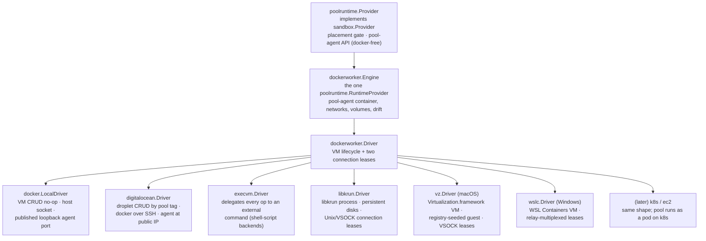

# Sandbox Provider Design

This package contains concrete sandbox provider implementations and factory
registration. It consumes `server/internal/sandbox` for the Go-level provider
interface, provider manager, typed `PoolManager` control-plane surface, and
shared provider types. It also consumes server-owned persistence models and
the pool-agent package for pool host boot metadata.

Providers own runtime mechanics only; services own persistence, authorization,
orchestration, and API shape.

A pool is its own runtime host (ADR-0006): one container, VM, or pod runs the
pool agent and hosts the pool's sandboxes.

## Runtime References

`SandboxRef` carries `project_id` and `sandbox_id`.

- `project_id` scopes provider placement, shared caches, VM selection, resource
  settings, and cleanup.
- `sandbox_id` identifies the managed runtime resource.

## Provider Layers

Docker container management is the invariant: every backend ends with "run the
pool-agent container in some Docker daemon." Backends differ only in VM CRUD
and how to reach that daemon and the pool-agent API.



`server/providers/poolruntime.Provider` is the registered `sandbox.Provider`
for pool-backed provider instances. It owns sandbox placement gating (the
sandbox's pool must be ready and schedulable — there is no candidate search
and no capacity check; sandboxes share their pool's CPU/memory/storage
envelope with no per-sandbox reservation, docs/adr/0029), capacity waits,
bootstrap credential minting, pool runtime convergence
(`sandbox.PoolRuntime`), and user-sandbox operations through the
pool-agent API. Docker never appears at this layer or above: the boundary
contract downward is the `poolruntime.RuntimeProvider` interface, and the
runtime contract for sandboxes is the pool-agent HTTP API reached through
`transport.HTTPClientLease`.

`poolruntime.RuntimeProvider` is a six-method interface: `Close`,
`EnsurePool`, `RepairPool`, `RemovePool`, `AcquirePoolAgentClient`, and
`OpenConsole`.
`dockerworker.Engine` is its only implementation. The engine owns everything
Docker: launching the pool-agent container with boot env, socket bind and host
mounts, scoped volumes, the per-pool sandbox proxy network, health waits,
config-revision drift detection, container replacement during repair, and
applying the pool envelope (CPU/memory) as the container limit. A sandbox
container created inside it gets no nested CPU/memory limit of its own — it
shares the worker container's cgroup with its siblings (docs/adr/0025). It
obtains Docker access exclusively through the driver.

`dockerworker.Driver` is the backend seam sized for "add EC2 without reading
the engine":

- `EnsureVM` / `StopVM` / `DeleteVM` / `InspectVM`: idempotent VM lifecycle
  keyed by pool ID. `StopVM` preserves driver-owned persistent state for
  repair; `DeleteVM` removes it after pool deletion is authorized. The local
  Docker driver resolves every pool to the host and lifecycle is a no-op.
- `AcquireDockerClient`: a Docker API client lease for the daemon hosting the
  pool's containers — the host socket locally, the in-VM daemon over SSH for
  DigitalOcean, or VSOCK terminated at a private Unix socket for local libkrun
  VMs. `NewDockerClientForDialer` adapts any `net.Conn`
  dialer; `dockerworker/sshdocker` is the shared pure-Go SSH-to-docker-socket
  dialer for cloud VM drivers and for `ssh://` endpoints from the exec driver.
- `AcquirePoolAgentClient`: an HTTP lease reaching the pool-agent API — the
  container's published loopback port locally, `http://<public-ip>:<agent
  port>` for cloud VMs, or VSOCK terminated at a private Unix socket for local
  libkrun VMs.

The engine owns Docker readiness waiting after `EnsureVM` (ping with a
deadline), so drivers never implement boot polling.

## Reporting What Bringing a Pool Up Is Doing

A sandbox that no pool has taken yet can say only that it is waiting, and on a
cold machine that is the longest part of a create: a VM disk image is fetched
and extracted, a machine boots, Docker comes up inside it, and the pool-agent
image is pulled — none of which the sandbox knows anything about.

So the driver doing the work records it. `sandbox.PoolProgressReporter` is a
nil-safe sink on the engine's config and on the vz driver's; every provider
builds one from its pool manager. Reports land on the pool row's
`provisionProgress`, and a client reading a pending sandbox asks its pool what
it is doing instead.

The engine reports the phases every backend shares — starting the VM, waiting
for Docker, pulling the pool image, starting and waiting for the agent — around
the calls that perform them. A driver refines that from inside: `vz` reports
fetching the VM image, which the engine can only see as part of starting a VM.

The record has a second reader. Placement waits for the sandbox's pool to become
schedulable, and that wait used to spend one fixed 30s budget whether the pool
was on its way up or stuck — so a cold VM pool, which fetches a disk image,
boots, waits for Docker and pulls the pool-agent image, failed with "no sandbox
capacity" every time while all of it was working. The wait now extends whenever
the pool's progress stamp moves, and only silence spends it. A pool that has
actually failed is still caught immediately, by its settled failure rather than
by a clock.

Two rules make it cheap enough to write from a hot path. Reports are a narrow
two-column update and publish no project event, because the reader is polling
anyway; and an image pull, the one phase with a denominator, is throttled to the
rate a byte counter has to move to read as movement. Nothing waits on any of it,
and a report that fails to store is dropped rather than failing the reconcile
that produced it.

## Pool Image Acquisition

Docker does not fetch on container create: an image the daemon does not hold is
a plain "No such image" error. The engine therefore inspects the configured pool
image and pulls it if it is absent, before creating the pool-agent container or
the console (`Engine.ensureImage`). This is the same rule the pool agent applies
one level down to the sandbox image, and it is what makes a released binary work
on a machine that has never built anything.

Inspect-then-pull rather than pull-always, because the development path below
places images that exist on no registry.

## Development Image Convergence

The development image watcher publishes a versioned manifest of
content-addressed pool, sandbox-base, and harness images. When its explicit
environment flag is enabled, server composition gives one shared
`dockerworker.DevelopmentImageSynchronizer` to every engine.

After `EnsureVM` and Docker readiness, both `EnsurePool` and `RepairPool`
converge that manifest before reconciling the pool-agent container. The
synchronizer inspects the destination daemon by reference and image ID, retags
an already-present ID without transferring it, and otherwise streams one
compressed multi-image archive from the developer's Docker daemon into the
driver-provided Docker client. Calls for the same daemon ID and manifest
coalesce. Destination inspection is the durable truth; no synchronized-host
state is persisted.

This is engine behavior, not a driver capability. Local Docker therefore
usually performs no transfer, while libkrun, DigitalOcean, and exec drivers
receive the same images over their existing VSOCK, SSH, or configured Docker
transport. Synchronization failures fail pool reconciliation rather than
allowing a host with incomplete development images to become ready.

The manifest has a second form. On a host with no Docker daemon of its own —
Windows and macOS, where the daemon lives inside the pool's VM — the watcher
describes each image instead of building it, and the engine builds it on the
destination daemon's embedded BuildKit, streaming the repository as the build
context over the driver's existing transport. Copy-mode addresses images by
built image ID; build-mode addresses them by a reference content-addressed over
the image's inputs, which is its freshness key. This is what makes development
work at all on a host that never installs Docker, and it is the step the `vz`
backend depends on to build its own pool image after the guest boots.

## Image Reclamation

The engine also reclaims what it put on a daemon. Discobox images are labeled at
build time (`harness.ReclaimLabel`), and a labeled image is removed once no
container refers to it and it has been on the daemon longer than the retention
window. The rules live in `imagereap`, shared with the pool agent, which applies
the same pass to its own daemon; ADR 0040 covers why local arrival time rather
than the image's `Created` timestamp decides staleness.

The window is 24h, or 15m when `DevelopmentImageSync` is set — the image watcher
supersedes an image every few minutes, so the production window would reclaim
nothing before the disk filled. That field is the whole development signal;
there is no separate mode flag. An explicit `DISCOBOX_IMAGE_RETENTION` overrides
both, and the engine propagates whatever it resolves into the pool container's
environment, so one setting governs the host daemon and every pool daemon under
it. The sweep interval is derived from the window (half of it, clamped to
[1m, 1h]) rather than configured, which is also how a pool inherits the
development cadence: it is handed a retention, not a mode.

Reclamation runs from two places, because the two daemons are reached
differently. `EnsurePool` reclaims on the daemon behind the pool it just
reconciled, throttled to once per interval per pool: a VM backend has no
long-lived host Docker client for a standing loop to hold, and one superseded
pool image per upgrade is exactly what an upgrade's own reconcile then clears.
The local Docker provider additionally runs a standing hourly loop over the host
daemon, where development rebuilds deposit an image per build with no pool
activity required to notice.

`Engine.imageKeepReferences` is what the container check cannot infer: the
configured pool image, which has no container while every pool is stopped, and
the development image set, whose sandbox base is run by nothing yet is the base
every harness image is built `FROM`.

That keep set is a startup snapshot, so it cannot be the only protection: an
image built after the server started is in no keep set at all. `imagereap` never
reclaims the newest image of a repository for exactly this reason — see ADR 0040
§5.

Pool runtime lifecycle is not the same as pool row deletion. The engine
replaces the pool-agent container (and a VM driver may replace the VM) for an
existing pool during reconciliation or repair, but the pool row and pool ID
are preserved: recovery is strictly in-place, and pool-local state survives in
named Docker volumes. Pool row deletion is intent-based and allowed only after
the control plane proves no sandbox is assigned to the pool.

Removing a pool does not require reaching its Docker daemon. `RemovePool`
removes the pool container first, but a *connection* failure is logged and
skipped rather than returned: nothing about retrying makes a daemon reachable,
so failing there strands the pool row and its disks permanently — which is
exactly what a VM guest that boots without bringing Docker up would cause. The
skip leaks nothing, because `DeleteVM` destroys the guest and everything in it,
and on the local Docker driver, where `DeleteVM` is a no-op, the drift watcher
reclaims a managed pool container that no longer has a pool row. A daemon that
answers and still refuses the removal is reporting something a retry can fix,
and that error keeps driving the reconcile.

`RepairPool` is the recovery hook for pools whose runtime is known to be
unhealthy, including a runtime whose agent never registered within the
registration timeout. The engine replaces the container and replaces the VM
only when `InspectVM` reports it missing or unhealthy.

The control plane launches the pool-agent container over the VM's Docker
daemon on every backend. Cloud VM images therefore stay generic: DigitalOcean
cloud-init only installs and enables Docker; bootstrap identity travels as
container environment rendered by `dockerworker.BootEnv`.

## Pool Host Console

`Engine.OpenConsole` gives an operator a root shell on the machine hosting a
pool: a privileged container in the host's PID, IPC, network, UTS, and cgroup
namespaces, running the pool image, with the host filesystem bind-mounted at
`/host` and the host's Docker socket in place. (The pool image carries the
Docker *client* for this: Debian's `docker.io` ships only the daemon, and a
console with the daemon's socket and no client can inspect it only by hand.) It exists to debug the backends
themselves — a WSL or macOS VM that will not bring Docker up, an agent that
never registers — which is why it is engine-owned and reached through
`Driver.AcquireDockerClient` rather than through the pool agent: the agent is
one of the things a broken host is not running. It is exposed as
`sandbox.PoolRuntime.OpenConsole` and served at the control-plane edge (see
[server](../DESIGN.md#pool-host-console)).

The console is deliberately outside the pool's convergence machinery:

- It is created once per pool host and reattached, so a capture or a trace
  started in it survives the operator detaching. Its shell is PID 1 in the
  container, so typing `exit` stops the container and the next console starts a
  fresh shell in it.
- It is replaced only when it was built from another image or an older console
  layout (`LabelConsoleConfig`); there is no drift reconcile, no health wait,
  and no pool-readiness gate, because a console is asked for precisely when the
  pool is not healthy.
- It carries `LabelPoolConsole`, never `LabelPoolAgent`. Pool runtime drift
  detection reconciles and deletes containers carrying the pool-agent label,
  and a console is not a pool runtime. The pool agent's own reaping is keyed
  off `discobox.sandbox.managed`, which the console also does not carry.
- Nothing reconciles it away, so `RemovePool` removes it as part of pool
  teardown.
- It gets no pool envelope: the console is not workload, and an operator
  debugging a host that is out of memory should not be capped by the pool's
  share of it.

The host filesystem is bound at the daemon's default (private) propagation.
`rslave` would reflect mounts made on the host after the console started, but
the daemon refuses it unless `/` is already shared or slave, which it is not on
a stock host or a WSL distro. The console shares the host PID namespace, so
`nsenter -t 1 -a` reaches the host's live mount table anyway.

## Pool Runtime Drift

Runtime drift detection is backend-owned. The local docker provider runs a
watcher over the shared daemon: it lists managed pool containers, compares
them with pool rows, and uses the engine's config revision
(`Engine.ShouldReconcileWorkerContainer`) for drift. For pool rows that still
exist it marks the pool dirty; the only direct side effect allowed is deleting
an orphan managed runtime (the pool container) with no pool row. VM-per-pool
backends get drift detection through `InspectVM` during normal reconciliation.

The server-created runtime (pool container, network, named volume) is the
watcher's / `RemovePool`'s job; the *agent-created* footprint (sandbox
containers and host data/proxy subtrees) is reaped by the pool agent itself.
On each successful `ReconcilePool`, the provider hands the now-ready agent the
authoritative pool set via the `pool-sync` API, so a shared host daemon reclaims
whole orphaned pools without the control plane re-deriving the agent's teardown
logic. This is a no-op on isolated per-pool daemons.

The watcher's initial drift scan and its event loop both run in the
background: provider initialization starts the watcher and returns
immediately. The initial scan is best-effort — its failures are logged, never
fatal. Drift detection is only about pool host runtimes: it must not inspect,
reconcile, or delete user sandbox containers hosted inside a pool; those
belong behind the pool-agent sandbox runtime API. It must never delete a
persisted pool row.

## Pool Failure and Recovery

Terminal failure is reserved for pools whose *initial create* never
succeeded. A pool is stateful once its runtime has completed create and its
agent registered (`Pool.EverCreated()`, keyed off `RegisteredAt`): it may own
runtime volumes and assigned sandboxes, so the control plane makes every
effort to reconcile it back to health instead of abandoning it.

- A failed reconcile of a never-created pool latches the terminal `failed`
  phase; a created pool drops to the non-terminal `offline` phase, not ready
  and not schedulable, and is re-driven (`SchedulePoolRepair` bumps the
  generation so schedulers can tell a pending retry from a settled failure).
- A reconcile failure while sandboxes are assigned repairs the runtime in
  place rather than recording the failure.
- The docker watcher re-marks a created but failed/offline pool even when its
  container is gone, so a missing runtime is recreated.

## Pool Agent HTTP Routing

Transport leasing is represented by `server/internal/transport.HTTPClientLease`.
The provider obtains pool-agent connectivity from
`RuntimeProvider.AcquirePoolAgentClient` and attaches per-request token
providers to the lease so credentials are minted close to use and are not
cached as driver or lease state.

The provider-facing logical URL space for a pool agent is:

```text
https://pool/api/project/{project_id}/pool/{pool_id}/...
```

The `https://pool` authority is a stable logical authority, not necessarily a
real DNS name. Drivers translate it into something that reaches the in-guest
pool-agent HTTP server. The pool agent validates that `{project_id}` and
`{pool_id}` match its bootstrap identity before performing any operation, and
sandbox routes require a short-lived scoped bearer token signed by the control
plane.

## Sandbox Pool API

The pool-agent HTTP server owns sandbox runtime operations inside one pool.
The control plane still owns persistence, authorization, events, and desired
state; calling the pool API must be done from reconciliation or provider
operations after intent has already been accepted and stored. The canonical
contract is `pool-agent/api/openapi/pool.yaml`; operation endpoints are
synchronous from the pool's perspective.

## Control Plane Reachability

A pool agent dials the control plane; the control plane does not dial it. The
transport comes from what the server is actually listening on, because HTTP is
opt-in (see [server](../DESIGN.md#listen-endpoints)):

| Backend | Agent reaches the control plane by |
| --- | --- |
| `libkrun` | VSOCK to the host CID |
| `vz` | VSOCK to the host CID, accepted by the driver's own listener |
| `wslc` | `unix://` socket served by the in-guest relay |
| `docker`, local daemon | `unix://` the control plane's own socket, bind-mounted into the pool container at the same path (`Config.RelaySocketDir`) |
| `docker`, remote daemon | the configured HTTP listener, rewritten to the container-resolvable host-gateway address |
| `digitalocean`, `execvm` | explicit `controlPlaneUrl`, required at config time |

The Docker provider prefers the socket whenever its daemon is local, which is
what lets a default install open no TCP port at all. A remote daemon cannot see
that socket, so it needs an HTTP listener; when none is configured, provider
instantiation fails with that as the message rather than producing a pool that
starts and never registers.

## Pool Boot Metadata

Bootstrap identity — control plane URL, project/pool identity, bootstrap
token, control-plane trust key, agent port — is rendered as container
environment by `dockerworker.BootEnv` and injected into the pool-agent
container by the engine, uniformly on every backend. VM drivers only need
their platform's Docker bring-up; they never carry bootstrap secrets in VM
user data.

## Pool Policy

`poolruntime.PoolPolicy` is the configuration every provider instance carries
whatever backend it runs pools on. Each provider's own `Config` embeds it
anonymously, so its fields flatten into that provider's JSON and appear in that
provider's catalog through `PoolPolicyConfigFields`. One declaration, and no
backend that can quietly be missing a setting the catalog claims it accepts.

The split is what the setting describes. Anything about what a pool does with
its own disk belongs here; anything about the machine a pool happens to run on
— image, region, socket, disk sizes — stays in the provider's own `Config`.

Values reach the pool the way bootstrap identity does, as pool-container
environment rendered by the engine (`poolContainerEnv`). An unset policy field
must serialize away entirely: `Config` is hashed into `configRevision`, so
materializing a default would recreate every pool already running at upgrade
for a policy nobody asked for. `ImageRetention` and `ProxyAuditRetention` both
follow that rule.

`ProxyAuditRetention` governs how long the pool proxy keeps an audit row and
the recorded body or upgraded stream it names (`proxy/DESIGN.md`, Retention).
It does not govern the proxy's response cache, which is content-addressed and
bounded by bytes rather than time.

## Guest Image Artifacts

`server/providers/guestimage` resolves the boot artifacts a VM driver needs —
kernel, initrd, root filesystem — from an OCI image, with no Docker daemon on
the host (ADR 0052 §5). It pulls by digest with go-containerregistry, caches one
directory per digest, and accepts a local override directory instead.

It is provider-neutral on purpose. Today only `vz` uses it; libkrun builds its
root image and kernel on the host with `docker-buildx`, and adopting this is
part of its convergence.

Two properties are load-bearing rather than incidental:

- The cache is content-addressed by manifest digest, so a new guest release
  lands beside the old one and an interrupted extraction is never mistaken for a
  complete one — extraction stages into a temporary directory and renames it.
- Only the artifacts a driver names are extracted. The guest image is a release
  artifact, not a tree to search.

The override directory is how a guest image built from local sources is booted.
`dockerworker.BuildArtifacts` produces one: it builds a Dockerfile on a pool's
own Docker daemon through the same BuildKit session that carries development
image builds, and streams the final `FROM scratch` stage back to a host
directory. That is what closes the bootstrap loop — the registry seeds the first
VM on a machine, and from then on a pool VM is the builder for its own successor
(ADR 0052 §6, §7).

## macOS (vz) Driver

`server/providers/vz` gives each pool one Virtualization.framework VM. The
framework is part of macOS, so this backend ships no launcher, no hypervisor
library, and no VM image to install: a Mac needs a codesigned `discobox-server`
and a network, and in particular no Docker daemon. See
[vz/DESIGN.md](vz/DESIGN.md).

## DigitalOcean Driver

`server/providers/digitalocean` implements the `dockerworker.Driver` contract
with one Docker-enabled Droplet per pool, keyed by the
`discobox-pool-<pool_id>` tag. Configuration includes the API token, control
plane URL, region/size/droplet image, pool-agent container image, registered
SSH keys plus the matching SSH private key, VPC UUID, tags, and feature flags.

## Exec Driver

`server/providers/execvm` implements the `dockerworker.Driver` contract by
invoking an external command as `<command> <op> <pool-id>`, so a pool backend
can be a shell script. The protocol is documented in the `execvm` package doc;
it exists both as an escape hatch and as the proof that the driver seam needs
nothing Docker-shaped.

## Placement

Placement is a gate, not a search: `SchedulablePoolForSandbox` verifies the
sandbox's pool is active, ready, schedulable, unrevoked, and that the request
fits the pool's agent-reported capacity. When the gate fails, the provider
kicks the pool reconcile and waits bounded time for the agent to report
schedulable, surfacing a settled pool failure (latest intent attempted and
lost) with its recorded cause instead of a bare capacity error.
