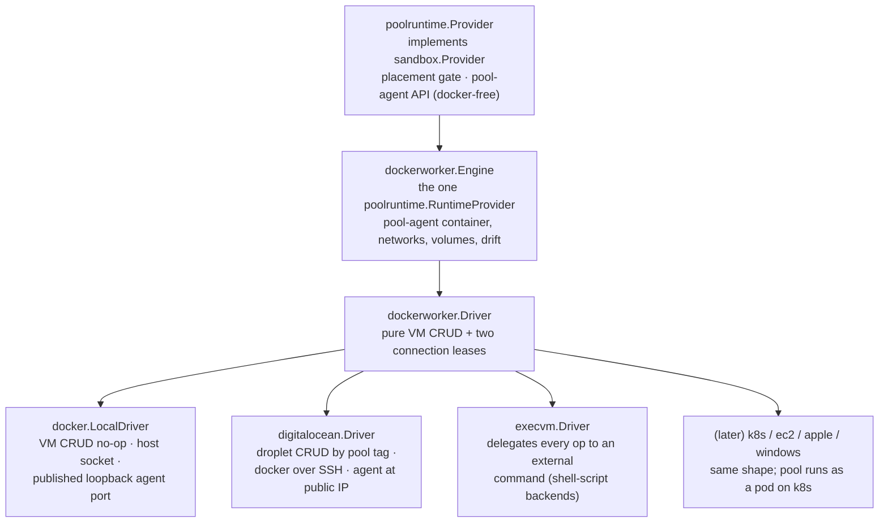

# Sandbox Provider Design

This package contains concrete sandbox provider implementations and factory
registration. It consumes `server/internal/sandbox` for the Go-level provider
interface, provider manager, typed `PoolManager` control-plane surface, and
shared provider types. It also consumes server-owned persistence models and
the pool-agent package for pool host boot metadata.

Providers own runtime mechanics only; services own persistence, authorization,
orchestration, and API shape.

A pool is its own runtime host (ADR-0006): one container, VM, or pod runs the
pool agent and hosts the pool's sandboxes.

## Runtime References

`SandboxRef` carries `project_id` and `sandbox_id`.

- `project_id` scopes provider placement, shared caches, VM selection, resource
  settings, and cleanup.
- `sandbox_id` identifies the managed runtime resource.

## Provider Layers

Docker container management is the invariant: every backend ends with "run the
pool-agent container in some Docker daemon." Backends differ only in VM CRUD
and how to reach that daemon and the pool-agent API.



`server/providers/poolruntime.Provider` is the registered `sandbox.Provider`
for pool-backed provider instances. It owns sandbox placement gating (the
sandbox's pool must be ready, schedulable, and fit the request — there is no
candidate search), capacity waits, bootstrap credential minting, pool runtime
convergence (`sandbox.PoolRuntimeReconciler`), and user-sandbox operations
through the pool-agent API. Docker never appears at this layer or above: the
boundary contract downward is the `poolruntime.RuntimeProvider` interface, and
the runtime contract for sandboxes is the pool-agent HTTP API reached through
`transport.HTTPClientLease`.

`poolruntime.RuntimeProvider` is a five-method interface: `Close`,
`EnsurePool`, `RepairPool`, `RemovePool`, and `AcquirePoolAgentClient`.
`dockerworker.Engine` is its only implementation. The engine owns everything
Docker: launching the pool-agent container with boot env, socket bind and host
mounts, scoped volumes, the per-pool sandbox proxy network, health waits,
config-revision drift detection, container replacement during repair, and
applying the pool envelope (CPU/memory) as the container limit so per-sandbox
limits nest inside it. It obtains Docker access exclusively through the driver.

`dockerworker.Driver` is the backend seam sized for "add EC2 without reading
the engine":

- `EnsureVM` / `DeleteVM` / `InspectVM`: idempotent VM CRUD keyed by pool ID.
  The local driver resolves every pool to the host and CRUD is a no-op.
- `AcquireDockerClient`: a Docker API client lease for the daemon hosting the
  pool's containers — the host socket locally, the in-VM daemon over SSH for
  DigitalOcean, vsock later. `NewDockerClientForDialer` adapts any `net.Conn`
  dialer; `dockerworker/sshdocker` is the shared pure-Go SSH-to-docker-socket
  dialer for cloud VM drivers and for `ssh://` endpoints from the exec driver.
- `AcquireWorkerAgentClient`: an HTTP lease reaching the pool-agent API — the
  container's published loopback port locally, `http://<public-ip>:<agent
  port>` for cloud VMs.

The engine owns Docker readiness waiting after `EnsureVM` (ping with a
deadline), so drivers never implement boot polling.

Pool runtime lifecycle is not the same as pool row deletion. The engine
replaces the pool-agent container (and a VM driver may replace the VM) for an
existing pool during reconciliation or repair, but the pool row and pool ID
are preserved: recovery is strictly in-place, and pool-local state survives in
named Docker volumes. Pool row deletion is intent-based and allowed only after
the control plane proves no sandbox is assigned to the pool.

`RepairPool` is the recovery hook for pools whose runtime is known to be
unhealthy, including a runtime whose agent never registered within the
registration timeout. The engine replaces the container and replaces the VM
only when `InspectVM` reports it missing or unhealthy.

The control plane launches the pool-agent container over the VM's Docker
daemon on every backend. Cloud VM images therefore stay generic: DigitalOcean
cloud-init only installs and enables Docker; bootstrap identity travels as
container environment rendered by `dockerworker.BootEnv`.

## Pool Runtime Drift

Runtime drift detection is backend-owned. The local docker provider runs a
watcher over the shared daemon: it lists managed pool containers, compares
them with pool rows, and uses the engine's config revision
(`Engine.ShouldReconcileWorkerContainer`) for drift. For pool rows that still
exist it marks the pool dirty; the only direct side effect allowed is deleting
an orphan managed runtime with no pool row. VM-per-pool backends get drift
detection through `InspectVM` during normal reconciliation.

The watcher's initial drift scan and its event loop both run in the
background: provider initialization starts the watcher and returns
immediately. The initial scan is best-effort — its failures are logged, never
fatal. Drift detection is only about pool host runtimes: it must not inspect,
reconcile, or delete user sandbox containers hosted inside a pool; those
belong behind the pool-agent sandbox runtime API. It must never delete a
persisted pool row.

## Pool Failure and Recovery

Terminal failure is reserved for pools whose *initial create* never
succeeded. A pool is stateful once its runtime has completed create and its
agent registered (`Pool.EverCreated()`, keyed off `RegisteredAt`): it may own
runtime volumes and assigned sandboxes, so the control plane makes every
effort to reconcile it back to health instead of abandoning it.

- A failed reconcile of a never-created pool latches the terminal `failed`
  phase; a created pool drops to the non-terminal `offline` phase, not ready
  and not schedulable, and is re-driven (`SchedulePoolRepair` bumps the
  generation so schedulers can tell a pending retry from a settled failure).
- A reconcile failure while sandboxes are assigned repairs the runtime in
  place rather than recording the failure.
- The docker watcher re-marks a created but failed/offline pool even when its
  container is gone, so a missing runtime is recreated.

## Pool Agent HTTP Routing

Transport leasing is represented by `server/internal/transport.HTTPClientLease`.
The provider obtains pool-agent connectivity from
`RuntimeProvider.AcquirePoolAgentClient` and attaches per-request token
providers to the lease so credentials are minted close to use and are not
cached as driver or lease state.

The provider-facing logical URL space for a pool agent is:

```text
https://pool/api/project/{project_id}/pool/{pool_id}/...
```

The `https://pool` authority is a stable logical authority, not necessarily a
real DNS name. Drivers translate it into something that reaches the in-guest
pool-agent HTTP server. The pool agent validates that `{project_id}` and
`{pool_id}` match its bootstrap identity before performing any operation, and
sandbox routes require a short-lived scoped bearer token signed by the control
plane.

## Sandbox Pool API

The pool-agent HTTP server owns sandbox runtime operations inside one pool.
The control plane still owns persistence, authorization, events, and desired
state; calling the pool API must be done from reconciliation or provider
operations after intent has already been accepted and stored. The canonical
contract is `pool-agent/api/openapi/pool.yaml`; operation endpoints are
synchronous from the pool's perspective.

## Pool Boot Metadata

Bootstrap identity — control plane URL, project/pool identity, bootstrap
token, control-plane trust key, agent port — is rendered as container
environment by `dockerworker.BootEnv` and injected into the pool-agent
container by the engine, uniformly on every backend. VM drivers only need
their platform's Docker bring-up; they never carry bootstrap secrets in VM
user data.

## DigitalOcean Driver

`server/providers/digitalocean` implements the `dockerworker.Driver` contract
with one Docker-enabled Droplet per pool, keyed by the
`discobox-pool-<pool_id>` tag. Configuration includes the API token, control
plane URL, region/size/droplet image, pool-agent container image, registered
SSH keys plus the matching SSH private key, VPC UUID, tags, and feature flags.

## Exec Driver

`server/providers/execvm` implements the `dockerworker.Driver` contract by
invoking an external command as `<command> <op> <pool-id>`, so a pool backend
can be a shell script. The protocol is documented in the `execvm` package doc;
it exists both as an escape hatch and as the proof that the driver seam needs
nothing Docker-shaped.

## Placement

Placement is a gate, not a search: `SchedulablePoolForSandbox` verifies the
sandbox's pool is active, ready, schedulable, unrevoked, and that the request
fits the pool's agent-reported capacity. When the gate fails, the provider
kicks the pool reconcile and waits bounded time for the agent to report
schedulable, surfacing a settled pool failure (latest intent attempted and
lost) with its recorded cause instead of a bare capacity error.
