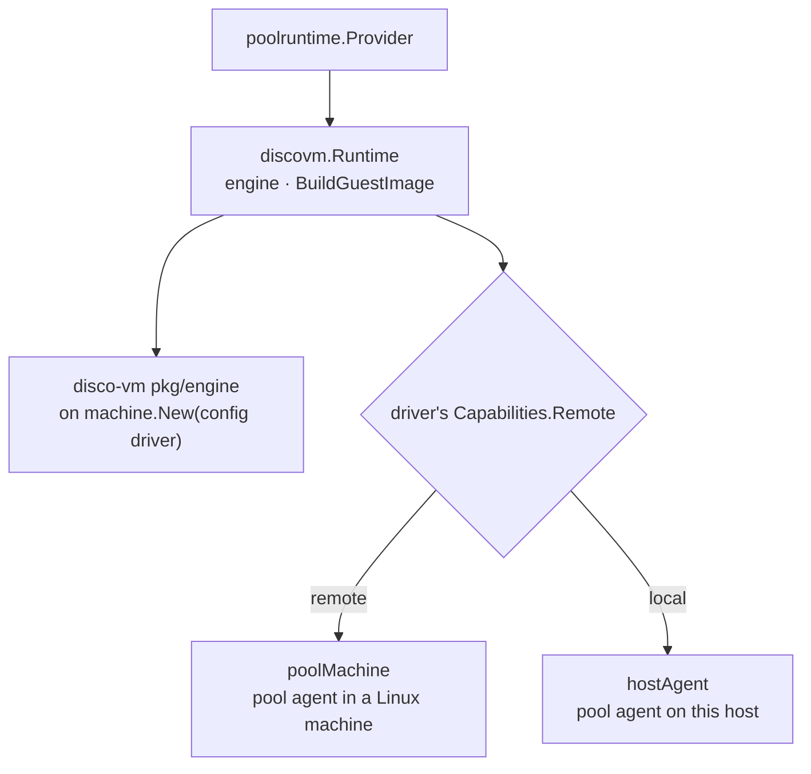

# disco-vm Provider Design

`discovm` is the `poolruntime.RuntimeProvider` for pools whose sandboxes are
disco-vm machines ([github.com/discobox-ai/vm](https://github.com/discobox-ai/vm)),
beside `dockerworker.Engine` rather than under it: a discovm pool runs no
Docker (ADR 26-10-09-106 §1). This package is the skeleton: the provider kind,
the embedded engine and its shim, and pool hosting with its console, log, and
image build. The driver is configuration it passes to disco-vm; how a pool is
hosted follows from what that driver reports. The machine seam a pool agent
drives sandboxes through (#122), and the pool agents themselves (#64, #127),
come next.

## The Engine Is the Server's

- One state root per host (`stateRoot`, under the platform's data directory),
  shared by every provider instance and every driver; it is not configurable.
  Each provider instance opens an engine on it with the driver it names. The
  engine's state is its files, so a cap it enforces at `Start` — vz's two
  running macOS guests — counts every instance's machines, which is what makes
  it the host's (ADR §4). The server is where the engine, its image store, its
  shims, and the boxd credential live (ADR §2).
- The module is imported by commit (a pseudo-version), never a tag.
- A local machine's shim is this binary re-executed as `__discovm-shim`
  (`RunShimIfInvoked`, called from `server.RunVMLauncherIfInvoked` before
  anything a server does) with the engine's root and driver, so the server
  ships no disco-vm binary. A remote driver (boxd) runs no shim: the engine
  attaches to boxd's machine on every call, so a running one is adopted across
  restarts, which "VM Lifetime" in [../DESIGN.md](../DESIGN.md) does not forbid
  for a machine that is not the host's.
- A shim does not yet die with the server; that is discobox-ai/vm#8, and it
  gates vz sandboxes, not this skeleton.

## Drivers

The driver is configuration, passed to disco-vm as it is: `newDriver` is
`machine.New(cfg.Driver)` on disco-vm's own registry, and validation asks the
same registry. Nothing in this package is written per driver. A build links
the real hypervisors its OS has (`drivers.go`: boxd everywhere,
`drivers_darwin.go`: vz, `drivers_windows.go`: hcs), as imports and nothing
else. It never links disco-vm's `fake` driver, whose guest agent is the
running binary serving exec on loopback; only tests do.

`driver` is `Immutable`: it cannot change while the provider has pools,
because only the driver that made a pool's host can remove it.

Where a pool's agent runs follows from what the driver reports
(`newPoolHost`, `machine.Capabilities.Remote`), as ADR 26-10-09-106 §1 places
it:

| driver reports | pool host | console | log |
| --- | --- | --- | --- |
| remote (boxd) | `poolMachine`: a Linux machine named `discobox-pool-<pool>` | `bash -l` in it, through disco-vm's guest exec | its journal for this boot, through the same exec |
| local (vz, hcs) | `hostAgent`: a pool agent process under `<stateRoot>/pools/<pool>` (#64) | refused, `sandbox.ErrPoolConsoleUnsupported`: the host is the user's own machine | the agent's `pool-agent.log` |

- `poolMachine` reaches the host through disco-vm's own guest agent, never
  through the pool agent, for the console's reason ([../DESIGN.md](../DESIGN.md#pool-host-console)).
- A pool machine is created from the engine's `discobox-<driver>-pool` image, started,
  and recorded on the pool row as registering. Repair stops and starts the same
  machine, keeping its disk; remove deletes it.
- A remote machine whose service does not answer reads `Unknown`, which is
  neither running nor stopped: ensure and repair answer
  `sandbox.ErrPoolNotReachable` rather than booting a second time, or stopping a
  healthy pool, for a network fault.
- Tests host pools in machines of the `fake` driver (a local driver, so they
  build that `poolMachine` themselves), which runs the engine, its shim, and the
  guest protocol as a real machine does.
- disco-vm's boxd driver reads `BOXD_API_KEY` from the server's environment,
  its only way today. Passing driver options (the key) through the provider's
  configuration needs `machine.New` to take them, and lands with the boxd pool
  (#127).

## Images

`BuildGuestImage` builds the driver's disco-vm images with disco-vm's builder
into the engine's store, from the build specs the checkout it is given holds
under `server/providers/discovm/images/<driver>/` — not under `vm-image/`,
which is the Docker pool VMs' guest and names no backend. Each
`<role>.yaml` builds the image tagged `discobox-<driver>-<role>`. The tag
names the driver because every driver on a host shares the engine's one store
and tag namespace. Which images a
driver has is the checkout's to say. The checkout is the build context. The image is
the server's, not the pool's, so the pool named only says where the operation
was asked from. A driver the checkout has no specs for answers
`ErrGuestImageBuildUnsupported`. `RestartHost` is refused: a machine is cloned
from its image, so a new image reaches a pool only when its machine is
replaced.

## Not Yet

- `EnsurePool` mints no bootstrap and `AcquirePoolAgentClient` answers that
  there is no pool agent: no driver starts one yet.
- No pool size fields: a machine's size is the driver's, decided with the pool
  images.
