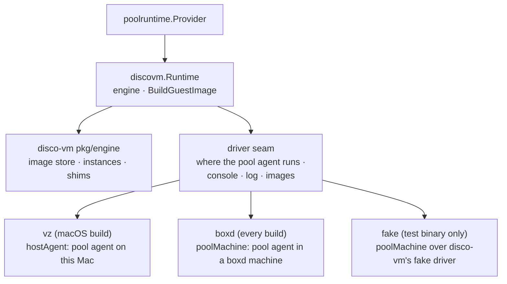

# disco-vm Provider Design

`discovm` is the `poolruntime.RuntimeProvider` for pools whose sandboxes are
disco-vm machines ([github.com/discobox-ai/vm](https://github.com/discobox-ai/vm)),
beside `dockerworker.Engine` rather than under it: a discovm pool runs no
Docker (ADR 26-10-09-106 §1). This package is the skeleton: the provider kind,
the embedded engine and its shim, and per-driver pool hosting with its console,
log, and image build. The machine seam a pool agent drives sandboxes through
(#122), and the pool agents themselves (#64, #127), come next.

## The Engine Is the Server's

- One state root per host (`stateRoot`, under the platform's data directory),
  shared by every provider instance and every driver; it is not configurable.
  Each provider instance opens an engine on it with the driver it names. The
  engine's state is its files, so a cap it enforces at `Start` — vz's two
  running macOS guests — counts every instance's machines, which is what makes
  it the host's (ADR §4). The server is where the engine, its image store, its
  shims, and the boxd credential live (ADR §2).
- The module is imported by commit (a pseudo-version), never a tag.
- A local machine's shim is this binary re-executed as `__discovm-shim`
  (`RunShimIfInvoked`, called from `server.RunVMLauncherIfInvoked` before
  anything a server does) with the engine's root and driver, so the server
  ships no disco-vm binary. A remote driver (boxd) runs no shim: the engine
  attaches to boxd's machine on every call, so a running one is adopted across
  restarts, which "VM Lifetime" in [../DESIGN.md](../DESIGN.md) does not forbid
  for a machine that is not the host's.
- A shim does not yet die with the server; that is discobox-ai/vm#8, and it
  gates vz sandboxes, not this skeleton.

## Drivers

A driver is in a build only where its hypervisor runs: `boxd.go` everywhere,
`vz_darwin.go` on macOS. The configuration's `driver` is validated against the
drivers the build has, and is `Immutable`: it cannot change while the provider
has pools, because only the driver that made a pool's host can remove it. The seam (`driver` in `runtime.go`) is what differs:

| | pool host | console | log | images |
| --- | --- | --- | --- | --- |
| `vz` | `hostAgent`: a pool agent process under `<stateRoot>/pools/<pool>` (#64) | refused, `sandbox.ErrPoolConsoleUnsupported`: the host is the user's own Mac | the agent's `pool-agent.log` | the macOS sandbox image (#126) |
| `boxd` | `poolMachine`: a boxd machine named `discobox-pool-<pool>` | `bash -l` in it, through disco-vm's guest exec | its journal for this boot, through the same exec | the pool and sandbox images (#123) |

- `poolMachine` reaches the host through disco-vm's own guest agent, never
  through the pool agent, for the console's reason ([../DESIGN.md](../DESIGN.md#pool-host-console)).
- A pool machine is created from the engine's `discobox-pool` image, started,
  and recorded on the pool row as registering. Repair stops and starts the same
  machine, keeping its disk; remove deletes it.
- A remote machine whose service does not answer reads `Unknown`, which is
  neither running nor stopped: ensure and repair answer
  `sandbox.ErrPoolNotReachable` rather than booting a second time, or stopping a
  healthy pool, for a network fault.
- `fake` is disco-vm's machine with no hypervisor, hosted as `poolMachine`. It
  is registered from the test binary alone, because its guest agent is the
  running binary, which in a server is a server.
- boxd reads `BOXD_API_KEY` from the server's environment, disco-vm's only way
  today. Taking the key as provider configuration, as the ADR has it, needs
  disco-vm to accept one, and lands with the boxd pool (#127).

## Images

`BuildGuestImage` builds the driver's disco-vm images with disco-vm's builder
into the engine's store, from build specs under
`server/providers/discovm/images/<driver>/` in the checkout it is given — not
under `vm-image/`, which is the Docker pool VMs' guest and names no backend. The checkout is the build context. The image is
the server's, not the pool's, so the pool named only says where the operation
was asked from. A driver with no images yet answers
`ErrGuestImageBuildUnsupported`. `RestartHost` is refused: a machine is cloned
from its image, so a new image reaches a pool only when its machine is
replaced.

## Not Yet

- `EnsurePool` mints no bootstrap and `AcquirePoolAgentClient` answers that
  there is no pool agent: no driver starts one yet.
- No pool size fields: a machine's size is the driver's, decided with the pool
  images.
