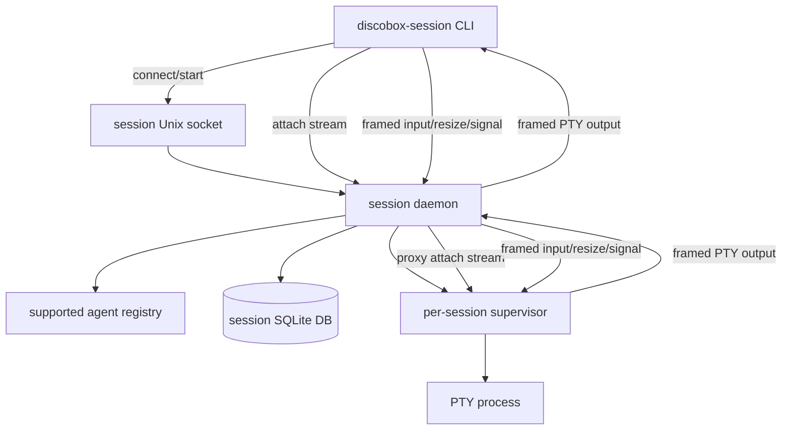

# Sessions Design

This module owns the standalone Discobox coding-agent session manager. It starts
interactive coding-agent CLIs in supervisor-owned PTYs and lets client CLIs
attach, detach, resize, and signal those live processes through a daemon API.

## Scope

Sessions are local to one Git worktree and one Discobox session ID. The module
does not depend on server internals or control-plane DTOs. It follows the hooks
runtime shape: resolve the Git root, compute XDG state/runtime paths, start a
session-scoped daemon on demand, and talk to that daemon over a Unix socket.

Supported agents are explicit. Defaults are built in for:

- `codex`: `codex`
- `claude-code`: `claude`
- `opencode`: `opencode`

Agent commands may be overridden by a JSON config file. The daemon loads config
from, in order:

- `$DISCOBOX_SESSIONS_CONFIG`
- `$GIT_ROOT/.discobox/sessions.json`
- `$XDG_CONFIG_HOME/discobox/sessions.json`

The daemon and supervisor JSON APIs are contract-first. The canonical OpenAPI
documents live at [`api/openapi/sessions.yaml`](api/openapi/sessions.yaml) and
[`api/openapi/supervisor.yaml`](api/openapi/supervisor.yaml). Generated daemon
scaffolding lives under [`api/gen`](api/gen), and generated supervisor
scaffolding lives under [`api/supervisorgen`](api/supervisorgen). The upgraded
attach streams are documented in the OpenAPI contracts but are still
intercepted by transport code before generated routing so they can hijack the
connection.

## Architecture

Each repository/session pair has at most one daemon, one daemon socket, one
startup lock, one SQLite database, and one daemon runtime metadata file. Each
coding-agent session has one detached supervisor process and one supervisor
socket.

Runtime/session state uses XDG-style paths outside the repo:

- state metadata: `$XDG_STATE_HOME/discobox/session/<session>/sessions/<repo-key>/`
- socket, startup lock, and transient metadata: `$XDG_RUNTIME_DIR/discobox/s/<session>/sessions/<repo-key-prefix>/`

The runtime path intentionally uses a shorter namespace than durable state so
the Unix socket stays below platform path-length limits under long runtime roots.

## Protocol

Non-streaming operations use HTTP over the Unix socket:

- `GET /ping`
- `GET /status`
- `GET /agents`
- `GET /sessions`
- `POST /sessions`
- `POST /sessions/{id}/resize`
- `POST /sessions/{id}/signal`
- `POST /shutdown`

Supervisor non-streaming operations also use HTTP over the supervisor Unix
socket and are served through the generated supervisor API:

- `GET /status`
- `POST /resize`
- `POST /signal`

`POST /sessions/{id}/attach` upgrades the HTTP connection and switches to a
small framed stream proxied to the supervisor `POST /attach` upgrade route.
Frames are one byte type, four byte big-endian payload length, then payload
bytes:

- `1`: PTY output, daemon to client
- `2`: PTY input, client to daemon
- `3`: resize JSON, client to daemon
- `4`: signal name, client to daemon
- `5`: attach error, daemon to client

The CLI owns local terminal raw mode and the `ctrl+p q` detach sequence. Detach
closes only the attach stream; it does not stop the supervisor-owned agent
process.

## Module Map

| Package/path | Ownership |
| --- | --- |
| root package | Public DTOs, agent config, and stream framing helpers. |
| [`api`](api) | Unix-socket OpenAPI contracts and generated client/server transport code. |
| [`models`](models) | GORM database models for durable session metadata. |
| [`store`](store) | GORM-backed persistence and runtime-file reconciliation helpers. |
| [`daemon`](daemon) | Session daemon lifecycle, supervisor launch/reconciliation, local HTTP API, attach proxying, supervisor runtime, and idle shutdown. |
| [`client`](client) | Unix-socket HTTP client and attach stream transport used by the CLI. |
| [`cmd/discobox-session`](cmd/discobox-session) | CLI entrypoint, path resolution, daemon startup, list/create/attach UX, and terminal control. |

## Lifecycle

`create <agent>` asks the daemon to persist a session row, start a detached
supervisor with the configured command in the current repository root by
default, allocate a PTY sized to the client terminal, and attach unless
`--detach` is set.

On Linux, supervisor-launched agent processes are started with
`Pdeathsig=SIGTERM` so an unexpectedly killed supervisor also terminates its
direct agent child. Normal supervisor shutdown sends `SIGTERM` to the agent
process group. Daemon shutdown does not stop supervisors; this lets a rebuilt or
restarted daemon reconnect to existing sessions.

Each supervisor has a per-session bearer token generated by the daemon, stored in
the SQLite session row, and passed to the supervisor through environment only.
Supervisor sockets require `Authorization: Bearer <token>` on status, attach,
resize, and signal routes. Tokens must not be written to runtime JSON files or
passed in process arguments.

`list` and `attach` start the daemon on demand. On startup and list/status, the
daemon reconciles database rows against supervisor sockets and supervisor
runtime files. If a supervisor is still running, the daemon can reconnect and
proxy attach to it. If the supervisor wrote an exit file, the daemon records the
exit code and error in the database. If neither the supervisor process nor exit
metadata can be found, or a recorded Linux PID belongs to a process that is not
the hidden `daemon supervisor`, the daemon marks the session `lost`.
