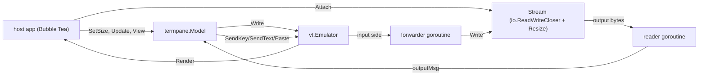

# termpane

A Bubble Tea component that draws a live terminal. It is the multiplexer half of
a terminal multiplexer and nothing else — no tiling, no workspaces, no session
daemon, no chrome.

Its own module, with no dependency on anything else in this repository, because
a component that draws terminals should not drag a control plane's client
libraries in behind it.

## The one decision the design turns on

A pane is driven by a `Stream`: `io.ReadWriteCloser` plus `Resize(cols, rows)`.
It never starts a process and never opens a PTY.

That is what makes it usable here at all. Disco's terminals are not local: they
are framed exec streams over a websocket to a sandbox on a pool host, with
replay and reconnect underneath. Multiplexers built around spawning local shells
(TUIOS, and every tmux-alike) tie the emulator to a PTY and an `exec.Cmd`, and
have no seam to hand a remote stream to. Inverting that — the caller brings the
stream — costs nothing and is the whole of the reuse.

## Decisions

**Input flows through the emulator, not around it.** Keys are handed to
`vt.Emulator`, and a goroutine copies the emulator's *input side* to the stream.
That is not indirection for its own sake: the emulator encodes keys the way the
application has asked for them (cursor-key mode, keypad mode, alt prefixing),
and it answers the queries applications make about the terminal they are running
in. Those replies are input like any other. An emulator whose replies are never
collected fills its buffer and wedges on the first query — which is exactly the
deadlock this codebase hit before.

**Printable text is sent as text, not as a key.** The emulator's key encoder
works from the unshifted code, so an uppercase `A` routed as a key arrives as
`a`, and `!` arrives as `1`. Anything with text and no ctrl/alt goes through
`SendText`.

**Modified special keys are encoded here** (`keys.go`). The emulator matches key
events by exact equality, so a Left carrying Ctrl or Shift matches none of its
cases and produces *nothing* — Ctrl-Left, Shift-Home and Ctrl-Delete reach the
application as silence. (Upstream says as much: "TODO: Support Kitty, CSI u, and
XTerm modifyOtherKeys".) Those are encoded in xterm's form before the emulator
is asked; everything else, Alt included, is left to it, since what it does there
works and is the application's own negotiated mode rather than a guess. A
modified cursor key takes the CSI form even in application-cursor mode, because
the SS3 form has nowhere to put a modifier.

**Detaching the forwarder is a handshake, not a kill.** `Emulator.Read` and
`Emulator.Close` both touch the emulator's `closed` flag with no synchronization
between them, so closing while a read is in flight is a data race — the obvious
implementation, and one the race detector catches. Instead the forwarder is
*woken*: a byte written to `InputPipe()` (the writer side of the very pipe its
`Read` waits on) returns that read, the forwarder sees the done signal and
leaves without forwarding the byte, and only then is the emulator closed. See
`stopForwarder`.

**End of file is an exit, not an error.** `ClosedMsg.Err` is nil when a stream
simply ends, so a host is not left reporting every normal exit as a failure. A
host whose stream is a local pty has one more of these to map: Linux fails a
read on the master with `EIO` once the last slave closes, which is what a
command exiting looks like from that side.

**Output bursts are coalesced.** A screen repaint is dozens of writes. The
reader queues them and `next()` drains everything waiting into one message, so a
burst costs one render rather than one render per chunk — the intermediate
states of a repaint are not something anyone asked to watch.

**`View` returns exact rows, and no frame.** Each row is truncated and padded to
exactly the pane's width, ANSI-aware, with any open style closed behind it. The
host draws its own chrome and places the cursor with `Cursor(originX, originY)`.
Passing a terminal grid through anything that re-wraps lines shifts every row
below the wrap and desyncs the hardware cursor from the screen the application
believes it is drawing on — which is why the host is given rows rather than a
rendered block.

**Chrome state is exposed, not acted on.** Title, alt-screen, cursor visibility
and shape, and a bell count come from the emulator's callbacks and are readable
by the host. The callbacks run on whichever goroutine is feeding the emulator,
so everything they touch is behind a mutex; the bell is a count rather than a
callback so a host can notice one without being interrupted on someone else's
goroutine.

**The reserved keys are optional and the policy is the host's.** `WithPrefix`
implements the screen/tmux escape hatch, with the detach key promoted to a press
of its own: detach emits `DetachMsg`; prefix then either reserved key sends that
key to the application; prefix then anything else sends both, so a mistyped
prefix costs nothing. Promoting detach is what lets a host reserve a key the
application also wants — Ctrl-C being the obvious one — while leaving a way to
type it. What *happens* on detach is the host's decision; the pane keeps
running.

**The mouse is mirrored, not seized.** `MouseMode()` reports what the
application has asked for, read off the stream by a CSI handler that returns
`false` so the emulator still applies the sequence (`mouse.go`). A host mirrors
it into its own mouse reporting, so the user only loses native selection while
something is actually using the mouse. `SendMouse` takes coordinates relative to
the grid — the same origin as `Cursor` — and drops anything outside it; the
emulator drops anything the application never asked for, so forwarding can be
unconditional.

Reading modes off the stream also means it makes no difference whether a mode
arrived from the application just now or from a reattach snapshot replaying what
it set before this client existed. They are the same bytes.

**A held Ctrl after the prefix is tolerated.** `afterPrefix` matches the second
keystroke with or without Ctrl, because the prefix is a Ctrl chord and letting
go precisely between the two keys is a skill nobody should need. GNU screen has
bound both forms for decades; tmux binds only the bare one and the control
variant silently does nothing. It applies *only* after the prefix — the detach
key on its own is matched exactly, since its bare letter is one you type
constantly — and not to typing the prefix itself, which takes the prefix twice
in full: its bare letter is one a binding can have, and with a leader like
Ctrl-A that letter is `a`.

**A binding can hold the sequence open.** `WithRepeatingPrefixBinding` leaves the
prefix armed after it fires, as long as the key that fired it was held with
Ctrl, so `prefix ^← ^← ^←` is one chord rather than three. It is for the
bindings you use in runs — walking across panes, resizing — where pressing the
prefix per step is the whole cost of the operation. Letting go of Ctrl ends it,
which is the release the fingers already make. The armed state is readable and
settable (`PrefixArmed`, `SetPrefixArmed`) because a host whose binding moves
focus to another pane has to carry the sequence there, or the run stops on its
own first step.

**Scrollback can be looked at.** `Scroll` moves the view back through what has
scrolled off, `View` draws those rows in place of the screen's, and any new
output pins it back to the live screen — a pane scrolled away from what is
happening in it, with no way to notice, is a pane that looks hung. What keys
drive it is the host's business, as with everything else here.

## Not here

There is no copy mode: scrollback can be read but not selected from.
