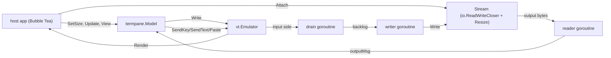

# termpane

A Bubble Tea component that draws a live terminal. It is the multiplexer half of
a terminal multiplexer and nothing else — no tiling, no workspaces, no session
daemon, no chrome.

Its own module, with no dependency on anything else in this repository, because
a component that draws terminals should not drag a control plane's client
libraries in behind it.

## The one decision the design turns on

A pane is driven by a `Stream`: `io.ReadWriteCloser` plus `Resize(cols, rows)`.
It never starts a process and never opens a PTY.

That is what makes it usable here at all. Disco's terminals are not local: they
are framed exec streams over a websocket to a sandbox on a pool host, with
replay and reconnect underneath. Multiplexers built around spawning local shells
(TUIOS, and every tmux-alike) tie the emulator to a PTY and an `exec.Cmd`, and
have no seam to hand a remote stream to. Inverting that — the caller brings the
stream — costs nothing and is the whole of the reuse.

## Decisions

**Input flows through the emulator, not around it.** Keys are handed to
`vt.Emulator`, and a goroutine copies the emulator's *input side* to the stream.
That is not indirection for its own sake: the emulator encodes keys the way the
application has asked for them (cursor-key mode, keypad mode, alt prefixing),
and it answers the queries applications make about the terminal they are running
in. Those replies are input like any other. An emulator whose replies are never
collected fills its buffer and wedges on the first query — which is exactly the
deadlock this codebase hit before.

**Printable text is sent as text, not as a key.** The emulator's key encoder
works from the unshifted code, so an uppercase `A` routed as a key arrives as
`a`, and `!` arrives as `1`. Anything with text and no ctrl/alt goes through
`SendText`.

**Modified special keys are encoded here** (`keys.go`). The emulator matches key
events by exact equality, so a Left carrying Ctrl or Shift matches none of its
cases and produces *nothing* — Ctrl-Left, Shift-Home and Ctrl-Delete reach the
application as silence. (Upstream says as much: "TODO: Support Kitty, CSI u, and
XTerm modifyOtherKeys".) Those are encoded in xterm's form before the emulator
is asked; everything else, Alt included, is left to it, since what it does there
works and is the application's own negotiated mode rather than a guess. A
modified cursor key takes the CSI form even in application-cursor mode, because
the SS3 form has nowhere to put a modifier. Backspace is the exception with no
form to encode: xterm sends DEL shifted or not, so Shift-Backspace is folded
onto Backspace (`unshiftBackspace`) rather than given a sequence of its own.

**Input is drained and written by separate goroutines.** The pipe behind the
emulator is synchronous — `Paste` and `SendKey` are held until their bytes are
read — and every one of its writers runs on the host's update goroutine, the
emulator's automatic replies included. So the drain never writes to the stream
itself: it copies into a bounded backlog that the writer empties at whatever
pace the far end allows. A stalled pty or a reconnecting transport costs the
host nothing until the backlog fills, which is two megabytes further on than
typing or any real paste reaches.

**The drain never gives up while attached.** A failed write ends the *writer*;
the drain goes on reading and drops what it reads. A drain that returned would
leave the pipe with no reader, and the next paste or keystroke — on the update
goroutine — would block on it forever, with nothing left able to run the detach
that would release it. One dead pane must not be a dead window. That the session
is over is the reader's to report, so nothing is reported twice.

**Paste markers are stripped from pasted text.** Text carrying `ESC [ 201 ~`
would close its own paste early on the far end, and everything after it would
arrive as though typed — a clipboard ending `\x1b[201~rm -rf /\r` would run.
Every terminal filters this and a pane is a terminal. Nothing else about a paste
is touched: it is the user's own text.

**Detaching the drain is a handshake, not a kill.** `Emulator.Read` and
`Emulator.Close` both touch the emulator's `closed` flag with no synchronization
between them, so closing while a read is in flight is a data race — the obvious
implementation, and one the race detector catches. Instead the drain is *woken*:
a byte written to `InputPipe()` (the writer side of the very pipe its `Read`
waits on) returns that read, the drain sees the done signal and leaves without
forwarding the byte, and only then is the emulator closed. See `stopForwarder`.

**A read-only pane also supplies the line discipline** (`WithReadOnly`). The
option is for a far end with no input side to reach — a process on pipes rather
than a PTY — so it drops keys, text and pastes, and stops sending resizes:
there is no terminal there whose size could be wrong.

Being on pipes has a second consequence that is easy to miss. A pipe has no
line discipline, so nothing has turned the program's `\n` into `\r\n`, and a
terminal reads a bare LF as "down one row, same column". Feed a pipe's output
to an emulator untouched and every line starts where the last one ended — the
staircase. The pane sets LNM (`ansi.SetModeLineFeedNewLine`) on the emulator at
attach rather than rewriting the stream: it is the terminal's own switch for
exactly this, a lone CR still overwrites its line so progress output works, a
CRLF still moves one line, and nothing modifies the bytes on their way to a
transcript. LNM also governs what the Return key sends, which is why it rides
on read-only rather than being an option of its own — only a pane that sends
nothing can set it without changing its input.

**End of file is an exit, not an error.** `ClosedMsg.Err` is nil when a stream
simply ends, so a host is not left reporting every normal exit as a failure. A
host whose stream is a local pty has one more of these to map: Linux fails a
read on the master with `EIO` once the last slave closes, which is what a
command exiting looks like from that side.

**Output bursts are coalesced.** A screen repaint is dozens of writes. The
reader queues them and `next()` drains everything waiting into one message, so a
burst costs one render rather than one render per chunk — the intermediate
states of a repaint are not something anyone asked to watch.

**`View` returns exact rows, and no frame.** Each row is truncated and padded to
exactly the pane's width, ANSI-aware, with any open style closed behind it. The
host draws its own chrome and places the cursor with `Cursor(originX, originY)`.
Passing a terminal grid through anything that re-wraps lines shifts every row
below the wrap and desyncs the hardware cursor from the screen the application
believes it is drawing on — which is why the host is given rows rather than a
rendered block.

**Chrome state is exposed, not acted on.** Title, alt-screen, cursor visibility
and shape, and a bell count come from the emulator's callbacks and are readable
by the host. The callbacks run on whichever goroutine is feeding the emulator,
so everything they touch is behind a mutex; the bell is a count rather than a
callback so a host can notice one without being interrupted on someone else's
goroutine.

**The reserved keys are optional and the policy is the host's.** `WithPrefix`
implements the screen/tmux escape hatch, with the detach key promoted to a press
of its own: detach emits `DetachMsg`; prefix then either reserved key sends that
key to the application; prefix then anything else sends both, so a mistyped
prefix costs nothing. Promoting detach is what lets a host reserve a key the
application also wants — Ctrl-C being the obvious one — while leaving a way to
type it. What *happens* on detach is the host's decision; the pane keeps
running.

**The mouse is mirrored — unless the host seizes it.** `MouseMode()` reports
what the application has asked for, read off the stream by a CSI handler that
returns `false` so the emulator still applies the sequence (`mouse.go`). A host
mirrors it into its own mouse reporting, so the user only loses native
selection while something is actually using the mouse. `SendMouse` takes
coordinates relative to the grid — the same origin as `Cursor` — and drops
anything outside it; the emulator drops anything the application never asked
for, so forwarding can be unconditional.

`HandleMouse` is the router over that (`select.go`): while the application has
the mouse and the host has not called `SetSeized(true)`, every event forwards
and selection is inert; otherwise the left button drives selection. Any nonzero
mouse mode counts as the application having the mouse — stealing motion events
an application subscribed to button events for breaks its drags in ways nobody
can debug. Seizing suppresses forwarding entirely; what arms it, and showing
that it is armed, are the host's, because "why is vim ignoring my clicks" must
be answerable from the chrome. The wheel goes to whoever can actually scroll: an
application with the mouse is forwarded the event; one without it on the
alternate screen is sent arrow keys — xterm's alternate-scroll bargain, and
the only scrolling a pager understands, there being no scrollback there to
offer — and everything else scrolls the pane's own scrollback. The right
button copies a showing selection, below. A host with a
different wheel policy keeps those events instead of delegating them.

**Where a link points is the host's, and the text is never touched**
(`WithLinkRewrite`, `links.go`). A pane whose terminal is somewhere else draws
addresses that are true where they were printed and false where they are read:
a server inside a sandbox prints `http://localhost:8080`, and here that port is
whatever a forward bound, if anything. The host supplies a function from URL to
URL; returning the URL it was given means "already right", which is the answer
for everything it does not recognize.

It governs two things. Every OSC 8 target an application emits passes through
it, so a link the application made itself lands where it meant. And plain text
that looks like a URL is linked when — and only when — the function moves it:
the terminal drawing the pane does its own URL detection, so linking everything
would take a working link away to hand back a copy of it, while a URL whose port
is a lie is the one case that detection cannot get right. The text on the screen
is the application's and stays exactly as printed; only the click is redirected.

It runs on the rendered row, in `View`, before the fit. Cells are the wrong
place: they hold half a URL for as long as the far end takes to print the rest,
and a line that scrolls off mid-write is in the scrollback before anything could
look at it — a rendered row has been assembled from the grid and says what it is
going to say. Rows come from `ansi.DecodeSequence`, so a style change inside a
URL is a token in the middle of it rather than a break, and the sequences added
occupy no cells. Before the fit because a scrollback row can be wider than the
pane, and a URL the truncation cut in half would otherwise be read as whatever
half survived; truncation keeps escape sequences, so the link opened around it
survives the cut. Detection is scheme-led and stops at the row: a URL wrapped
across the right edge is not one.

**Selection is a cell-space overlay, mouse only** (ADR 0036). The gesture
machine and extraction live in the `selection` subpackage against a small
`Grid` interface. A double-click's idea of a word is vte-shaped: letters,
digits, the underscore, and a configurable set of gluing punctuation
(`WithWordChars`), whose default — xfce4-terminal's effective set less the
comma — brings out a path, URL, or `--flag` in one click while the shell's
own operators still split; `select.go` adapts the emulator to it as one absolute line
space — scrollback first, live screen after — so a selection keeps naming the
same text while output scrolls it into history, and selecting across the
boundary is no special case. Rows the selection touches are re-rendered from
their cells with a style transform (reverse video by default, `WithHighlight`
to theme) so highlight and copied text are read from the same cells and cannot
disagree; every other row keeps the fast `Render()` path. A finished gesture
returns a command carrying `CopyMsg` — the pane never touches a clipboard.
While a selection is showing — and only then — the copy chords (ctrl+c,
ctrl+shift+c, super+c) re-emit it and clear the highlight, outranking both the
application's interrupt and the pane's own reserved keys: the visible
selection is the mode, and clearing it means the second press is the
interrupt, or the detach, that the key otherwise is. Classic terminals cannot
distinguish the enhanced chords from plain ctrl+c and deliver the form that is
caught anyway; macOS cmd+c never reaches a terminal application at all, which
is why copy happens on release — the clipboard is written before the habit
keystroke, whose no-op nobody notices. The right button is that rule with a
mouse in hand (`rightClickCopy`): over a showing selection it copies and
clears, which is what Windows terminals do and what a hand already on the
mouse reaches for. With nothing selected it is inert — the other half of that
gesture is paste, and a pane has no clipboard to paste from, so a host that
wants it handles the button itself.
Extraction joins soft-wrapped rows without a newline, detected for now by the
full-width heuristic behind `Grid.Wrapped` until the upstream wrap flag lands.
A selection whose coordinates stop meaning what they meant is cleared, never
left to slide: content overwritten in place (the post-output text no longer
reads back identical), a resize (no reflow, so columns are meaningless), an
alt-screen switch, or output while a full scrollback is evicting under a
selection that touches it.

**The application's own copies are selections too** (`clipboard.go`). An
application that has learned it is on a remote terminal copies by writing
OSC 52 — vim with `clipboard=unnamed`, tmux's `set-clipboard`, anything using
the `Ms` capability — and the emulator has no handler for it, so the pane is
the only place it can be caught. A copy is held on the model and handed out of
`Update` as the same `CopyMsg` a finished selection produces: what a host does
with copied text does not depend on which end started it. Only the selections
that mean a clipboard are taken (`c`, `p`, `s`, and the empty default); xterm's
cut buffers are registers, not a clipboard. A clear (empty payload, or anything
that is not base64) is dropped — an application emptying its own clipboard is
no reason to empty the user's — and the last copy in a burst is the one
delivered, which is what the clipboard would have been left holding anyway.

**A clipboard *read* is answered with silence.** `OSC 52 ; c ; ?` asks the
terminal to send back what is on the clipboard, which would let anything that
can print inside the pane collect whatever the user last copied for something
else. xterm ships it disabled, and a pane has no way to ask the host's
permission, so the sequence is consumed and nothing is written back.

Reading modes off the stream also means it makes no difference whether a mode
arrived from the application just now or from a reattach snapshot replaying what
it set before this client existed. They are the same bytes.

**A held Ctrl after the prefix is tolerated.** `afterPrefix` matches the second
keystroke with or without Ctrl, because the prefix is a Ctrl chord and letting
go precisely between the two keys is a skill nobody should need. GNU screen has
bound both forms for decades; tmux binds only the bare one and the control
variant silently does nothing. It applies *only* after the prefix — the detach
key on its own is matched exactly, since its bare letter is one you type
constantly — and not to typing the prefix itself, which takes the prefix twice
in full: its bare letter is one a binding can have, and with a leader like
Ctrl-A that letter is `a`.

**A binding can hold the sequence open.** `WithRepeatingPrefixBinding` leaves the
prefix armed after it fires, as long as the key that fired it was held with
Ctrl, so `prefix ^← ^← ^←` is one chord rather than three. It is for the
bindings you use in runs — walking across panes, resizing — where pressing the
prefix per step is the whole cost of the operation. Letting go of Ctrl ends it,
which is the release the fingers already make. While the run is open, only the
repeating keys — still under Ctrl — are taken; any other key, bound letters
included, ends the run and goes to the application. The prefix was held open
for the run, never re-pressed, so the key after it is the first keystroke of
whatever is typed next rather than a second command — without this, a run of
moves followed by typing fires a binding per letter. The armed state is
readable and settable (`PrefixArmed`, `SetPrefixArmed`) because a host whose
binding moves focus to another pane has to carry the sequence there, or the
run stops on its own first step; setting it armed opens the run form, since
the carry is the only thing it is for.

**Scrollback can be looked at.** `Scroll` moves the view back through what has
scrolled off, `View` draws those rows in place of the screen's, and any new
output pins it back to the live screen — a pane scrolled away from what is
happening in it, with no way to notice, is a pane that looks hung. What keys
drive it is the host's business, as with everything else here.

## Not here

There is no keyboard copy mode — no movable cursor, no vim motions, no search.
Keyboard selection belongs to the applications in the pane and to the user's
terminal emulator; the mouse path above covers the rest, scrollback included,
via drag with edge autoscroll.
