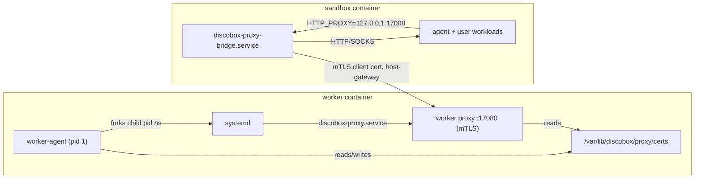

# Worker Agent Design

This module owns the in-guest worker agent process.

The worker agent owns and reads worker bootstrap metadata, authenticates to the
control plane, reports worker health/capacity, and runs the local worker runtime
plumbing needed by provider backends. It also owns the worker-local sandbox
operations HTTP server for sandboxes hosted on that worker. That API is distinct
from the future in-sandbox `sandbox-agent` API.

## Package Map

| Package/path | Ownership |
| --- | --- |
| `api/openapi` | Worker-agent-owned OpenAPI contracts, including the canonical worker-local sandbox operations API. |
| `api/gen` | Generated worker-local sandbox operations client/server scaffold. |
| `api/model` | Generated stable aliases for worker-local sandbox operation schema types. |
| `cmd/discobox-worker-agent` | Worker agent binary entrypoint. |
| `.` | Root `workeragent` Go package: boot contract, registration flow, status reporting, and high-level command orchestration. |
| `server` | Worker-local HTTP server, health/metadata endpoints, and generated sandbox API route/auth adapter. |
| `sandboxruntime` | Local sandbox runtime implementations used by the worker server. |
| `proxyagent` | Worker-scoped proxy wiring: certificate bundle preparation, the `proxy` subcommand entrypoint, and per-sandbox client material staging. |
| `systemd` | Linux/systemd namespace startup and child reaping helpers, with non-Linux stubs. |

## Startup Flow

1. The VM receives bootstrap settings from cloud-init, kernel command-line args,
   or environment variables.
2. The worker agent reads the settings into its `workeragent.Bootstrap`
   contract.
3. The agent generates or loads an Ed25519 worker keypair.
4. The agent registers with the control plane using project ID, sandbox ID,
   bootstrap token, and public key; the control plane derives the worker ID from
   the sandbox assignment.
5. The control plane validates the bootstrap token against the sandbox-assigned
   worker, stores the worker public key, and returns a short-lived runtime auth
   token.
6. The worker uses the runtime token for work subscription and status updates.

After registration, the worker periodically reports scheduling status and local
pressure details. It sets `ready`, `schedulable`, and `degraded` booleans for
control-plane scheduling. Richer pressure/condition details can be sent as an
opaque JSON blob for display.

## Worker-Local HTTP Server

After registration, the worker agent runs an HTTP server for provider runtime
operations against sandboxes hosted on that worker. The logical route shape is:

```text
/api/project/{project_id}/worker/{worker_id}/...
```

The generic VM provider reaches this server through a VM-driver-provided HTTP
client lease. Callers use the logical base URL `https://worker`; individual
drivers may rewrite that URL to localhost, a Unix socket, container networking,
private VM networking, or a temporary tunnel. The Docker driver does not need to
serve HTTPS when the rewritten endpoint is localhost-only.

The worker agent must reject requests whose `{project_id}` or `{worker_id}` do
not match its bootstrap identity. It must also reject sandbox operation requests
without a short-lived PASETO v4.public bearer token signed by the control-plane
key supplied in bootstrap metadata. Tokens are audience-bound to `worker-agent`,
carry `project_id`, `worker_id`, optional `sandbox_id`, and scopes, and generated
API operations must authorize against those scopes. Sandbox operation handlers
under this route own only local runtime work; control-plane persistence, user
authorization, project events, and desired-state orchestration remain outside
this module.

## Worker Proxy Integration

The worker runs the worker-scoped proxy (root `proxy` package) so all sandbox
egress is intercepted, recorded, and policy-controlled.



- `proxyagent` prepares the CA bundle and worker server certificate before
  systemd boots, so the `discobox-proxy.service` unit and per-sandbox client
  certificates share one CA without a first-generation race. Both processes see
  the same `/var/lib/discobox/proxy` files because the child systemd namespace
  shares the container filesystem content.
- The proxy binds `0.0.0.0:17080`; sandboxes reach it through a
  `discobox-worker-proxy:host-gateway` entry so the mTLS `ServerName` check stays
  valid regardless of the runtime gateway IP.
- `sandboxruntime.CreateSandbox` issues a per-sandbox client certificate
  (client ID = sandbox ID, the proxy tenant boundary), bind-mounts only the
  public CAs and that sandbox's keypair at `/etc/discobox/proxy` (read-only), and
  injects the `HTTP(S)_PROXY`/CA environment into both the container and the
  sandbox manifest so `sandbox-agent`-spawned terminals and execs are proxied.
- Normalize provider-owned source destination defaults before both mounting
  sources and writing the public sandbox manifest so manifest consumers observe
  the paths actually used by the runtime.
- Publish the worker-resolved sandbox user (name, UID, GID, and home) in the
  manifest even when the request omitted or partially specified `config.user`.
  The home mount, container environment, sandbox-agent exec defaults, and
  home-relative harness files must all use that same identity.
- Keep harness behavior opaque. The worker transports only selected harness
  identity, `harnessMode`, and the non-secret project file overlay. Commands and
  the project harness catalog are image-owned and never interpreted here.
- MITM CA trust is split by how tools find roots: the sandbox
  `discobox-trust-ca.service` runs `update-ca-certificates` early in boot so the
  system bundle (curl, git, wget, OpenSSL, and the `SSL_CERT_FILE` /
  `REQUESTS_CA_BUNDLE` env for Python) trusts the MITM CA alongside real roots;
  Node.js and Claude Code use `NODE_EXTRA_CA_CERTS` pointed at the mounted MITM
  CA because they ship their own root store.
- The in-sandbox forwarder is the dependency-light `proxy/bridge` package, run by
  the `sandbox-agent proxy-bridge` subcommand as `discobox-proxy-bridge.service`.
  It forwards local plaintext proxy traffic to the worker proxy over mTLS.
- Sentinel secret swapping is not yet wired: the proxy runs with a nil resolver,
  so it records and forwards traffic but does not substitute secrets.

## Boundary Rules

- Keep worker boot metadata in the root `workeragent` package; providers should
  consume that contract instead of defining provider-local boot metadata.
- Generate worker-local sandbox operation client/server code from the canonical
  `worker-agent/api/openapi/worker.yaml` contract into
  `worker-agent/api/gen`, with schema aliases in `worker-agent/api/model`. Do
  not generate these worker-local routes from the root `api/openapi/sandbox.yaml`;
  that YAML is itself generated from `api/openapi/server.yaml` for the
  in-sandbox agent API.
- Build the worker-agent image from the repository root with
  `docker build -f worker-agent/Dockerfile ... .` so the Dockerfile can copy
  root support packages without vendoring them.
- Do not import server internals or provider implementation packages.
- Keep future in-sandbox agent API implementation code in the `sandbox-agent`
  module; worker-local provider operation routes and their generated server
  adapter belong under `server`.
